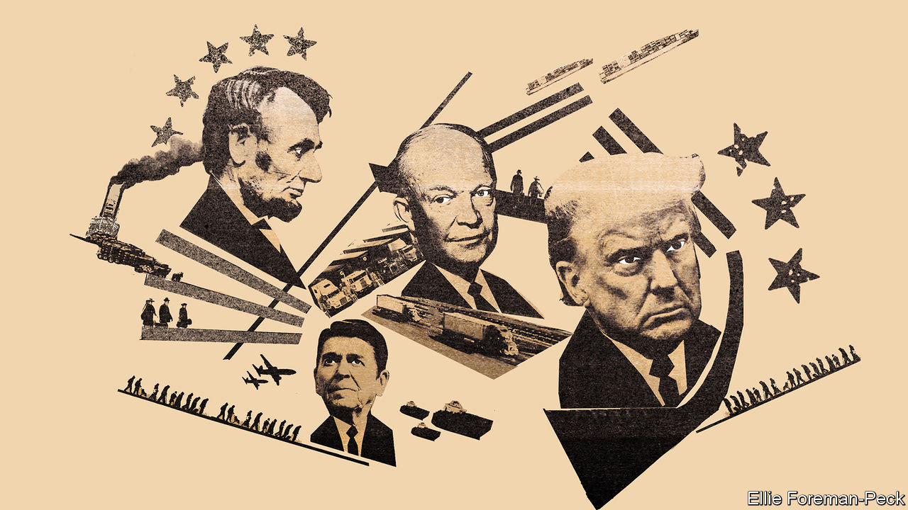
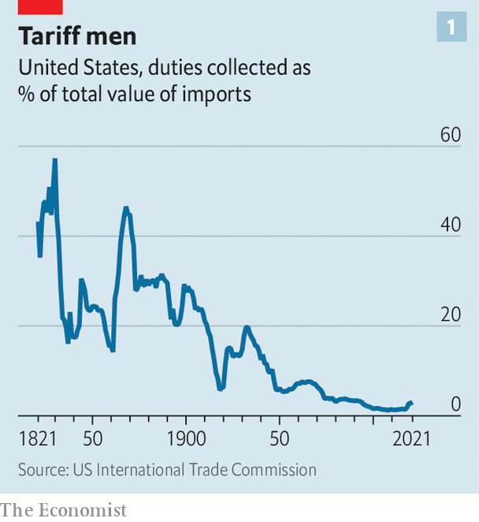
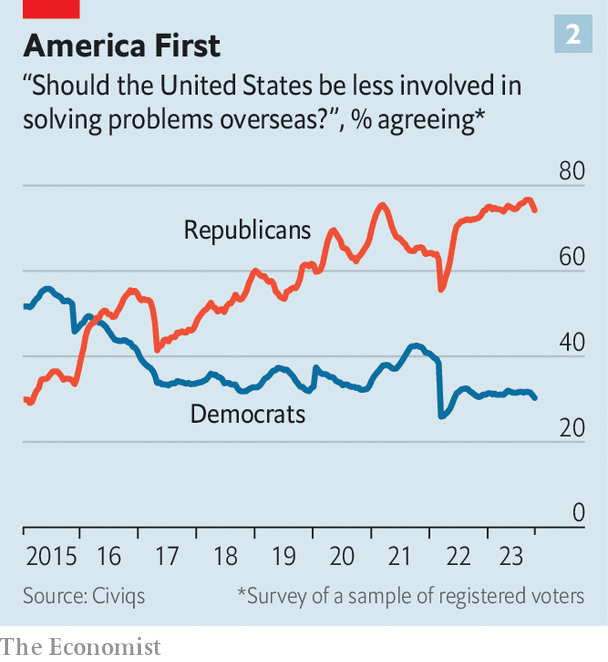
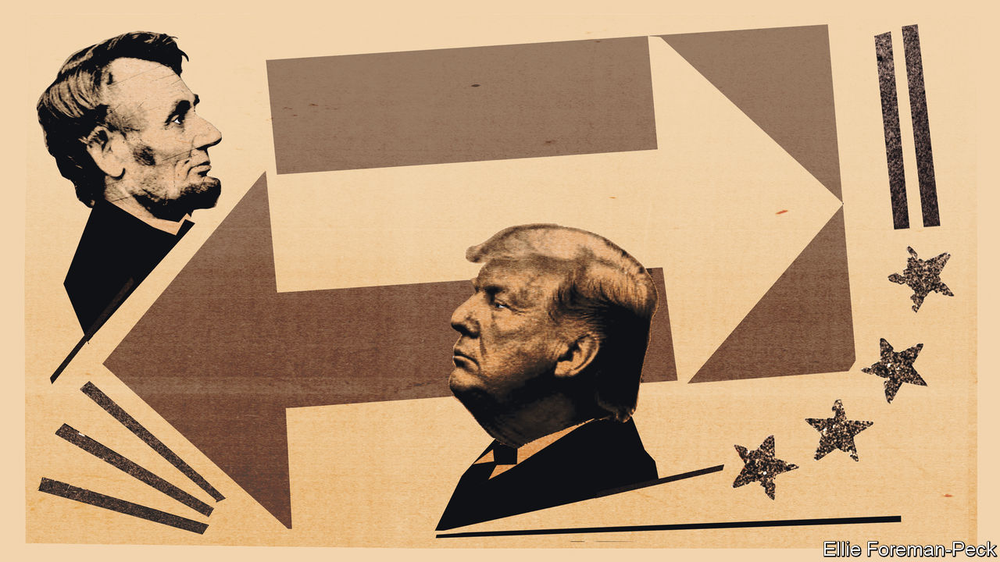

###### Losing their religion

# The Republican Party no longer believes America is the essential nation 

##### How the GOP went from isolationism to internationalism and back again 

 

> Oct 26th 2023 

Except for an admiration for Ronald Reagan and tax cuts, it is hard to see how the Republican Party of Donald Trump resembles the Republican Party of George W. Bush just two decades ago. In place of the “compassionate conservatism”, which aimed for a grand bargain to settle the status of illegal migrants, is a paranoid nativism. In place of a foreign policy that saw America as a protector of freedom and democracy is a new doctrine of America First that shuns allies (barring Israel) and would give up on the Ukrainians fighting off a Russian invasion, even when no American soldiers are at risk. The free-traders in the Bush administration entered into trade deals with 13 new countries and tariff rates remained close to zero; Mr Trump wants to put a 10% tariff on all imports. 

In the aftermath of the Hamas attack on Israeli civilians on October 7th, something like the old party shone through. Republicans unanimously condemned the terrorism and reaffirmed their alliance; they promised to send billions of dollars in security assistance to Israel; and some rattled their sabres at Iran, which sponsors Hamas among other proxies in the region. At the same time, though, much of the party is balking at the prospect of sending arms to Ukraine, which Reagan and both Bushes would surely have done. What happened? The obvious answer is: Mr Trump. But to make sense of this bewildering shift, it helps to look beyond a bit further back.

Ever since 1856 the Republican Party has published a party platform every four years as part of its presidential nominating convention—all the way to 2020, when it just re-endorsed the previous one. Read through them all (and the 2016 one twice) and the long intellectual arc that somehow bent towards the party’s current isolationism becomes a bit more comprehensible.

In this longer view, the free-trade and free-market orthodoxy that the party was most known for in the modern era looks more like an aberration. A deep protectionism starting with Abraham Lincoln ran for nearly a century until Dwight Eisenhower snapped it. What followed—six decades of internationalism and liberalised trade—now looks a bit more like an interregnum.

 


Start with the demise of free trade. When Mr Trump came into office he slapped tariffs on antagonistic countries like China and also friendly ones like South Korea and Canada. The protectionism was a stark reversal from the “neoliberal” days of the 1990s, when the American left and right mostly agreed on expanding global trade. Mr Trump’s universal 10% proposal would bring tariffs on imports back to their highest level since the 1940s (see chart 1).

For much of its history, American industry was safely ensconced under the broad protective tariff of the sort that Mr Trump proposes. The protectionist impulse has roots that run deeper than even the modern two-party system. Henry Clay, the eminent Kentucky senator, championed what he called the “American system” in the early days of the republic. He and his fellow Whigs advocated for protectionist tariffs, heavy infrastructure spending and stable monetary policy through a national bank (then a contentious issue). After the party imploded in the 1850s, Whiggish ideas found their home in the new Republican Party, which had coalesced around halting the expansion of slavery.

“I was an old Henry Clay tariff Whig,” Lincoln wrote in 1859. “In old times I made more speeches on that subject than on any other. I have not since changed my views.” While Lincoln was president, tariff rates nearly tripled to around 45%, in part to fund the war effort. Republicans remained aligned with incumbent businesses and therefore staunchly protectionist until the second world war. “The Republican Party stands now, as always, in the fullest sense for the policy of tariff protection to American industries and American labour,” the party wrote in its platform of 1916, protesting against Woodrow Wilson’s reduction of average tariff rates from 40% to 27%. In 1936 the party howled in protest at Franklin Roosevelt’s liberalised trade regime, arguing that “its effect on agriculture and industry has been destructive”.

That’s me in the corner

If Mr Trump returns to office, he has pledged that “the travel ban [on Muslims] is coming back even bigger than before and much stronger than before”. He has also repeated his aim to end birthright citizenship for children born in America to foreign parents (even though this seems to directly contradict a provision of the 14th Amendment), an urge that seems older. In the 1889 case upholding the plain racial discrimination of the Chinese Exclusion Act of 1882, which barred all Chinese labourers for a decade, the Supreme Court wrote in a unanimous opinion that “the presence of Chinese labourers had a baneful effect upon the material interests of the state, and upon public morals; that their immigration was in numbers approaching the character of an Oriental invasion, and was a menace to our civilisation”.

Conservative enthusiasm for immigration has also waxed and waned over the past century—inversely to the level of migration. The Ellis Island era, when millions of Europeans passed the Statue of Liberty on their journey to America, swiftly led to a nativist counterreaction. At the start of the 20th century as many as one in seven American residents were foreign-born—a similar share to the present day. Then as now, much of the opposition was couched in terms of protecting domestic labourers. “In the further interest of American workmen we favour a more effective restriction of the immigration of cheap labour from foreign lands,” the Republican presidential platform of 1900 argued.

Sometimes the motivation was explicitly racial. In 1924 Republicans slammed the country’s borders shut, passing the Johnson-Reed Act that completely banned immigration from Asia and established strict quotas on European migrants. “America must remain American,” said President Calvin Coolidge as he signed the bill into law. Albert Johnson, a congressman and one of the bill’s namesakes, was a prominent eugenicist. “Our capacity to maintain our cherished institutions stands diluted by a stream of alien blood with all its inherited misconceptions,” he said in a committee hearing that year. Migration into America that was once torrential dwindled to a trickle, until the policy was reversed in 1965 by Lyndon Johnson.

This too became a cross-party consensus. When he accepted the Republican nomination for president in 1980, Reagan adhered to the standard American dogma on migration, which lionises immigrants past while expressing some scepticism towards immigrants present and future. “Can we doubt”, he asked, “that only a divine providence placed this land, this island of freedom, here as a refuge for all those people in the world who yearn to breathe free?” As president, he signed a law in 1986 that sought to solve the problem of illegal immigration by granting amnesty to those already in the country while stiffening border security and employer checks on work eligibility. The party’s transformation seemed complete.

 


But the nature of ideas is that long ostracisms can end suddenly. So it is with the isolationist strain within American conservatism. The most ardent supporters of Mr Trump see foreign entanglements—even pledged alliances—as pointless distractions. One of the reasons that the berserker caucus of the Republican Party defenestrated Kevin McCarthy, the speaker of the House, was their strong opposition to continued military aid to Ukraine. Mr Trump has pledged to end that war on his first day in office—presumably by promoting capitulation. In one recent vote on a bill that would fund training for Ukrainian military officers, a majority of Republicans in the House were opposed.

At the start of the 20th century, too, Republicans were staunchly sceptical of multilateralism. Democrats were the relatively internationalist party, then as now. Woodrow Wilson famously outlined the Fourteen Points in his address to Congress—among them “economic free trade on the seas during war and peace” and the creation of the League of Nations. Yet America never joined because of Republican opposition. In the 1930s Gerald Nye, a prominent Republican senator, urged the passage of several neutrality acts making the export of arms to warring nations illegal. The original America First Committee was led by isolationists, including the aviator Charles Lindbergh, wanting to prevent entry into the second world war. It seemed finished when the first bombs fell on Pearl Harbour; 80 years later, its titular slogan commands Republican foreign policy.

That’s me in the spotlight

Even after the second world war, isolationism persisted in the form of Robert Taft, a senator from Ohio, who had backed the original America Firsters and was vehemently opposed to post-war multilateralist institutions like the reconstruction of Europe through the Marshall Plan (though he later came round to that), the NATO military alliance and the World Bank. In a speech published in 1951 castigating America’s entry into the General Agreement on Tariffs and Trade (GATT), the predecessor of the World Trade Organisation (WTO), and the Korean war, he stated his objection plainly: “If in the great field of foreign policy the president has arbitrary and unlimited power, as he now claims, then there is an end to freedom in the United States in a great realm of domestic activity.”

For all the attention lavished on Reagan as an ideological transformer of the party, too little is paid to Eisenhower in reshaping the party for the modern age. The Republican primary in 1952 was a severe contest between Taft and Eisenhower for the future of the party, decided by a narrow margin and much vote-jockeying at the Republican convention in Chicago. “We favour the expansion of mutually advantageous world trade,” the party platform proclaimed after Eisenhower’s success. It blamed the Truman administration for abandoning the friendly nations of Eastern Europe to Soviet aggression; it pledged to use its “friendly influence” in Western Europe to actually contain further advances of communism.

If Taft had triumphed, it would certainly have read differently. “Taft dying [one year later, in 1953] is important,” says Matthew Continetti, a scholar of conservative thought at the American Enterprise Institute, a think-tank. “And the echo of that is in 2018, when John McCain dies. These leaders kind of possess special qualities inherent to their person. And when they go, a whole school of thought goes with them.”

With some modifications, Eisenhower’s vision held sway over the party for decades. Persuasion had something to do with it, certainly. But the essential glue may have been great-power competition with the Soviet Union, when capitalism became synonymous with freedom. Friedrich Hayek’s idea, published first in the 1940s, that central planning was the road to serfdom began to hold more sway when ruthless Stalinism persisted and communist revolutions began to spread.

The inverse of Hayek’s thesis—that free markets themselves led to free societies—was forcefully argued by Milton Friedman in his 1962 classic, “Capitalism and Freedom”. By the time of Reagan’s presidency, their arguments had become entrenched: “The Republican Party believes that protectionist tariffs and quotas are detrimental to our economic wellbeing,” according to the 1980 manifesto.

Although Reagan remains beatified within the party, the institutions he was aligned with have changed. The clearest example is the Heritage Foundation, the conservative think-tank that once functioned as the external brain for the Reagan White House. It is seeking to reprise the role for a possible Republican administration in 2025, preparing detailed policy manifestos and pre-screening personnel—but with a much more populist orientation. Heritage is still concerned about the size and cost of government spending generally and welfare programmes specifically. But the old free-trade agenda now has a large, China-shaped caveat. Once an exceptionally hawkish outfit, and among the most fulsome supporters for the wars in Iraq and Afghanistan, Heritage is perhaps the most influential organisation in Washington that is rallying against additional American spending on Ukraine.

Trying to keep up with you

“It’s expensive to be engaged in neoconservative adventurism,” says Kevin Roberts, the president of Heritage, about the reason for the shift. Mr Roberts argues that Heritage “was an avatar for what was going on in the conservative movement” during the Reagan revolution, and it is an avatar for what is going on now. “In the same way that Heritage in the late 1970s was saying, ‘Guys, something has changed since the  decision, something has changed since the utter failure of the United States in Vietnam.’… In the 2020s, we’re saying, ‘Guys, something has changed.’ And what has changed is that the United States is weaker economically, we have some very worrisome trends.” (He points to falling marriage and birth rates.) 

 


As the party has grown more suspicious of entanglements in Europe and the Middle East, some have tried to rationalise their continued effusive support for Israel. The Republican senator J.D. Vance circulated a memo arguing against Mr Biden’s proposal to jointly fund security assistance to Ukraine and Israel. He argues that “our political and military relationship with Israel is qualitatively different”, and that “the United States does not have a plan in Ukraine, but we do have a plan in Israel”. “Israel is in very select company as it relates to which countries in the world are most important to the interests of the Americans: it’s the Israelis and the British. It’s really that simple,” says Mr Roberts of Heritage. 

After the Soviet Union fell in 1991, the anti-communist rationale for conservative free-market economics disappeared. Policy did not reset overnight. Free trading had become a bipartisan concern by that point. NAFTA was a Reaganite dream ratified under the Democratic administration of Bill Clinton. Mr Clinton also cut the deal in October 2000 that established permanent normal trade relations with China upon its accession to the WTO—relying mostly on free-trading Republican votes in Congress.

In retrospect, that was the heyday of faith in globalisation. The next two decades would see America slowly losing that religion as discontent mounted with the loss of manufacturing jobs because of the “China shock”, the wars in Afghanistan and Iraq launched by a staunchly interventionist Bush administration and the wreckage of the financial crisis. Economic changes which had quite a lot to do with blander things like technological improvements and an economic shift towards services were blamed largely on globalisation.

When Mr Trump launched his campaign for the White House in 2015 he was relying on a mix of old ideas—protectionism, isolationism and nativism—that seemed novel in the post-war Republican Party. By instinct, rather than by deliberate study of history, he was tapping into the sentiments that had dominated America’s conservative party for much of its history.

Yet within parties, even if one strain of thought is dominant, its takeover is not complete. Just as there were dissenters from Republican isolationism—one of them, Wendell Wilkie, even managed to snatch the party’s presidential nomination in 1940 during a contested party convention—there are dissenters now.

Among Republican lawmakers are a set of true converts on foreign policy (usually found in the House), a set of more internationalist dissenters (found in the Senate) and a large set unconcerned with foreign policy who simply go with the majority of the party. That is one reason that swings in ideology can happen so quickly—from neoconservatism to isolationism. That shift may endure for a while longer. If Mr Trump secures the nomination in 2024 the party will, just as in 2020, probably simply republish its 2016 manifesto once again. ■


