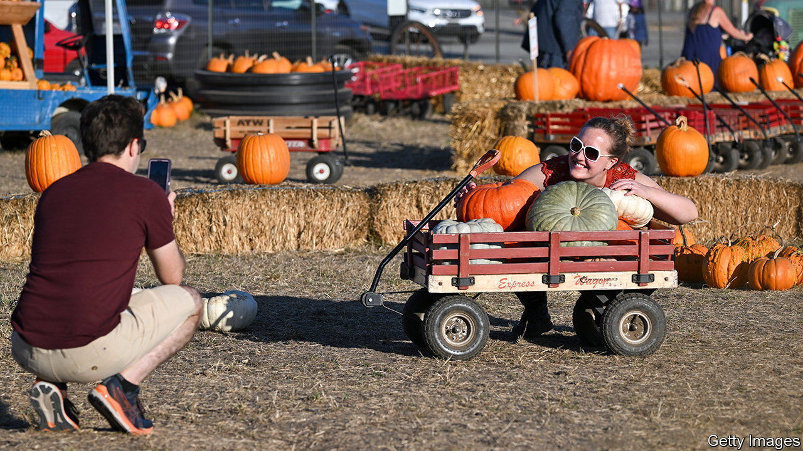

###### Oh my gourd

# The economics of pumpkin patches 

##### They are pointless, lucrative and generally a force for good 

 

> Oct 26th 2023 

QUEENS COUNTY farm museum is one of the few pastoral corners in New York City. It has an apiary, an orchard, livestock and, in autumn, a pumpkin patch. Parents take photos of their tykes, some dressed as pumpkins, sitting on a mound of pumpkins. Twenty-somethings, hoping not to look like pumpkins, strike poses next to hay bales and post them on Instagram. This meeting of big tech and smallholding might seem as natural as a Clarendon filter. In fact the two go together.

In the 19th century, as people moved away from farms to cities, many felt they had lost their connections to nature. Pumpkins became a symbol for that rural ideal. Americans will still happily drive hours to purchase a fruit (yes it is) that they will not eat. Small towns with no economic ties to the squash host pumpkin festivals and contests. Andy Wolf grows gourds in excess of 2,000lbs (907kg). “We keep track of the genetics like you would a champion racehorse,” he says. 

 Pumpkin patches are a way for people to maintain connections to rural life, says Cindy Ott, author of “Pumpkin: The Curious History of an American Icon”. The effects are real enough. “The crazy thing is, that the popularity of pumpkin pie and the jack-o-lanterns is helping, has helped to rejuvenate small family farms,” she adds.

Libby’s, which produces most of the canned filling for pumpkin pies, relies on a few dozen small-scale farmers. According to NIQ, a market-research firm, nearly $820m of pumpkin-related products, which includes everything from pumpkin candles to pumpkin cinnamon bagels, were sold over the past year, a 9% annual increase. Sales of fresh pumpkin amounted to more than $190m in the year ending October 14th.

Pumpkin patches are not hard to create. Farmers do not have to devote too much acreage to make a worthwhile patch. Money can be made from selling apple cider and donuts to the pumpkin punters as well as jams and vegetables. The Queens County Farm charges $16 ($12 for kids) to enter the “amazing maize maze”, a living labyrinth. Another queue waits for the $6 hayrides. Steve Reiners, a horticultural professor at Cornell University, says pumpkins “can make all the difference whether they have a profitable year.”■


