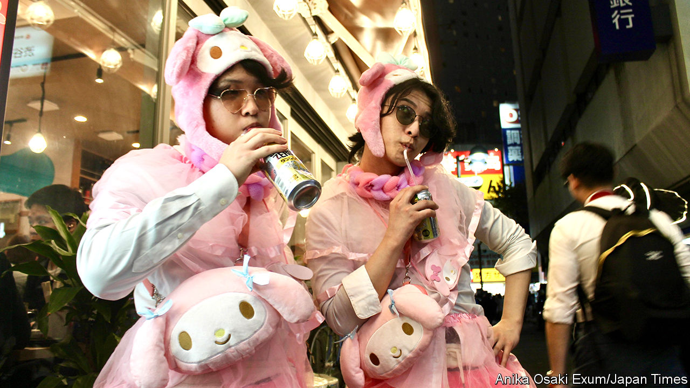

###### Save our ghouls

# A Tokyo district cracks down on Halloween 

##### Japan’s ageing society is limiting youthful pleasures 

 

> Nov 1st 2023 

SHIBUYA, A DISTRICT in Tokyo known for its zesty pop culture, is a place to find strange clothes and youthful frolics most days. Yet on Halloween the capital’s top tourist attraction traditionally takes it up a gear. For years crowds of partygoers in fancy dress have filled  and celebrated Scramble Crossing. In 2019 around 40,000 flocked to the district on Halloween. But this October 31st the mood was much less joyous. The killjoys of Shibuya’s local government had banned Halloween festivities in the ward.

Unwelcoming signs were plastered all over it, including a billboard reading: “No events for Halloween on Shibuya streets”. Outside the district’s metro station, a famous meeting-place, security guards blew whistles and hustled away anyone tempted to linger. Most monstrous to Shibuya devotees, police sealed off the spot’s iconic statue of Hachiko, a legendary Japanese dog known for its loyalty. “We came here to see Hachiko. How could they do this?” complained Olga, 31, a Russian tourist, looking disconsolately at the boarded-up dog.

The crackdown was in response to a Halloween tragedy last year in Seoul, in which over 150 people were crushed to death. Officials feared Shibuya’s narrow alleys could see another disaster. According to Fukuda Mitsuru, a crisis-management expert, the fact that Halloween festivities are a fairly recent foreign import exacerbated such concerns.

Yet the curbs are part of a broader crackdown on fun-seeking in Shibuya. Complaining of excessive noise and litter, the ward banned public alcohol consumption at certain times. Such measures seem unobjectionable in isolation. Drunken salarymen lying prostrate on pavements is a less edifying Tokyo spectacle. But combined with the Halloween ban they look to many like an overreaction against youthful spirits by heavy-handed and often aged officials.

That was certainly the view of those carousers who did bravely make it to Shibuya this week. “I come to Shibuya every year for Halloween, so I feel betrayed,” said Takeuchi Tetsuya, wearing a Mickey Mouse costume.■

