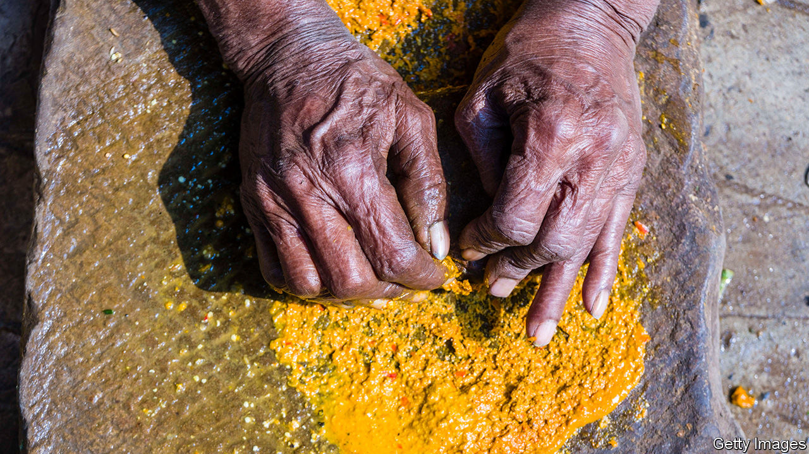

###### Death by turmeric

# Bangladesh strikes a blow against lead poisoning 

##### Are India’s rulers wise enough to take a lesson from their neighbour? 

 

> Nov 2nd 2023 

Turmeric is the key to a good curry—ask any South Asian. The spice supplies a distinctive flavour, aroma and bright yellow colour. Many believe that consuming turmeric, or even bathing in it, also has multiple health benefits. But in much of South Asia, and perhaps far beyond, the spice also exacts a terrible cost.

That is because turmeric sold in these places is routinely adulterated with lead chromate in order to brighten its golden hue. And exposure to lead, a neurotoxin, increases the risk of heart and brain diseases. Children are especially vulnerable, because lead poisoning stunts cognitive development. According to a study by the Centre for Global Development, a think-tank in Washington, lead poisoning among children in poor countries explains 20% of the learning gap between them and their peers in rich countries. 

People in South Asia have the highest levels of lead in their blood, according to a new study published in the . Pinpointing the main cause had long seemed daunting, because lead is everywhere in the region. Traces of the metal can be found in cooking utensils, cosmetics and other everyday products. But in 2019 a team of researchers from Stanford University and the International Centre for Diarrhoeal Disease Research, Bangladesh (ICDDR, B ), a health-research institute, began focusing on turmeric adulteration. Working with the country’s food-safety authority, and politicians right up to Sheikh Hasina, Bangladesh’s powerful prime minister, they then launched a nationwide campaign to root out the use of lead-chromate pigment in turmeric. It turns out to have been hugely successful, according to a new study published in the journal .

In less than two years, the share of turmeric samples in Bangladeshi markets that contained detectable lead fell from 47% to 0%. This elimination of lead adulteration had a near-immediate public-health impact. Among workers at turmeric mills, blood lead levels dropped by 30% on average. Across Bangladesh the reduction in lead exposure probably saved thousands of lives for little cost. A preliminary analysis by Pure Earth, a New York-based environmental NGO, suggests the programme delivered an additional year of healthy life for $1. (Generating the same effect through cash transfers is estimated to cost $836.)

In a region where rapid policy responses, let alone effective ones, are rare, Bangladesh’s success is all the more impressive. It was founded on recruiting support from policymakers by explaining the problem to them in a credible way, says Jenna Forsyth of Stanford University. Between 2014 and 2018, she and her colleagues collected data to demonstrate the link between turmeric consumption and high lead exposure levels among pregnant women in rural Bangladesh. Armed with these findings, the researchers were able to convince not just Bangladesh’s food-safety officials to take urgent action, but also the prime minister’s office.

The mass-media campaign that followed included graphic warnings about lead-tainted turmeric. Sheikh Hasina commented on the problem on national television. Around 50,000 public notices about it were plastered in markets and public areas. At a big turmeric processor, researchers tested workers’ blood samples to show how lead was poisoning those responsible for pulverising, colouring and packaging the tubers from which the spice is produced; then publicised the results. 

Turmeric adulteration was declared a crime—and this change was also broadcast. A bust on a major turmeric producer was aired on TV. Two wholesalers were prosecuted in a mobile court for selling contaminated turmeric, a trial the media was again encouraged to cover. The wholesalers were convicted, fined and had much of their stock confiscated. 

The Stanford team hopes to help launch similar campaigns in India and Pakistan, where they believe turmeric adulteration may be even more prevalent and deep-rooted. Much of the poisonous pigment used in Bangladesh was imported from India. The spice supply chain is also longer and more complicated in India than in Bangladesh, where a handful of wholesalers serve the entire turmeric market. 

The broader lessons from Bangladesh are applicable to all sorts of policy problems, suggests Mahbubur Rahman of ICDDR, B. First, identify and cultivate the most influential champions for change, he says. The impetus they generate can then be sustained by launching broad-based coalitions. In Bangladesh this meant rallying researchers, government, media outlets and private firms to collaborate against poisonous spices. It was hardly a secret recipe for success; but, as when making curry, the challenge lay in putting the ingredients together judiciously. ■ 

