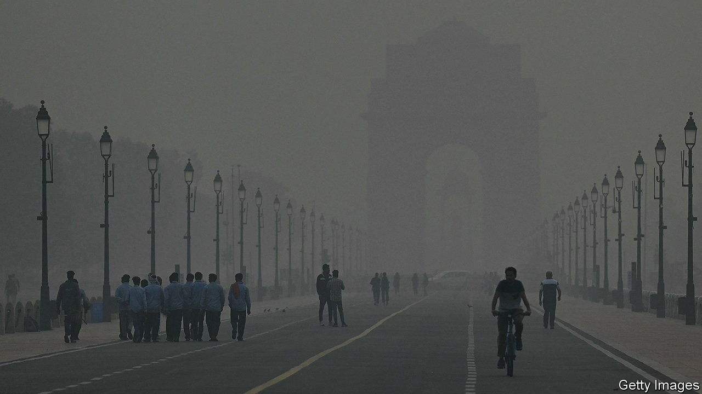

###### Choking a city

# Politics hampers Delhi’s fight against air pollution 

##### Narendra Modi’s central government is at war with Delhi 

 

> Nov 2nd 2023 

DURING THE last week of October, Delhi’s air quality began its seasonal shift from unpleasantly foul to sickeningly filthy. As temperatures dropped and clouds heavy with brown particulate matter drifted in from neighbouring states, the official rating of air quality in India’s capital went from “poor” to “very poor” and then “severe” in places. This means that Delhi’s air, the most polluted of any big city, is now hazardous to breathe even for healthy people. It is likely to remain so for much of the next three months.

Air pollution in South Asia is estimated to claim over 2m lives a year. Partly caused by agricultural practices, including stubble burning, it is most severe in northern India, especially in winter, when cold air traps pollutants in the mostly windless Indo-Gangetic Plain bordered by the Himalayas. A recent study suggests that the average resident of Delhi loses up to 12 years of life to air pollution. According to official figures, in 2022 Delhi’s air was considered “good” or “satisfactory” on only 68 days. The average concentration of particularly harmful PM 2.5 particles—which can enter the bloodstream and cause heart disease and respiratory problems—was 98 micrograms per cubic metre. That is nearly 20 times the level considered safe by the World Health Organisation.

As sources of air pollution are often far from the worst-affected places, it can only be significantly mitigated by different authorities acting in concert. Yet partisan rivalry often gets in the way—as is illustrated by the latest row between Delhi’s government, which is run by the Aam Aadmi Party (AAP), and the central government of Narendra Modi’s Bharatiya Janata Party (BJP).

The argument pits Delhi’s environment ministry against the city’s pollution control committee, which is headed by a bureaucrat on secondment from the national home ministry. In late October the capital’s environment minister claimed this official had unjustifiably withheld funding from a years-long study to measure the source of pollutants in Delhi’s air. The pollution control committee claimed to have identified methodological flaws in the study which, it said, were designed to absolve the aap government of blame for the problem. The city administration, in turn, claimed the scuppering of the study was part of a pattern of government officials loyal to the BJP deliberately undermining the AAP’s work. Whoever is right, the study is unlikely to be resumed—a serious setback for pollution mitigation in the world’s filthiest city.

The row is part of a broader fight between the AAP and centre over control of Delhi’s entire bureaucracy. In August the central government passed a law in effect awarding control to itself. This superseded a Supreme Court verdict on the issue in the AAP’s favour. A constitutional challenge by the AAP government is pending.

The row is threatening a rare hopeful anti-pollution effort. A regional anti-pollution body, encompassing Delhi, its neighbouring states and several central-government ministries, was recently launched to co-ordinate smog mitigation policies. The fact that the AAP also governs Punjab, where much of the stubble-burning happens, made that seem all the more promising. Yet the body will not achieve much so long as the central and Delhi governments prize partisan advantage over making Delhi’s air safe to breathe. ■

