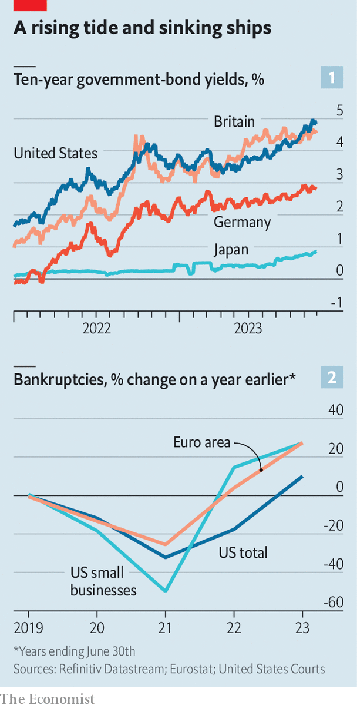
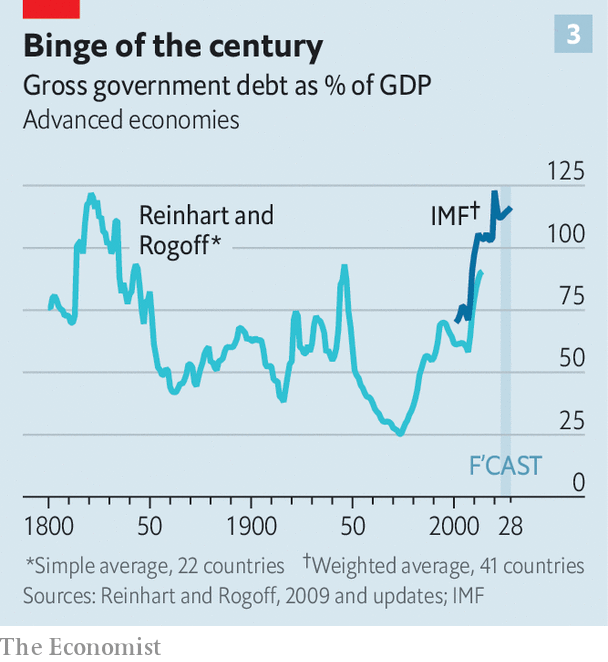

###### Higher for longer

# Markets think interest rates could stay high for a decade or more 

##### The economic consequences could be grim 

 

> Nov 2nd 2023 

NOT LONG ago, as interest rates in the rich world hovered near zero, economists debated whether their downward march was the product of a decades-, centuries- or millennia-long trend. Now the burning question is how long they will stay high. On October 18th the ten-year Treasury yield, which incorporates long-term expectations for interest rates and was below 1% as recently as 2021, hit 4.9%, its highest since 2007. The 30-year Treasury yield crossed 5% the same day. Analysts at Bank of America may have sounded a little breathless when they declared last month that rates were “coming off 5,000-year lows”. But that is indeed how it feels to economists, investors and anyone in the uncomfortable position of servicing debts they incurred when almost everyone expected rates to be low for ever.

 


The conviction that rates will remain “higher for longer” is spreading around the world. The euro zone saw negative interest rates in 2021; now Germany must pay nearly 3% to borrow for a decade. Britain’s bond yields are nearly as high as America’s. Even Japan, whose apparently permanently low rates were seen as a harbinger for the rest of the world, has faced upward pressure on its bond yields (see chart 1). Bets that its central bank will have to raise interest rates in 2024 for the first time since 2007 are mounting. 

If markets are right, a new era is beginning and the consequences will be far reaching. Households and companies will have to pay much more to borrow. The financial system will have to adjust to a painful new reality. And governments will find they have to divert more tax revenue to pay the interest on their accumulated debt. The higher-for-longer scenario that many investors are now predicting is a potentially toxic mix.

Start with the real economy. One of the surprises of the past year is how resilient the world economy—and particularly America—has been in the face of higher rates. On October 26th it was revealed that America’s GDP grew at an annualised pace of 4.9% in the third quarter. Consumer spending has been supported by the excess savings households built up thanks to the lockdowns and stimulus payments of the covid-19 pandemic. Many firms issued long-term debt when rates were low, and so continue to enjoy low financing costs today. Net interest payments by America’s companies have actually fallen this year, because the interest they earn on the cash they keep to hand has risen faster than the cost of servicing their debts.

These protective buffers will last for a while yet. In September statisticians revised up the estimate of savings accumulated during the pandemic, which had previously looked like they were on the verge of exhaustion. It now appears that America’s households are still sitting on about $1trn of excess cash, equal to nearly 5% of annual personal income in aggregate. It will also take time for higher rates to slow companies down. Goldman Sachs, a bank, estimates that just 16% of America’s corporate debt will mature over the next few years. Refinancing it will lift the average interest rate on the total stock of debt from 4.2% this year to just 4.5% in 2025.

Not all companies are resilient to higher rates, however. Smaller American firms, whose debts typically fall due sooner than those of big ones, are under strain even though the economy is booming. There and in Europe, where growth is weaker, corporate bankruptcies are rising (see chart 2). In some economies firms are much more exposed to rising rates: at the end of 2021 the median maturity of Spanish and Italian businesses’ debts was only 2.6 years and 2.1 years respectively. In Sweden, where corporate debt is an eye-watering 155% of GDP, the average effective interest rate on outstanding bank loans to companies rose from 1.5% to 3.9% in the year to March and will be higher still by now. In September the number of corporate bankruptcies was 14% higher than a year earlier.

Were rates to reach a permanently higher plateau, even long-dated debt would eventually start to cost companies dear. That would be painful because during the 2010s firms borrowed heavily: America’s non-financial corporations issued a net $4.1trn in debt over that decade while retiring a net $3.2trn of equity through dividends and buy-backs. In advanced economies as a whole, corporate debt is around 93% of GDP, up from less than 80% in the mid-2000s, according to data from the IMF. If rates stay higher for longer, this borrowing binge may need to be unwound. A long period of deleveraging could therefore inhibit investment in the 2020s, just as low growth inhibited it in the 2010s.

Home is where the hurt is

Households, too, will eventually find that higher rates bite. In America and some European countries interest rates on mortgages can be fixed for decades, which protects borrowers from rate rises as long as they do not move house. But house prices are likely to fall, because they depend mostly on buyers who borrow afresh, and therefore face much higher costs. On October 18th Mortgage News Daily, a data provider, reported that the average 30-year fixed-rate mortgage in America carried an interest rate of 8% for the first time since 2000. As a result the monthly payment required to buy the median American home with a mortgage worth 90% of the property’s value is now nearly 60% of average earnings, up from 33% in July 2021. 

It strains credulity to think that housing markets can sustain such ratios. According to the Bank for International Settlements, real house prices in 12 advanced economies fell by 10% between the start of 2022 and the second quarter of 2023. Should rates follow the path implied by markets, real house prices should fall by another 14% by the end of 2025. In a scenario in which interest rates stabilise slightly above their current level, the peak-to-trough fall in real house prices would reach 35%. For comparison, the fall prompted by the global financial crisis was 13%.

Next, consider the implication of higher rates for the financial sector. Traders often joke that interest rates go up until something breaks. In the spring of 2023 something did: banks. They own lots of government bonds, which lose value as rates rise. The jump in the yield of ten-year Treasuries from 1.5% at the end of 2021 to around 3.5% a year later drove down the value of a broad index of Treasury bonds by about 10%. That inflicted over $600bn of losses on American banks, the most vulnerable of which—Silicon Valley Bank and First Republic—suffered runs and failed. The crisis was eventually forestalled by the Federal Reserve offering to lend to banks against the face value, rather than the market value, of their Treasuries, easing the pressure on their balance sheets.

But in a higher-for-longer world, the crisis could return. The last loans under the Fed’s new lending scheme are to be made in March. Even if it is extended, banks may find themselves unable to afford to pay the interest on the Fed loans (which is similar to prevailing short-term rates and so has been rising steadily). 

And it is not just Treasuries whose market value falls when rates rise. More or less any loan paying a fixed return over a medium-to-long duration will follow the same pattern. Erica Jiang, Gregor Matvos, Tomasz Piskorski and Amit Seru, a group of economists, undertook an analysis that valued all the assets of American banks at the market prices that prevailed in March and then tested to see what would happen if half or all of their uninsured depositors withdrew their savings. They found that, even under the less apocalyptic scenario, some 200 or so banks, with collective assets of $300bn, would potentially be insolvent. Another paper, by Mark Flannery and Sorin Sorescu, two more economists, concluded, “If all unbooked losses were fully reflected in bank balance sheets, roughly half of all banks, holding roughly half of all bank assets, would not meet their minimum regulatory capital requirements.”

Since March the bond index has fallen by 5% more. Ms Jiang and her co-authors have repeated their analysis. They find that unrealised losses have climbed modestly, but are now concentrated at bigger banks. In March only some 30% of the $2.2trn of these losses were at banks labelled “systemically important” by regulators. Now there are $2.5trn of unrealised losses, with about two-thirds at such banks. 

There are other sources of financial vulnerability, too. Commercial property loans make up around a tenth of bank assets, and the value of office buildings has collapsed owing to higher interest rates and lower occupancy. Some owners have simply handed the keys to lenders. What is more, much lending has migrated in recent years from banks to other sorts of financial institutions, such as pension funds and insurance firms. They have never gone through a cycle of rising rates as big lenders before. Although the dispersal of risk is in principle helpful, it also means a greater number of firms face potential losses. 

 


Last, consider the vulnerability of governments. After the global financial crisis, rich countries’ public debts surged to the highest level since 1946. Since the pandemic they have been larger, relative to GDP, than at any time since the Napoleonic wars (see chart 3). The sustainability of these massive debts depends not just on interest rates, but on how those rates compare with economic growth. In the low-rate era it became fashionable to note that if GDP expands faster than interest accrues, then a government’s debt-to-GDP ratio can shrink even as it borrows afresh to pay its interest bill. It may even be able to borrow more still to fund extra spending while keeping its debt-to-GDP ratio stable.

In October the IMF projected that, between 2023 and 2028, the economic growth rate in advanced economies will continue to exceed the interest rate their governments pay on their debts, by 1.4 percentage points on average, despite recent rate rises. The reason is that governments, like companies, have locked in low rates to some degree by issuing long-term debt.

Yet debt-to-GDP ratios are mostly set to rise anyway, because many governments continue to run excessive deficits. America especially is borrowing with abandon: strip out accounting distortions and its deficit for the past year was 7.5% of GDP, according to the Committee for a Responsible Federal Budget, a think-tank. Deficits that high are typically seen only during wars or catastrophic recessions.  calculated the fiscal adjustments that advanced economies would need to make to keep their debts stable, given the IMF’s projections. In every big advanced economy bar Germany and Japan, belt-tightening is needed to stop the debt-to-GDP ratio from rising further. America would have to trim its primary budget deficit—ie, its deficit excluding interest on its debt—by an annual 2.4% of GDP. Such parsimony will be especially difficult given the extra spending that is needed to cope with ageing populations, the climate crisis and rising geopolitical tensions—the annual bill for all of which, the IMF estimates, will add up to about 7.5% of gdp in rich countries.

What is more, in a higher-for-longer world governments, like companies, must refinance eventually. Ten-year yields are now above plausible estimates of long-run growth in most rich economies. That means much more belt-tightening could be needed to keep debts from rising. It is hard to escape the conclusion that, on current growth forecasts, higher-for-longer would force governments into another round of painful budget-balancing like that suffered by Europe in the 2010s. If upheaval in the finance industry prompts expensive bail-outs, the fiscal outlook would become yet bleaker.

There is always cope

Can the world economy cope with corporate deleveraging, falling house prices, turmoil at banks and fiscal frugality? Surprisingly, the answer is, perhaps—if rates have risen for the right reason. Economists typically think that interest rates are determined in the long term by the balance between the world’s desire to save and to invest. All else equal, more saving pulls down the so-called “natural” rate of interest; more investment pushes it up. The most popular explanation for the rock-bottom rates of the 2010s was that ageing populations were stashing away more money for retirement, while insipid long-term growth prospects had sapped companies of the desire to expand—a phenomenon sometimes called “secular stagnation”.

For rates to have shifted permanently, that outlook must have changed. One possible reason it might have is the anticipation of faster economic growth, driven, perhaps, by recent advances in artificial intelligence (ai). In the long term, growth and interest rates are intimately linked. When people’s incomes rise over time, they have less need to save. Companies, expecting higher sales, become keener to invest. Central banks have to keep rates higher to stop economies from overheating.

It might seem farfetched to say that optimism about AI is pushing up bond yields. Yet it would explain why the prospect of higher-for-longer has not caused stockmarkets to fall much. In theory, higher bond yields should reduce the value of companies’ future earnings, an effect that bites hardest for technology firms, since they tend to promise jam tomorrow. In fact, as optimism about AI has spread, the value of big tech firms such as Microsoft and Nvidia has soared. Their rising value has kept the cyclically adjusted price-earnings ratio of the S&amp;P 500 at around pre-pandemic levels, even though bond yields—and hence the rate used to discount future profits—are now much higher. And America’s strong growth in the third quarter was not driven by an unusual jobs boom; in fact, the labour market is cooling. If the growth number is accurate, productivity must have risen.

 


To the extent that productivity growth explains higher rates, the new era could be a happy one. Alongside the rise in debt-service costs, households will have higher real incomes, firms will have higher revenues, financial institutions will enjoy low default rates and governments will collect more tax. Healthy competition for capital might even bring benefits of its own. Some economists long suspected that the low-rate era of the 2010s made the economy less dynamic. “It was easy for relatively inefficient companies to stay afloat, so there wasn’t much creative destruction,” says Kristin Forbes of MIT. In a higher-rate world underpinned by faster growth, there would be plenty of dynamism.

Alas, there is a more worrying explanation for higher rates: that government debt has grown so large that it has sopped up the world’s surplus savings, leaving the private sector to compete for the scraps. In the short term, many traders blame the avalanche of debt issuance since the pandemic, as well as the unwinding of big bond purchases at central banks, for rising bond yields. Economists often pooh-pooh the significance of existing bonds changing hands, but they do think the size of the outstanding stock of debt matters. A rule of thumb proposed in 2019 by Larry Summers of Harvard University and Lukasz Rachel, then at the Bank of England, is that a ten-percentage-point increase in debt-to-GDP raises interest rates by 0.35 percentage points in the long run, while every percentage point increase in deficits raises rates by a similar amount. That would imply that spendthrift governments have contributed to today’s high rates.

To the extent government debt is to blame for “higher-for-longer”, then the world economy will have to deal with higher rates without any accompanying fillip to growth. That would be painful. “You can’t really take the view that deficits will continue to push interest rates up and will also continue unchecked,” says Maurice Obstfeld of the Peterson Institute for International Economics. “Something’s got to give, whether it’s a more restrictive fiscal policy or some sort of debt crisis.”

Other than a fiscal crisis, how could the tension be resolved? One possibility is that persistently high inflation could erode the real value of government debts, as it has in the past after moments of economic crisis. In that case, though nominal interest rates might be higher-for-longer, the real interest rate would not have risen as much. Companies and governments would survive high rates because their incomes would be strong in cash terms. Relative to the high real yields they expect today, bondholders would be squeezed.

Another possibility is that high rates push the world economy into a recession, which in turn causes central banks to cut them. In line with this thesis, on October 23rd Bill Ackman of Pershing Square Capital announced that his fund was no longer betting that rates would keep rising, pushing down the value of Treasuries. “There is too much risk in the world to remain short bonds at current long-term rates,” he wrote. “The economy is slowing faster than recent data suggests.” If he is right, higher may not be for that much longer. ■ 

