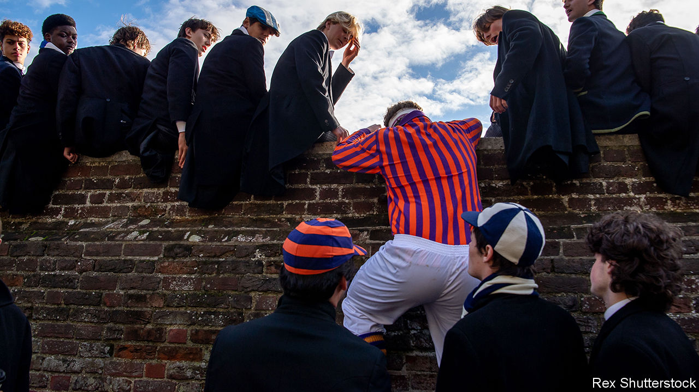
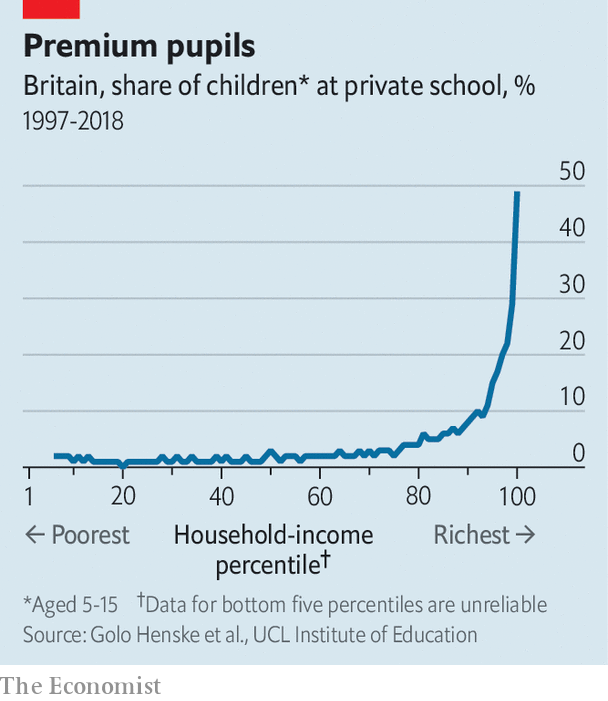

###### Classroom war

# Do Labour’s plans for Britain’s private schools make sense? 

##### A proposal to charge VAT on fees arouses passion on all sides 

 

> Oct 31st 2023 

For decades, on and off, the Labour Party has been promising to take a harder line on private, fee-paying schools. Before the general election in 2019 it pledged to explore ways of “integrating” them into the public sector. That idea has been dropped, along with one to strip private schools of their charitable status. 

But the policies spelled out to enthusiastic applause at Labour’s conference in October—to make private-school fees subject to value-added tax (VAT), at the standard rate of 20%, and to remove a discount these schools receive on business rates—are still controversial. Given the party’s yawning lead in the polls, they are also likely to become reality. As claims and counterclaims fly, three questions dominate. What is the case for making the tax changes? Would they materially affect private schools? And would they improve education in Britain? 

On the rationale for the policy, Sir Keir Starmer, Labour’s leader, has batted away claims that his party is contemptuous of aspirational parents; he has said he sees “no case” for trying to abolish fee-paying schools. Instead Labour’s argument is that it is unjust to continue exempting from tax a service bought mostly by the rich. 

Research suggests that pupils in private schools learn more than they would if they studied in the state sector. Indeed, the fact that they get more and better qualifications is the biggest single reason they earn more than others in adulthood, according to academics at University College London (UCL) and Cambridge. (Chummy networks probably also help.) By the time they turn 25, privately educated Britons earn 17% more than workers from similar homes, according to research published in 2020. The pay premium widens by the age of 42, according to earlier research, to around 21% for women and 35% for men.

 


About three-quarters of children in Britain’s private schools come from the richest 30% of families, according to another study by academics at UCL. In contrast, only 2% of pupils come from the poorest third of families (see chart). Although private schools sometimes offer means-tested discounts aimed at drawing in poorer children, last year only about 7% of private-school pupils benefited. Of this small group, only about half received help amounting to 50% or more of total costs; only about one-quarter attended free. 

Critics say that the “partnerships” private schools boast of forming with state schools are underwhelming, sometimes involving little more than matches between their sports teams. It is also occasionally argued that private schools deprive government ones of wealthy and engaged parents. And according to Francis Green at UCL, private schools educate less than 7% of pupils in England but employ around 14% of teachers.

Private schools push back. They object in particular to Labour’s claims that they are benefiting from “tax breaks”. Most education spending is exempted from consumption taxes, on the principle that encouraging adults to invest in youngsters’ brains will benefit the country in the long run. Parents do not pay VAT when they send toddlers to playgroups; undergraduates never pay VAT on their tuition fees (even though degrees can greatly boost their incomes). Julie Robinson of the Independent Schools Council (ISC), a group representing more than half of Britain’s 2,400 or so private schools, says it is rare for countries to tax school fees, and that if Britain were still in the EU it would not be allowed.

Fee or free 

Private schools also complain that debates about the sector focus on a handful of very toffee-nosed institutions, such as Eton, and on a subset of parents seeking a shortcut to Oxbridge. In fact, plenty of parents have turned to private schools in the hope that extra help might turn a struggling schoolchild into an average one. And lots of private schools offer specific educational or religious environments that are not available in the state sector. Lizzy Nesbitt, the principal of Emmanuel Christian School, a private primary with 60 pupils in Oxford that charges annual fees of about £6,500 ($7,900), thinks her school’s families—about one-third of whom earn £40,000 or less—are probably not the kind that Labour is imagining it is targeting.

The second debate is what the effects of changing the tax rules would be. The ISC insists the impact of adding VAT to school fees would be huge. A report it commissioned in 2018, when such a policy was last widely discussed, claimed that private-school enrolment could fall by 17-25% in the five years following; some 90,000-135,000 additional pupils would enter state schools. Competition for spots in the best government schools would inflate house prices in their catchment areas; adding lots of spots to the state system would cost money. Labour says it will raise £1.7bn from its plan; the ISC’s study warned that the reform might raise little extra cash.

There is good reason to think the consequences would be much less dramatic. The Institute for Fiscal Studies (IFS), a think-tank, argues that there is only a very weak relationship between the cost of private schooling and the number of parents who pay for it. Average private-school fees, now £15,200 a year, have jumped by 20% in real terms since 2010 and by 55% since 2003, for reasons unrelated to the government. Over that time the share of all children who are educated privately has barely budged. Private-school parents are increasingly concentrated in very high-earning professions such as finance, goes one explanation; fees are also more likely to be paid in part or in full by rich grandparents.

The IFS’s best guess is that adding VAT to fees would cause private-school enrolment to fall by 3-7% (up to 40,000 kids) over several years. It thinks the policy would raise about £1.3bn-1.5bn for the government—equal to about 2% of the state-school budget. Unlike other analysts, it argues that parents who stop paying school fees will probably end up spending the money they save on other things, most of which would be taxed. So even if as many as 15% of pupils shifted, the change would still raise about £1bn.

Again, however, the impact is likely to be unevenly distributed. About half of private schools have fewer than 290 pupils; a quarter have fewer than 155. Even modest swings in enrolment could hit these fairly hard. The largest and most elite schools may be less affected. Businesses that charge VAT are exempt from paying the tax on their own “inputs”; the greatest beneficiaries would be schools that spend the most on things other than teachers’ pay, including luxuries such as golf courses.

The final question is what scale of improvements Labour can drive in the state sector with the extra tax receipts. So far it has promised to spend £350m hiring 6,500 more teachers, which would swell the state-school workforce by around 1%. It talks of spending a similar amount providing breakfast clubs in primary schools, which some evidence suggests can boost how much the littlest pupils learn.

A vaguer list of uncosted aspirations contains nothing anyone could find offensive but may not drive big improvements. Labour has rejected the government’s proposal that all pupils study maths until 18; its alternative idea, to keep improving maths teaching in the early primary years, seems both less ambitious and less responsive to what international data suggest are currently schools’ biggest flaws.

During the years of Conservative rule England’s schools have drifted up international league tables. That has probably had less to do with funding—which has too often been miserly—than with unpopular reforms to curriculums and tests. Pushing up standards in the state sector has made it gradually harder for private-school pupils to win places on the most prestigious degree courses. That, as well as efforts by elite universities to increase their state-school intake, may be a bigger threat to fee-paying schools than any change in tax rules.

Arguments, in other words, are being over-egged on all sides. Private schools will lose some pupils but fewer than they claim, especially among their core constituency of rich parents. Labour will draw a bit of cash from rich parents and please a lot of its voters, but the most-affected private schools and parents are likely to be smaller and less wealthy, respectively. The money raised will be useful at the margins but it will not fix the biggest issues in schools. The signals sent by this issue arouse passions; its actual importance is less great. ■


