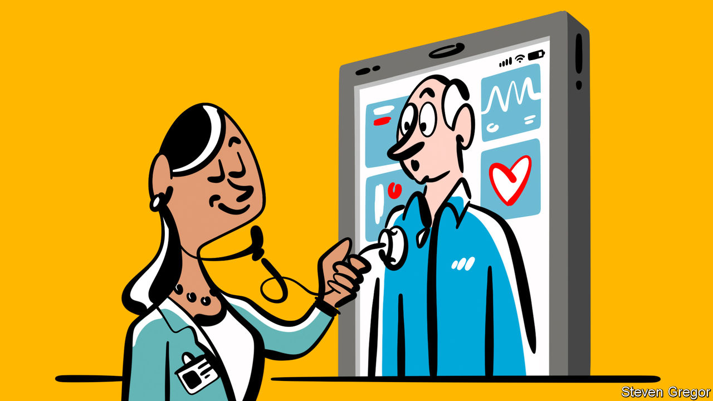

###### Introducing the VHS

# How the rapid growth of virtual wards is helping the NHS 

##### One way to increase capacity in hospitals as winter approaches 

 

> Nov 2nd 2023 

There is never going to be one answer to the problems of the National Health Service (NHS). But by preventing admissions to hospital in the first place, or enabling an earlier discharge date, virtual hospital wards promise to offer a practical solution to shortages of real beds.

Virtual wards is a fancy term to describe low-risk patients who are monitored at home. Patients are given electronic doodads—blood-pressure cuffs, thermometers, oximeters—so that hospital staff can collect data about their health in real time. They are not new but their roll-out accelerated during the pandemic. Given the approach of both winter and an election, the pace is not letting up. The NHS in England reached 10,000 virtual beds this autumn—actual beds total about 140,000—and wants to have 24,000 of them by the end of next year. During one period this summer, 14 beds were being added daily, says Ben Horner of Boston Consulting Group.

Hertfordshire Community NHS Trust runs its virtual ward, with help from a tech firm called Doccla, from a nondescript office building on the edge of Stevenage. It looks like a call centre, except that nurses, doctors and pharmacists are the ones sitting in front of screens. These display lists of patients alongside their vital signs, such as pulse rate, oxygen saturation, blood pressure and temperature. The measurements taken depend on what kind of ward it is. Virtual wards today are often for geriatric or respiratory patients. But their use in cardiology and other areas is growing. 

The benefits of virtual wards to a hospital system that is chronically short of real beds, especially during the winter, are obvious. Virtual beds can be created far more rapidly and cheaply. Patients seem to like them—most people, unsurprisingly, prefer to remain at home with their families, sleep undisturbed by nurses changing shifts and eat their own food. If patients don’t go to hospital they will not pick up an infection nor bring one in. 

Operating 10,000 virtual beds should release about 7,500 actual beds, says Mr Horner (the disparity is because virtual patients are discharged a bit more slowly than those in hospital). That “takes our high occupancy rate in winter back down to the magic number of 91%”, a threshold that allows hospitals to run better. A range of other benefits has been proposed, such as faster recovery times. 

Charles Tallack, director of data analytics at The Health Foundation, a think-tank that is analysing virtual wards, says the challenge in assessing them is their heterogeneity. Some are not tech-enabled at all; they just comprise patients at home who get a daily call asking about their activity and how they are feeling. But overall he says that virtual wards are “broadly promising”. Everyone seems to agree that the costs per day of virtual wards are lower; Mr Horner puts this at about a third of the cost of a real one. But how much of this gain is lost because of longer stays in virtual beds is not yet known. 

The NHS has to get a more precise handle on these costs and benefits soon. The central pot of money that the government has set up to establish virtual wards is due to run out next year; trusts will then need to pay for them out of their own budgets, and will want to know what they are getting. Virtual wards are not without challenges—a lack of standardisation and guidance on how they should be set up and run is already a concern. There are no rules on what staffing ratios should look like, for example, though anecdotally a ratio of one nurse to every 30 patients seems to be common (an equivalent NHS ward is not meant to exceed a 1:8 ratio). 

As technology progresses, some wonder if entire virtual hospitals for some patients might be possible. The government might fulfil its pledge to have 40 new hospitals by the end of the decade, after all. ■


