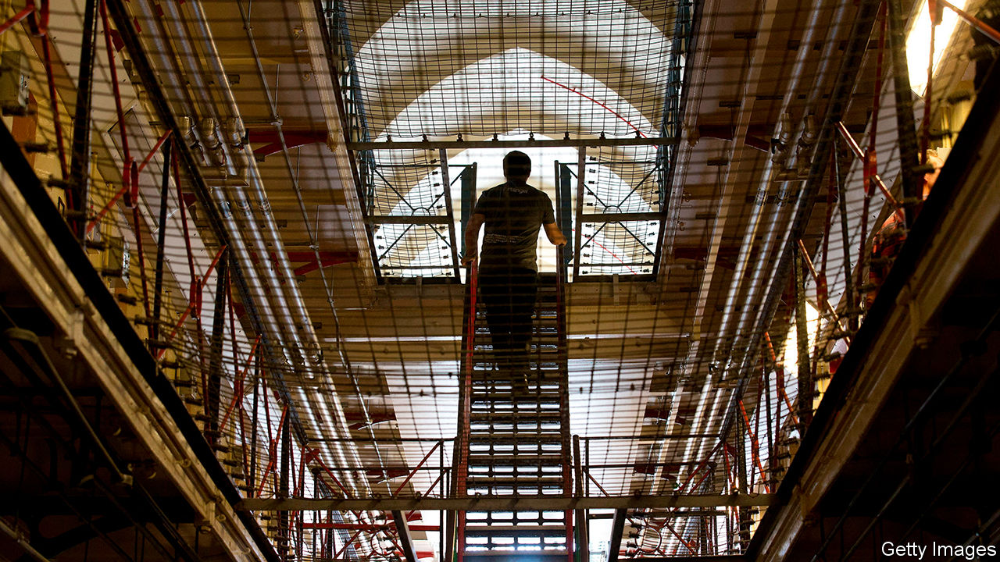
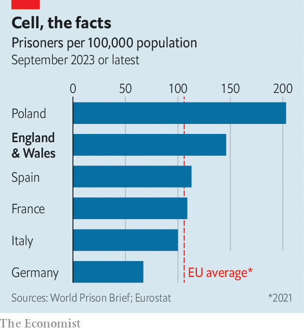

###### Wasted time

# The blight of Britain’s prisons 

##### Overcrowded and understaffed, they are at crisis point 

 

> Nov 2nd 2023 

Judith Feline loved being a prison governor. The former boss of hmp Maidstone in Kent relished the challenge of helping prisoners “become better people”. Small, everyday interactions were a crucial part of that, she reckoned. But twin challenges—a rising prison population and a shortage of staff—meant this was becoming increasingly unachievable. “I didn’t want to stop loving my job,” she says. So last year she took early retirement.

Ms Feline’s experiences mirror those of innumerable prison workers. In October data from the Ministry of Justice (MoJ) revealed the prison population of England and Wales had hit an all-time high—only a few hundred short of official capacity. Most British prisons have long been overcrowded. A dramatic escape from Wandsworth prison in London this summer showed it was holding more than 1,600 men, though it was built for 1,000. 

The situation has been dreadfully exacerbated by a shortage of prison guards. In 2013 the MoJ introduced a voluntary redundancy scheme for prison officers, the effects of which were so dire it tried the following year to rehire many of those it had paid off. In his most recent annual report Charlie Taylor, the chief inspector of prisons, said every inspected institution suffered from staff shortages. 

For prisoners, this has been calamitous. It may seem a simple thing, says Ms Feline, to put another bunk in a cell that already sleeps one, or even two. (Most of Britain’s prisons were built in the 19th century when cells were intended for one.) But in jammed, understaffed jails, people are locked up for far longer: 22 hours of confinement is not uncommon. 

“It’s awful to hear people describe spending endless hours doing nothing locked in their cells,” says Andrew Neilson, director of campaigns at the Howard League for Penal Reform, “and how self-harm, drug use and violence are all rising as the situation gets worse and worse.” In the year to September 2023 the number of suicides in prison rose by 24%. All this means prisons are failing in one of their chief purposes: to rehabilitate. Prisoners cannot “do the stuff they need to do to show they are worthy of an early release,” says Ms Feline. “It’s disheartening”. 

 


This perfect storm of failures has been gathering since the mid-1990s, when a more punitive sentencing policy was introduced. Since then most types of crime have seen “sentence inflation”, says Mr Neilson. The average sentence for murder was 20 years in 2020, up from 12.5 years in 2003. No government has tried to reverse this trend, which is why the prison population of England and Wales is now nearly double what it was three decades ago. 

But the situation has now become so bad that the government cannot ignore it. In October Alex Chalk, the justice secretary, announced a series of emergency measures to tackle overcrowding. Some are better than others. 

One, limiting  (of less than 12 months) for low-level offenders, should have been introduced long ago. Research shows that for such petty criminals, many of whom are drug addicts, short prison sentences result in higher levels of reoffending than community sentences. Community options are cheaper, too. And because chaotic, low-level criminals (who are the main conduit for drugs into jails) make prisons more difficult to run, reducing their number may also make it easier to recruit prison staff. 

Another initiative, releasing some prisoners who are serving sentences of less than four years 18 days early, is also sensible “and not alarming for the public,” observes Pia Sinha, chief executive of the Prison Reform Trust and a former prison governor. She notes, however, that it is unclear how much difference it would make given that it seems likely to be limited to certain prisons and prisoner-types.

These measures, like most that would reduce overcrowding, have a major flaw: they would put more pressure on the , which manages community sentences and oversees some prisoners after they have been released. The probation service is itself in shockingly bad shape, and badly needs reforms of its own. 

Another initiative announced by Mr Chalk, of sending prisoners overseas, has been tried elsewhere; both Belgium and Norway have in the past rented cells in the Netherlands. Mr Neilson says that ensuring domestic laws—on family visits, say, or prisoners’ rights to speak to a lawyer—are followed on foreign soil can be fraught. No more than a few hundred prisoners are likely to be dealt with this way, he reckons. 

The government is also considering two further measures. The prison population has increased sharply since the pandemic because  have increased the numbers on remand (ie, suspected criminals who are locked up before they get to court). Their number has risen from 9,000 in 2019 to over 15,000 in 2023. The MoJ is considering giving them longer to plead guilty before they get to trial; since guilty pleas result in reduced sentences, that would help. It should also stop imprisoning so many offenders who infringe the terms of their licence on release. Most of those infractions, such as going abroad without permission, are not crimes in the normal sense of the word.

Yet none of these will be enough to ease the crisis in prisons. Partly because it is recruiting more police officers, the MoJ expects the prison population to reach 98,700 by 2026, up from around 88,000 now. Its prison-building programme is not keeping pace, so what is to be done?

For one thing, the MoJ must recruit more prison officers and find ways to retain them. “It’s not just about numbers,” says Ms Feline, the former governor. “There’s nothing like working on the landing. You can be trained, but the real training is experience.” She says her old prison in Kent has lost a lot of workers to the border force. The inspector of prisons says elsewhere in south-east England prison staff are leaving for the police. Better pay may help. But making prisons less crowded and dysfunctional would mean fewer staff left for less stressful jobs.

Perhaps most importantly, the MoJ must push for a reduction in the length of sentences. There is little point giving criminals more time if they spend it in their cells, becoming more violent, hopeless and, in many cases, mentally unwell. This, however, would be a major undertaking, not least because politics plays such an unhelpful part in criminal-justice policy. The Labour Party, assuming it forms Britain’s next government, will not want to be seen single-handedly to undo the tough-on-crime policies of the Tories. A cross-party parliamentary inquiry or even a royal commission might be one way to defuse this problem. “A crisis of this scale calls for systematic change,” says Ms Sinha. “It’s time to get experts round a table, look at what works, take politics out of it.” ■


