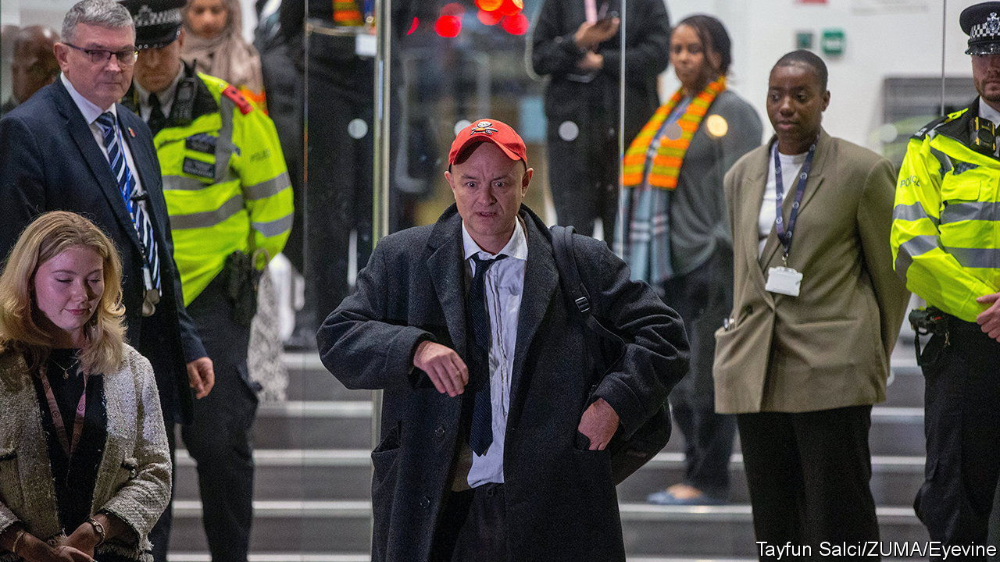

###### I swear, your honour. A lot

# The covid-19 inquiry exposes chaos in Boris Johnson’s government 

##### Wrong people, wrong place, wrong time 

 

> Nov 1st 2023 

IT WAS EASY to get distracted by the foul language. Did Dominic Cummings regret calling ministers “useless fuckpigs”, “morons” and “cunts” in WhatsApp messages, or describing the Cabinet Office as “terrifyingly shit”? Giving evidence to the covid-19 inquiry on October 31st,  to Boris Johnson was characteristically caustic. If anything he had “understated” the scale of the dysfunction within the government as it grappled with covid. 

Many countries have completed short, sharp exercises to draw lessons from the pandemic. Britain’s sprawling inquest will try to dissect the functioning of almost every part of the state. Witnesses will be questioned until at least 2026. Lawyers will pore over a vast trove of documents and try somehow to pin down a narrative. 

In retrospect,  of the pandemic does not appear as bad as it once did. On a crude measure of excess deaths, the country ranks close to the middle of the pack, helped greatly by an impressively fast vaccine roll-out. But the inquiry will look at why Britain did so badly before the jabs arrived, probing government decisions over lockdowns, care homes and public-health guidance. This autumn’s hearings, focused on 10 Downing Street and the Cabinet Office, will be among the juiciest sessions. Hovering over them is one question: was the British state badly prepared or were individuals in power spectacularly unsuited to the job?

It is already known, for example, that the country’s national risk assessment failed to anticipate and plan for a novel pathogen, and that the state was slow to adapt the plans it did have for a flu pandemic. The Cabinet Office lacked basic data to track what was happening. In 2021 Mr Cummings told a parliamentary committee that departmental responsibilities for the crisis were horribly muddled. This week he reiterated that the core part of the state supposed to prepare for emergencies was glacially slow to respond. 

Yet the big-name witnesses now appearing on the stand heighten the sense that the chaos was driven by individuals. The portrait of Mr Johnson as a prime minister who was unserious, indecisive and unable to grasp detail is hardly new. Memorable colour is being added, though. In one message Mr Johnson ponders whether older people should accept their fate (while demonstrating a sketchy grasp of the concepts of “median age” and “life expectancy”). As a former media adviser put it on the witness stand this week, covid did “not suit his skill set”. (Mr Johnson himself is expected to appear next month.)

As for Mr Cummings, he styles himself as a truth-telling maverick interested in systems. Yet he appears to have been incapable of running a functioning office. At one point he moans that meetings in Number 10 did not function on a basic level, when he had been the prime minister’s chief of staff for seven months. On November 1st Helen MacNamara, the then deputy cabinet secretary, described an environment that was toxic, macho and sexist. 

All of which raises difficult questions for Simon Case, the cabinet secretary, who is yet to give evidence. It also bodes ill for Rishi Sunak, who will also appear before the inquiry next month. It is not just that the prime minister will face tough questions about his time as chancellor. It is that Mr Sunak has spent the past year  memories of his chaotic predecessors. Instead, the circus is back. ■


