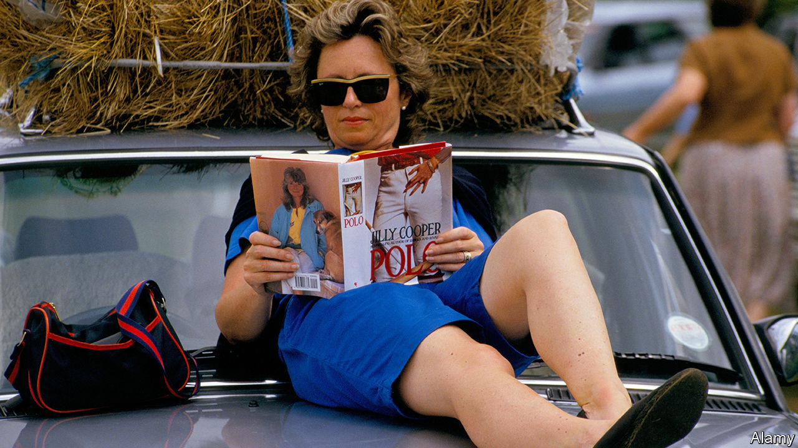

###### Sex and horses

# The genius of Jilly Cooper, queen of British bonkbusters 

##### The magic and the meaning of an 86-year-old social pornographer 

 

> Oct 30th 2023 

Jilly Cooper novels are smutty, sexist and snobbish. They have titles such as “Mount!” and “Score!” and “The Man Who Made Husbands Jealous” and are not easily mistaken for the collected works of Jane Austen. Their cast lists feature characters such as Rupert Campbell-Black (“nirvana for most women”), Bethany (a “nymphomaniac”) and Cadbury (a Labrador). Her novels contain far too many appearances of the word “wet” and a frankly distressing number of “thrusts”. They are reprehensible in almost every way. They are, in other words, great fun. And they also say something about how Britain has changed during Ms Cooper’s long career. 

The release of her latest novel, on November 9th, will be a peculiar publishing event. Everything from its nudging title (“Tackle!”) to its cover (more tackle—perhaps even tackle!—in white shorts) suggests that this is the sort of book that literary London will sneer at. In fact, literary London almost certainly will not. Ms Cooper has written 18 novels and sold over 11m copies in Britain alone. She has built up not so much customers as a congregation, less readers than religious believers. Her followers range from the prime minister,  (“You need to have escapism”), to Cambridge dons (she is, one wrote, “precise, insightful, witty”). 

Such public displays of affection surprise many who haven’t read Ms Cooper’s novels, and can particularly surprise the young. Ms Cooper’s style is not what you would call “woke”—and it is certainly not feminist. Feminists do appear in her pages: they can usually be spotted by their hairy legs and their fondness for the . In one Cooper novel, a boy asks his father who Florence Nightingale was. The father answers briskly: “A lesbian.” But then if Ms Cooper is out of touch that is hardly surprising. She is 86 and, like most who live so long, is anachronism incarnate—a living reminder that social and sexual changes which appear prehistoric to younger minds were in fact pretty recent. 

It was only in 1975, the year in which her first novel, “Emily”, was published, that British women finally gained the right to open bank accounts without a male signatory. When “Riders”, the first of her novels set in the fictional county of “Rutshire”, was published ten years later, Debrett’s guide to “Etiquette and Modern Manners” could still be read earnestly rather than ironically. Its 1981 edition included advice on everything from how to address a marchioness (“Lady”) to how to deal with a butler (let him buttle). It instructed on how to handle asparagus (demurely), corn on the cob (so messy it is best saved for those whose love you are sure of) and even “Sexual Relationships” (see corn on the cob). 

Openly admitting to reading “Jilly” also surprises some people because it seems akin to openly admitting to an enthusiasm for porn. It is not entirely unreasonable to assume that her novels are all about sex. Her books were among a group of novels that led to the introduction of the term “bonkbuster” into the Oxford English Dictionary in 2002. There are lashings of sex in them—at times there are even lashes. But the idea that they are pornographic is simply wrong, says Dr Ian Patterson, a fellow in English at Cambridge University, since in a Cooper novel sex is “just to do with fun” and not there “to titillate”. 

In fact the real pornography here is social, not sexual. Her books are filled with sweeping lawns, puce-faced colonels and above all, handsome upper-middle-class Englishmen. Her hero, Rupert Campbell-Black—the hyphen gets heavy use in her stories—is said to be partly based on Andrew Parker Bowles, the current queen’s first husband. Her books linger lovingly over cads as they drink, smoke, swear and fondle fat Labradors and slender women in stone-flagged Cotswold kitchens. 

It is not all light; there are villains in Rutshire. They are called “socialists” and can be recognised because they wear sandals, drink your champagne and complain about things. But true darkness rarely breaks into Ms Cooper’s writing. Evelyn Waugh once said of P.G. Wodehouse, a comic novelist, that his was a world in which there “has been no Fall”—no evil had broken into his Eden. And, despite the sex and the smut, so it is with Ms Cooper’s books. Her novels have “a relentless faith in human good nature, of a quite old-fashioned sort”, says Dr Patterson. 

And when things do go wrong, her characters don’t talk about it. Because perhaps the most archaic thing of all about her novels is that the good never complain. One of the most striking entries in that updated Debrett’s edition appears in the section on “Royal, Diplomatic and Formal Occasions”. Beneath the advice on what to wear (hats) and how to behave (toadyingly) comes the heading “Choking” (on food, that is). “If it happens it happens,” Debrett’s advises, but you should “do it as discreetly as possible”. Ms Cooper comes from this school of . When she was involved in a terrible train crash in 1999, she simply said: “I know how lucky I am.” She has expressed bafflement at modern men who have beards and “cry all the time”.

There are plots in her books—stuff about football and horse-jumping. There are flaws, too. The recent novels in particular are more sprawling and less sharp. But that barely matters. Ms Cooper has created not merely stories but a world. Like Dickens’s London or the Brontës’ Yorkshire or Austen’s “—shire”, “Rutshire” is a place you know the moment you open the page, where people have clipped accents, rambling houses and, most important, fun. ■


