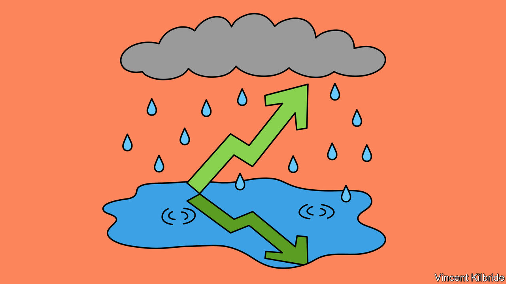
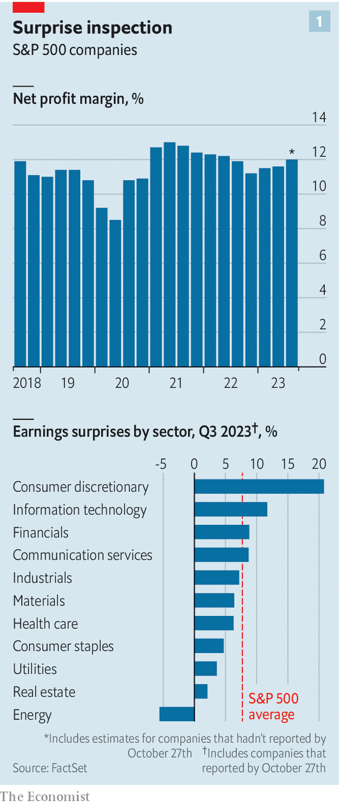
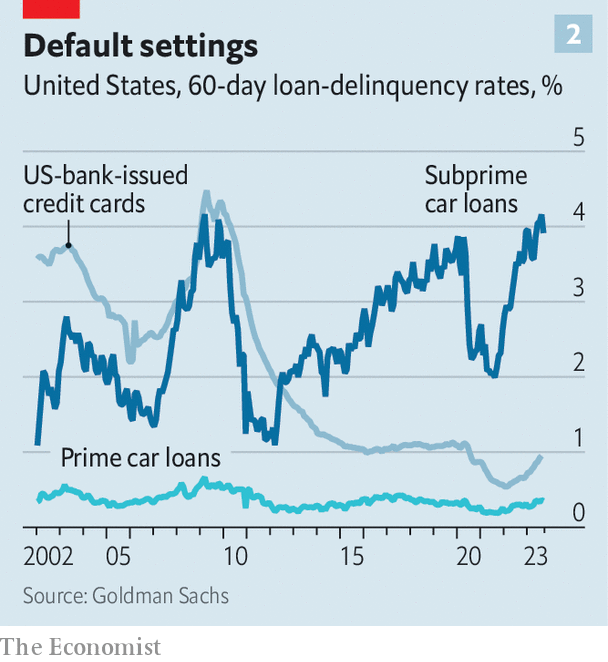

###### Heady, with headaches

# America’s economy is booming. Why aren’t its bosses happier? 

##### Companies’ earnings calls have hardly been celebratory 

 

> Oct 29th 2023 

Good news about  seems to keep rolling in. In the third quarter gdp expanded by a barnstorming 4.9% in annualised terms. Heading into earnings season, the month or so each quarter when most firms report their latest results, a stream of upbeat economic figures led  analysts to hold their  for the quarter steady, rather than trim them as they normally do. Many called the end of America’s corporate-earnings recession. 

 


Such optimism now looks justified. Following a hat-trick of consecutive year-on-year quarterly profit declines, America Inc’s bottom line is growing again. According to FactSet, a data provider, of the roughly half of big companies in the S&amp;P 500 index that have reported their latest results, 78% have beaten profit expectations (see chart 1).

Yet the mood during the quarterly carnival of conference calls has hardly been celebratory. Plenty of bosses failed to excite investors despite bringing them sound results. The reaction to the performance of big tech was particularly discordant. Alphabet, Google’s parent company, heartily beat profit forecasts but saw its share price sink by 10% after investors were underwhelmed by how its cloud-computing division was doing. Meta’s warning on macroeconomic uncertainty meant that the social-media empire’s biggest-ever quarterly revenue figure went unrewarded by markets. The lingering possibility of a recession and anaemic levels of corporate dealmaking overshadowed banks’ profits from lending at higher rates of interest. 

Why the gloom? A boom in the third quarter notwithstanding, the future health of America’s consumers remains bosses’ principal worry. Small wonder. American businesses draw more than a third of their revenues directly from domestic consumers’ pockets, according to Morgan Stanley, a bank. Shoppers have seemed indefatigable lately; retail sales grew by 0.7% in September, compared with August. Coca-Cola and PepsiCo both raised their profit guidance for the rest of the year. But recently their growth has been the consequence of price rises rather than selling more fizzy drinks and snacks.

 


Other cracks are beginning to appear. According to Bank of America, credit- and debit-card data show a downturn in spending in October, compared with a year ago. Last month Americans with student loans had to resume debt payments after a three-year reprieve. In aggregate, spending is now growing faster than real disposable income, eating into savings. At the same time, credit-card and car-loan delinquencies have been ticking up (see chart 3). Consumers tell surveys that they are gloomier about their financial situation—and who can blame them? 

That is worrying chief executives. UPS, a delivery firm, said Americans were spending less on goods and more on services, dampening its outlook for profits. Mattel, a toymaker which owns the Barbie brand, among other things, delivered a blockbuster quarter but its outlook for Christmas was a flop with investors. Bosses at Alphabet say that the technology titan’s data showed customers hunting harder for deals and offers of free shipping for goods. On Tesla’s investor call Elon Musk bemoaned the effect of rising interest rates on consumers’ ability to afford the company’s electric cars. (Though, as Mr Musk also admitted, some of the carmaker’s problems were home-made: “We dug our own grave with the Cybertruck.”) Since the call, Tesla’s share price has fallen by 15%, wiping more than $100bn off its market value.

Companies are also closely watching their costs, especially for labour. Margins were boosted by cooling wage inflation across the economy and the summer of strikes is at last winding down. In September Hollywood writers agreed to up pens. In the past week the United Auto Workers (UAW) union struck deals with Ford, General Motors (GM) and Stellantis (whose biggest shareholder also part-owns ’s parent company); its members are returning to the factory floor. 

But workers, especially in Detroit, have extracted higher wages and other concessions. And the weeks-long stoppages have already cost the carmakers dearly. Stellantis, whose marques include Chrysler and Jeep, said that they shaved $3bn from its sales. GM, which held out the longest of Detroit’s “big three”, withdrew its profit guidance for the year. So did Illinois Tool Works, which makes car parts. Even Bosses at Delta Air Lines complained that fewer passengers were landing in Motor City, possibly as a result of the labour unrest. 

Happenings farther afield were also weighing on bosses’ minds. A refrain in many earnings calls was sadness at the loss of life in Israel and Gaza. Yet for now at least, conflict in the Middle East is not having large financial effects on American companies. A few firms signalled caution—Snap, a social-media firm, said some advertisers in the region paused spending as a result of the hostilities. But corporate America as a whole earns a vanishingly small part of its profits in the volatile region. American bosses who examine the direct risks posed to their business by the war in Gaza are likely to conclude that they are much smaller than the costs of, say, unwinding operations in Russia, let alone the existential worries about America’s relationship with China. 

Bosses were silent on a bigger long-term threat to earnings: higher interest rates. During the past year the fortunes of big business have diverged from those of smaller firms, especially ones owned by private-equity funds, as they have been largely immune to the soaring cost of capital. Bank of America reckons that more than three-quarters of debt borrowed by S&amp;P 500 firms is both long-term and fixed-rate, compared with less than half in 2007, when ten-year Treasury bond yields last exceeded 5%. Eventually, however, big businesses’ debt piles will need to be refinanced at a higher rate of interest, which will squeeze profits. The earnings recession might have ended in the third quarter. But plenty of threats still lie ahead. ■


