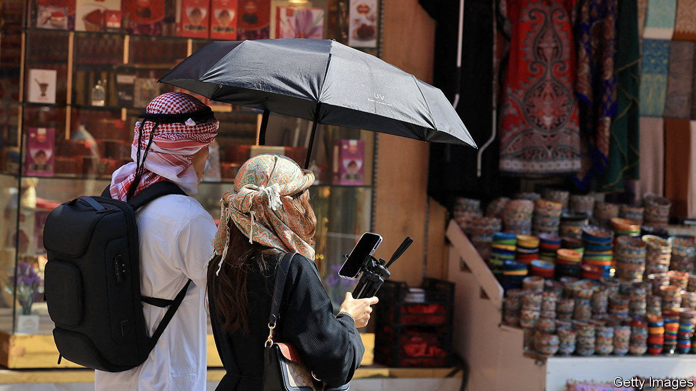

###### Holding pattern

# Can Israeli-Emirati business ties survive the Gaza war? 

##### The commercial logic of the rapprochement is sound. The politics is trickier 

 

> Nov 2nd 2023 

IN 2020 MIDDLE EASTERN commerce was transformed. The United Arab Emirates (UAE) and a few other countries signed the Abraham Accords with Israel, normalising relations between the Jewish state and some of its Arab neighbours. Israeli tourists flooded into Dubai on the first ever direct flights. In the first eight months of 2023 Dubai welcomed almost 230,000 travellers from Israel, 73% more than in the same period last year. Nowadays travel agencies in Tel Aviv even offer bar-mitzvah tours in the emirate, with pit stops at kosher restaurants. 


Business dealings have blossomed, too. The UAE-Israel Comprehensive Economic Partnership Agreement came into force in April. Official trade between the two countries is expected to surpass $3bn this year, from nothing in 2019. Last year Abu Dhabi’s sovereign wealth fund, Mubadala, reportedly invested $100m in six venture-capital (VC) funds based in Israel or focused on Israeli startups. It also bought a $1bn stake in an offshore natural-gas field from NewMed Energy of Israel. Israeli technology companies such as Liquidity Group, a fintech darling, have opened research-and-development centres in the UAE. Israeli and Emirati universities have forged research partnerships on things like artificial intelligence.

All of this progress is now at risk as a result of the war raging between Israel and Hamas. Since the conflict erupted, reports one Israeli entrepreneur, many Emirati contacts have gone silent. An Israeli-American investor who splits his time between Dubai and Tel Aviv worries that even after the conflict abates, Arab firms will think twice about transacting with Israeli ones.

That would be unwelcome for Israel and the UAE alike. Israeli business confidence was slumping even before the hostilities in Gaza. Proposed reforms to weaken the supreme court worried corporate bosses. Amid a worldwide VC winter, Israeli startups raised less than $4bn in the first half of 2023, the lowest since the same period in 2018. More than two-fifths of Israeli companies surveyed in late October reported that their prospective backers had cancelled or delayed investment agreements. Israel’s businesses could therefore use the UAE’s deep pools of capital and access to its domestic market, especially as their country recovers from hostilities that are, according to surveys, already affecting four in five of its tech firms. 

The UAE, for its part, covets Israeli know-how, which could accelerate the country’s economic diversification away from oil and help it keep up with competition from its bigger neighbour, Saudi Arabia, itself in the throes of a modernisation drive (and, until the Gaza war, on course to forge diplomatic ties with Israel). In the past decade private investment in the UAE has declined as a share of GDP. Although the government has put in place various incentives for entrepreneurs, from accelerator programmes to credit guarantees, the IMF has recently pointed to the “weak technology content” of the Emirati economy. Most new tech ventures end up looking like copycats of stale e-commerce businesses. Israel, with its keen technological acumen in areas from digital technology to water desalination and a culture of free enterprise, has a lot to teach the Emiratis.

The commercial logic of continued rapprochement, then, remains sound. Many businesspeople in Israel and the UAE know it—and are hoping that the current pause is just that, rather than a collapse. ■


