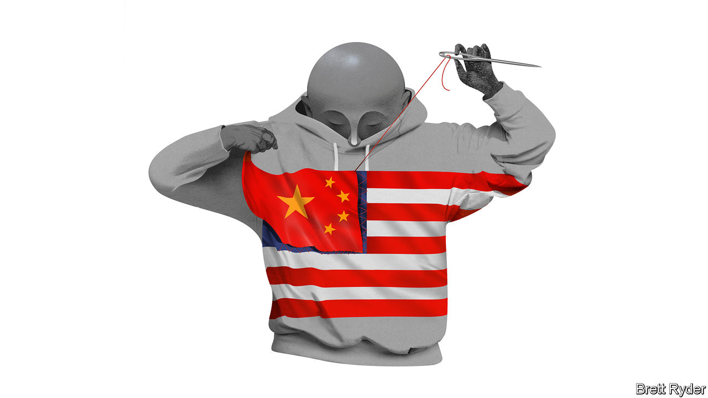

###### Schumpeter

# Chinese apps are a mixed blessing for American big tech 

##### How long will the advertising blitzes of Shein and Temu last? 

 

> Nov 2nd 2023 

During the past year Shein and Temu, two ultra-fast-fashion upstarts famous both for $5 frocks and for playing down their Chinese heritage, have waged an internecine legal battle in America. Singapore-based Shein, the better-known of the two, threw down the frilly gauntlet, accusing Temu, which has invaded its territory in America, of stealing its trademarks and using social-media influencers to disparage it. Temu, which is based in Boston but owned by PDD, a Chinese e-commerce giant, struck back. It accused Shein of monopolistic practices like using its market power to force a network of 8,000-plus suppliers in China to refuse to do business with Temu. Then, on October 27th, Reuters reported that the firms had suspended hostilities. 

To observers in the West these goings-on might once have seemed like an entertaining sideshow. But they illustrate that the cut-throat drama of Chinese e-commerce has now arrived in America. The fortunes of Shein and Temu are intricately bound up with those of some of America’s biggest technology firms, such as Meta, with its social-media empire, Alphabet, owner of Google, and Amazon, America’s e-commerce behemoth—not to mention physical retailers like Walmart and the dollar stores ubiquitous across American strip malls. No one likes to say this out loud, but for all the talk of Sino-American decoupling, China-linked e-commerce platforms are muscling into American business with the same shock-and-awe tactics that TikTok, a video app, used to besiege social media. For digital advertisers it is a mixed blessing. For discount retailers it is a curse. For everyone it may change the warp and weft of cross-border commerce. 

Take advertising for starters. In its third-quarter results announced in late October, Meta revealed that advertisers from China, including e-commerce and gaming firms, had an “outsized” impact on revenue growth. Meta did not name the firms or quantify their impact, but supersleuths went to work. One was Brian Wieser, a former adman turned analyst, who five years ago first drew attention to the importance of Chinese advertisers on Facebook after spotting differences in company data between the geographic location of those who sell ads on its platforms and those who see them. Only this year did Meta start acknowledging China’s importance, vindicating his work. Using similar location data, MoffettNathanson, a research firm, estimates that Shein and Temu provided nearly a third of Meta’s revenue growth in the nine months to September, or almost $3bn (a figure well short of Mr Wieser’s estimates). Alphabet, too, is reaping the bonanza. Tinuiti, a marketing firm, says that in the third quarter Temu was as big a competitor in auctions for ads on Google Shopping as Walmart. A year ago the fledgling firm was nowhere.

Then there is e-commerce. Amazon’s platform has long hosted sellers of cheap goods from China. They seldom advertise their provenance. Nonetheless, Juozas Kaziukenas, founder of Marketplace Pulse, an e-commerce research firm, has combed through physical addresses to estimate that many merchants selling on Amazon are based in China. As Shein and Temu surge in popularity, some of those vendors may switch to their platforms. For now, Mr Kaziukenas does not expect the cut-price duo to materially challenge Amazon’s business, which is much bigger, has a broader range of goods for sale and vastly outpaces them on speed of delivery. That said, if e-commerce in China is any guide, the upstarts will not rest until they have taken market share from American competitors, undaunted by their rivals’ heft. TikTok, too, is becoming a force to be reckoned with in online shopping, using live jamborees to attract shoppers, a common practice in China. MoffettNathanson calls the triple-barrelled onslaught the “biggest disruptive threat” to e-commerce in years. 

If the Asian trio loom so large, why are America’s tech giants so hush-hush about them? For those enjoying the ad windfall, one reason may be questions about the longevity of Shein’s and Temu’s marketing sprees. In mass-market retail, with wafer-thin margins, pouring billions of dollars into digital ads is a road to ruin if it goes on too long. Meta and Alphabet may not want to draw attention to the potential volatility of the revenue streams. 

Political headwinds in America may be mounting, too. Sinosceptics in Congress, in a similar tizzy about Shein and Temu as they are about TikTok, accuse the fast-fashion duo of exploiting an exception in American law that allows packages under $800 in value to enter the country duty-free and with scant inspection. It reckons the two firms are responsible for 30% of packages entering America under this rule. Closing the loophole could significantly cut the discounts the two platforms offer in America. Moreover, their algorithms draw on oceans of data about shoppers. That opens them up to the same attacks as TikTok. 

One risk that the retail firms are apparently spared is a crackdown in China. With headquarters outside the country, they are less likely to suffer the fates of successful Chinese tech firms that have fallen foul of President Xi Jinping in recent years. Sky Canaves of Insider Intelligence, a data-gatherer, says their success may in fact be helping their Chinese suppliers offset the economic slowdown at home. She thinks that will boost their standing with the government. 

The cat is out of the bag

It is not clear why Shein and Temu settled their legal grievances, but it will surely be a relief to the powers that be in Beijing. After all, a common front is better for the country’s image abroad than a catfight on the digital catwalk. Whether the truce means they will spend less to out-market each other remains to be seen. But American tech giants are in a new world order. They are still largely shut out of China. China, by proxy, is all over their home turf. The new competition no doubt frustrates big tech. To its customers, it is a neatly wrapped gift. ■


