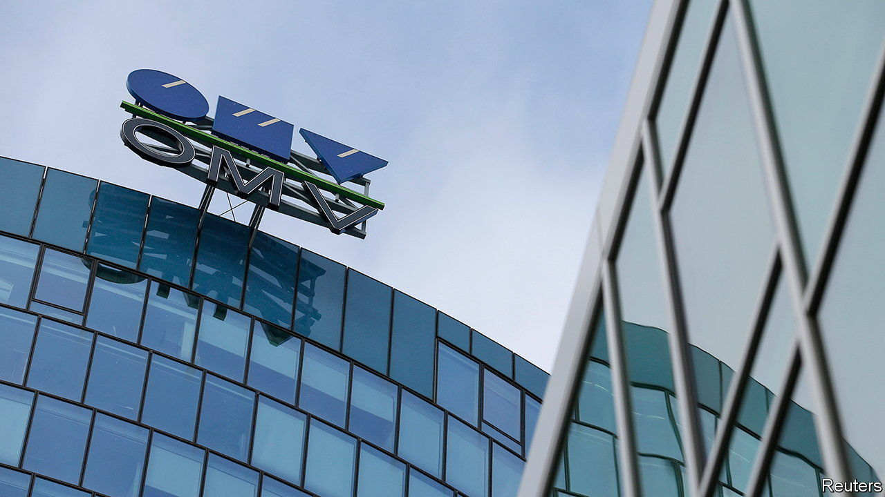

###### Plastic surgery

# OMV, Austria’s energy major, reimagines its future 

##### Less carbon, more plastic 

 

> Nov 2nd 2023 

WHEN HE became chief executive of OMV in September 2021, Alfred Stern had one word for Austria’s oil-and-gas major: plastic. Having previously run the concern’s chemicals division, Borealis, he saw that business, not fossil fuels, as OMV’s future. Global demand for carbon-emitting products will sooner or later peak. That for virgin plastics used in packaging is forecast to increase on average by 4.7% a year until 2030, faster than world GDP; for recycled plastics it will expand by as much as 12% annually. 

Mr Stern must have seemed prescient to his underlings in February 2022, when Russia, from which OMV was buying most of its natural gas, invaded Ukraine. A month later he publicly unveiled his new strategy. From now on the company would focus on producing and selling sustainable fuels, chemicals and materials—with an emphasis on “sustainable”. It would gradually wind down its production of oil and gas. OMV’s boss wants the oil-and-gas division to account for 30% of the group’ operating profit by the end of the decade, compared with an average of 44% between 2019 and 2021. Chemicals would make up half, up from 29%.

Such a transformation would be ambitious at the best of times. With global markets for energy, chemicals and materials all being buffeted by geopolitical and economic forces, it seems almost brazen—especially when other oil-and-gas companies are revising their green plans and doubling down on crude. 

On October 31st OMV said that sales slumped by nearly half in the third quarter, compared with a year earlier, to €9.5bn ($10bn). Net profit plummeted by almost two-thirds, to €431m. Both the energy business (the exploration and production of oil and gas) and the fuel and feedstock unit (which supplies the chemicals industry) did worse than forecast. Borealis beat expectations, but still reported a loss of €11m. 

Investors nevertheless seem happy with the thrust of Mr Stern’s plan. Some of the earnings slide was merely a return to earth from a period of sky-high prices for oil and gas that had boosted profits a year ago. Many applauded his announcement in the earnings call of a joint venture with Interzero, a German firm, to build Europe’s largest sorting plant for chemical recycling in southern Germany. Oleg Galbur of Raiffeisen International, an Austrian bank, thinks that the chemicals unit in particular has plenty of room for improvement once the cyclical industry recovers from the current economic slowdown in large markets such as China and parts of Europe. 

The division’s prospects could brighten further if talks between OMV and Abu Dhabi National Oil Company (ADNOC) aimed at uniting Borealis and Borouge, the Emirati giant’s chemicals unit, succeed. That would create one of the world’s biggest makers of polyolefin plastics, which would be listed and owned in equal parts by OMV and Adnoc. (Borealis already owns 36% of Borouge and ADNOC 25% of Borealis.)

Mr Stern’s biggest challenge will continue to be dealing with the fallout of his company’s close business ties with Russia. In 2018 his predecessor, Rainer Seele, signed a deal with Gazprom for gas deliveries until 2040. Mr Stern has made clear he is not planning to renege on that contract. But he had to write off €2.5bn in Russian assets, including a €1bn investment in Nord Stream 2, the defunct gas pipeline from Russia to Germany. 

During the latest earnings call Mr Stern was at pains to reassure investors that OMV could honour its gas-delivery contracts even if Ukraine’s government lived up to its intention of stopping the transit of Russian gas through pipelines on its territory by the end of 2024. He has made a big effort to find alternative gas suppliers, such as Norway. OMV has also signed a deal with BP, a British energy giant, to get liquefied natural gas via a terminal in Rotterdam. In July Mr Stern signed off on Neptun Deep, a joint project with Romgaz, a Romanian gas firm, to explore for gas in the Black Sea. Plastic may be the future. But OMV’s present will involve energy for a while yet. ■


