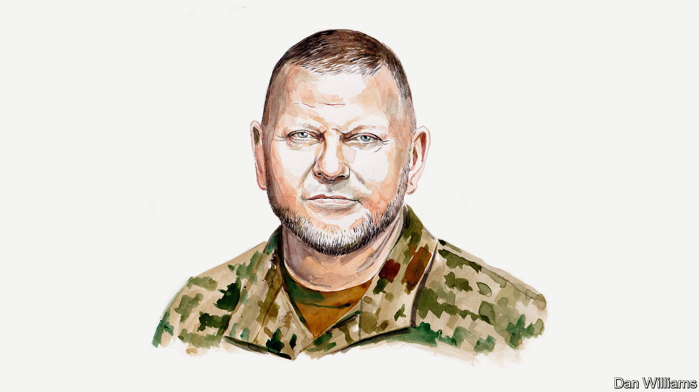

###### The war in Ukraine

# The commander-in-chief of Ukraine’s armed forces on how to win the war 

##### Technology is the key as the war becomes “positional”, says Valery Zaluzhny 

 

> Nov 1st 2023 

RUSSIA’S INVASION of Ukraine in February 2022 provoked a global security crisis. The assault on democracy by a morally sick imperial power in the heart of Europe has tilted the balance of power in other parts of the world, including the Middle East and Asia-Pacific. The failure of multilateral bodies such as the UN and Organisation for Security and Cooperation in Europe to maintain order means that Ukraine can only restore its territorial integrity by military force. 

 Ukrainians have shown their willingness to lay down soul and body for their freedom. Ukraine not only halted an invasion by a far stronger enemy but liberated much of its territory. However, the war is now moving to a new stage: what we in the military call “positional” warfare of static and attritional fighting, as in the first world war, in contrast to the “manoeuvre” warfare of movement and speed. This will benefit Russia, allowing it to rebuild its military power, eventually threatening Ukraine’s armed forces and the state itself. What is the way out? 

Basic weapons, such as missiles and shells, remain essential. But Ukraine’s armed forces need key military capabilities and technologies to break out of this kind of war. The most important one is air power. Control of the skies is essential to large-scale ground operations. At the start of the war we had 120 warplanes. Of these, only one-third were usable. 

Russia’s air force has taken huge losses and we have destroyed over 550 of its air-defence systems, but it maintains a significant advantage over us and continues to build new attack squadrons. That advantage has made it harder for us to advance. Russia’s air-defence systems increasingly prevent our planes from flying. Our defences do the same to Russia. So Russian drones have taken over a large part of the role of manned aviation in terms of reconnaissance and air strikes. 

Drones must be part of our answer, too. Ukraine needs to conduct massive strikes using decoy and attack drones to overload Russia’s air-defence systems. We need to hunt down Russian drones using our own hunter drones equipped with nets. We must use signal-emitting decoys to attract Russian glide bombs. And we need to blind Russian drones’ thermal cameras at night using stroboscopes. 

This points to our second priority: electronic warfare (EW), such as jamming communication and navigation signals. EW is the key to victory in the drone war. Russia modernised its EW forces over the past decade, creating a new branch of its army and building 60 new types of equipment. It outdoes us in this area: 65% of our jamming platforms at the start of the war were produced in Soviet times. 

We have already built many of our own electronic protection systems, which can prevent jamming. But we also need more access to electronic intelligence from our allies, including data from assets that collect signals intelligence, and expanded production lines for our anti-drone EW systems within Ukraine and abroad. We need to get better at conducting electronic warfare from our drones, across a wider range of the radio spectrum, while avoiding accidental suppression of our own drones. 

The third task is counter-battery fire: defeating enemy artillery. In this war, as in most past wars, artillery, rocket and missile fire make up 60-80% of all the military tasks. When we first received Western guns last year, we were quite successful at locating and striking Russian artillery. But the effectiveness of weapons such as Excalibur, a GPS-guided American shell, has declined dramatically owing to improved Russian electronic warfare.

Meanwhile, Russia’s own counter-battery fire has improved. This is largely thanks to its use of Lancet loitering munitions, which work alongside reconnaissance drones, and its increasing production of precision-guided shells that can be aimed by ground spotters. Despite the dismissive view of some military analysts, we cannot belittle the effectiveness of Russian weapons and intelligence in this regard.

For now, we have managed to achieve parity with Russia through a smaller quantity of more accurate firepower. But this may not last. We need to build up our local GPS fields—using ground-based antennas rather than just satellites—to make our precision-guided shells more accurate in the face of Russian jamming. We need to make greater use of kamikaze drones to strike Russian artillery. And we need our partners to send us better artillery-reconnaissance equipment that can locate Russian guns.

The fourth task is mine-breaching technology. We had limited and outdated equipment for this at the start of the war. But even Western supplies, such as Norwegian mine-clearing tanks and rocket-powered mine-clearing devices, have proved insufficient given the scale of Russian minefields, which stretch back 20km in places. When we do breach minefields, Russia quickly replenishes them by firing new mines from a distance. 

Technology is the answer. We need radar-like sensors that use invisible pulses of light to detect mines in the ground and smoke-projection systems to conceal the activities of our de-mining units. We can use jet engines from decommissioned aircraft, water cannons or cluster munitions to breach mine barriers without digging into the ground. New types of tunnel excavators, such as a robot which uses plasma torches to bore tunnels, can also help. 

My fifth and final priority is to build up our reserves. Russia has failed to capitalise on its hefty manpower advantage because Vladimir Putin is worried that a general mobilisation might spark a political crisis, and because Russia cannot train and equip enough people. However, our capacity to train reserves on our own territory is also limited. We cannot easily spare soldiers who are deployed to the front. Moreover, Russia can strike training centres. And there are gaps in our legislation that allow citizens to evade their responsibilities. 

We are trying to fix these problems. We are introducing a unified register of draftees, and we must expand the category of citizens who can be called up for training or mobilisation. We are also introducing a “combat internship”, which involves placing newly mobilised and trained personnel in experienced front-line units to prepare them.

Russia should not be underestimated. It has suffered heavy losses and expended a lot of ammunition. But it will have superiority in weapons, equipment, missiles and ammunition for a considerable time. Its defence industry is increasing its output, despite unprecedented sanctions. Our NATO partners are dramatically increasing their production capacity, too. But it takes at least a year to do this and, in some cases, such as aircraft and command-and-control systems, two years. 

A positional war is a prolonged one that carries enormous risks to Ukraine’s armed forces and to its state. If Ukraine is to escape from that trap, we will need all these things: air superiority, much-improved electronic-warfare and counter-battery capabilities, new mine-breaching technology and the ability to mobilise and train more reserves. We also need to focus on modern command and control—so we can visualise the battlefield more effectively than Russia and make decisions more quickly—and on rationalising our logistics while disrupting Russia’s with longer-range missiles. New, innovative approaches can turn this war of position back into one of manoeuvre.■


