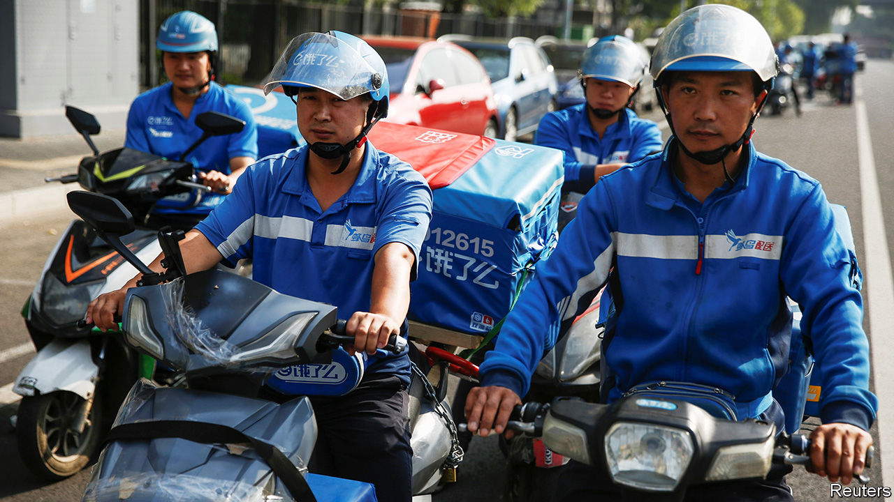

###### New tactics

# How China’s delivery drivers quietly fight to improve their lot 

##### Sometimes there is a good reason that food ordered in Beijing doesn’t arrive 

 

> Nov 2nd 2023 

China’s food-delivery drivers have a lot to complain about. Many work long days, earning as little as 5 yuan ($0.68) per delivery. Heavy rain and heatwaves do not stop them—in fact, demand is highest during such weather. Delivery apps promise fast turnarounds, so drivers, most of whom work for contractors, are sometimes fined for arriving late (not to mention scolded by customers). The only way to keep up, they say, is by running red lights and speeding. Accidents are common.

Drivers and couriers have pressed for improvements, holding around 400 protests in the past five years, says China Labour Bulletin, an NGO in Hong Kong. Perceived troublemakers can face consequences, such as being cut out of deliveries. Nevertheless, a new study suggests that labour activism among drivers may actually be more widespread than previously thought. Some are using quieter tactics to get their way.

The research was carried out by Bo Zhao of Fudan University in Shanghai and Siqi Luo of Sun Yat-sen University in Guangzhou. One of the authors spent 18 months working as a delivery driver in southern China. During this time they witnessed five small-scale strikes, none of which was known to the public. Rather than taking to the streets, upset drivers simply logged out of the app that assigns deliveries during a period when demand was high, such as at lunchtime. That was enough to cause delays to snowball, forcing the company to reject orders.

Even the threat of such action causes some supervisors to bend rules on when drivers get fined, says the study. Another piece of research, from 2021, found that small-scale strikes were sometimes effective in convincing contractors to increase (slightly) how much they pay.

It helps when the public gets involved. In 2021 a company called Ele.me said it could pay only 2,000 yuan ($273) in compensation to the family of a delivery worker who died on the job. After a backlash on social media, the company agreed to cough up 600,000 yuan. Later that year, the government demanded that delivery companies improve working conditions for drivers and couriers. But little has actually changed, says China Labour Bulletin. 

More organised and ambitious labour activism would probably lead to more gains for workers. But the Chinese government is unlikely to tolerate it. For years Chen Guojiang, a food-delivery driver in Beijing, posted videos online trying to drum up support. At one point he said he was talking to 14,000 drivers via groups on WeChat, a messaging service. He encouraged them to work together and fight for better conditions. That was too much for the authorities. In 2021 he was arrested for “picking quarrels and provoking trouble”, a vague charge commonly used to punish activists. Small, quiet victories may be the best drivers can hope for.■


