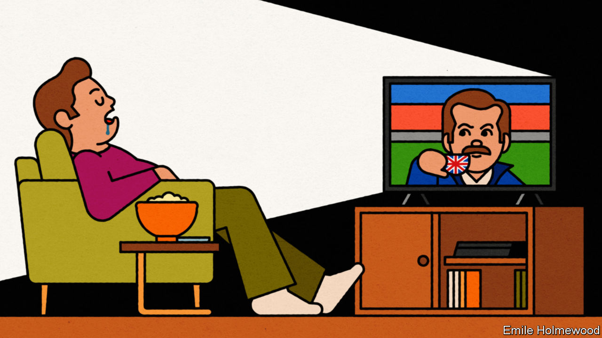
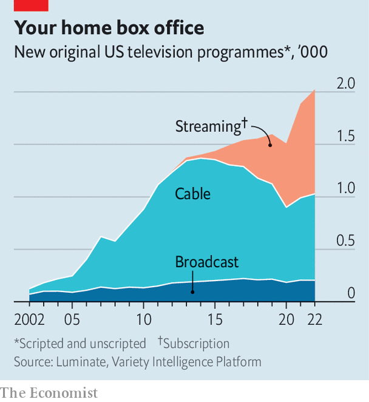

###### Television

# A golden age of TV is losing its shine 

##### How Ted Lasso killed Tony Soprano 

 

> Oct 27th 2023 

 By Peter Biskind. 

 By Walt Hickey. 

“Shh, it’s ok,” whispers Frank Underwood (played by Kevin Spacey), as he strokes an injured dog just hit by a car. As the dog whimpers, he soothes it—then, after looking the viewer directly in the eye, wrings its neck.

Not so long ago this scene, which launched Netflix’s  in 2013, would have been unshowable on American television. Broadcasters were bound by federal rules against rude or racy content and cowed by advertisers who demanded wholesome heroes and happy endings. But in the 21st century bad guys have had a good run. The amoral Congressman (later President) Underwood, the violent mobster , the cocaine-smuggling Pablo Escobar of  and the megalomaniacal media baron  have lit up the small screen in what critics have hailed as a golden era for TV. As viewers migrated from broadcast channels to cable, and then to streaming, shows became darker and more daring.

Yet today, the TV business is in flux once more—and so is the nature of its output. Insurgent streamers have settled in as cosy incumbents. Big tech firms are using streaming to promote their other products. The upshot, argues Peter Biskind in “Pandora’s Box”, a binge-worthy book about TV, is that the risky, rule-breaking shows that defined television in the early 21st century are giving way to less original fare.

Mr Biskind, a cultural critic, traces TV’s recent golden era to the  of Home Box Office (HBO), a cable network. With its “G-String Divas”, “Taxicab Confessions” and so on, HBO was initially known for “fighting and fondling”. But then it began to commission original drama series and ventured where broadcast television did not. HBO and other cable networks could ignore the nannying rules that constrained broadcasters. And their subscription fees meant no ads, and therefore no jittery advertisers demanding bland, brand-safe content. 

Writers relished this freedom. “The things I’m getting away with, I should be arrested for,” said a writer on “Oz”, a boundary-pushing HBO prison drama whose plotlines include an inmate having a swastika burnt onto his bottom with a cigarette. Bossy advertisers got short shrift. When executives at AMC, another cable network, tried to arrange a product placement for Jack Daniel’s whisky in “Mad Men”, a writer responded: “If you want me to work this thing into the show, I’m going to have it sterilising equipment in the back alley of an abortionist clinic.”

New television was not just about shock. Cable allowed writers to make shows more sophisticated. As , the creator of “The Sopranos”, put it: “On network, everybody says exactly what they’re thinking at all times. I wanted my characters to be telling lies.” Since cable aired episodes repeatedly, writers could assume that viewers were up to date, meaning that story arcs could last whole seasons rather than being crammed into self-contained episodes. This attracted star directors and actors to try out the small screen, including  and Tom Hanks, who made “Band of Brothers” for HBO in 2001. In drama, “The beginning is inevitable, the end is inevitable, but the middle is not so inevitable, and television is about the middle,” says , who played Logan Roy in HBO’s “Succession”.

 


Streaming took what cable started and pushed it further. Making whole seasons available on demand has allowed viewers to binge, reviving the importance of plot, which had been subordinated to character in shows like “The Sopranos”. With past episodes fresh in the viewer’s mind, less plodding exposition is needed. Streamers’ offering of thousands of shows at once has also enabled niches to thrive. Streaming has found a home for ideas that were too daring, weird or obscure even for cable, from Korean horror to Swedish romance. As Reed Hastings, Netflix’s co-founder, put it, “We are to cable networks as cable networks were to broadcast networks.”

Today Hollywood’s output is changing. Six months of strikes by writers and actors have halted production this year. (Writers have gone back to work, but actors have not.) Even before that, studios were preparing to cut back, as investors began to demand evidence of profits rather than just subscriber growth. In America more than 2,000 original series were released last year (see chart). This will probably be the high-water mark, believes John Landgraf, chairman of FX, a cable network.

The upcoming season

As the quantity of new shows falls, some believe the quality is diminishing, too. Several studios have been plagued by real-life drama: from 2018, HBO endured four unhappy years of ownership by AT&amp;T, a phone company that knew little about TV. (Its boss suggested producing “Game of Thrones” in 20-minute episodes to be mobile-friendly.) Across the industry, a shift is under way. Mr Biskind quotes writers and actors who complain that streamers are returning to the safe centre ground that broadcast networks used to occupy. “I want to do in-your-face shit,” says Kenya Barris, the creator of inventive shows such as “Black-ish”. But “Netflix wants down-the-middle…Netflix became CBS.”

Advertising has made a comeback, as streamers try to squeeze more dollars out of subscribers. And bingeing is being reined in. Most streamers now release new shows weekly to keep subscribers on board for longer. Even Netflix, the pioneer of bingeing, is moving this way, dripping out episodes of some new shows one by one.

With hundreds of millions of subscribers, the likes of Netflix and Amazon Prime Video have bigger audiences than any broadcaster. As they grow, streamers seem to be edging away from niches and towards the mainstream. One example is sport. Amazon has shelled out for the rights to American football, and Netflix will air its first live sporting event (a celebrity golf tournament) in November. Streamers and cable firms are also becoming like film studios by developing a dependence on franchises and sequels. HBO, which long resisted spin-offs and prequels, has embraced a “Sex and the City” reboot and multiple “Game of Thrones” , including animations and a stage play.

It is hardly surprising that studios are leaning on franchises during hard times: they are safe bets, argues Walt Hickey in “You Are What You Watch”, a chart-filled tour through the entertainment business. Mr Hickey, a data journalist at , a news site, calculates that since 1980 the average movie sequel has made 4.2 times its budget at the box office, while the equivalent figure for original works is 2.8 times. 

Perhaps the biggest driver of the move to the mainstream is the tech titans’ push into streaming. Both Amazon and Apple TV+ will survive the financially ruinous streaming wars. (They will “hold everybody’s head under water until they drown,” Steven Soderbergh, a film director, tells Mr Biskind.) But Amazon and Apple see streaming as a way to bolster audiences’ interest in their other businesses. As Jeff Bezos, Amazon’s founder, once said to groans in Hollywood: “When we win a Golden Globe, it helps us sell more shoes.”

The result is resolutely brand-safe output. Rather than the “nudity, raw language and violence” on other streamers, Apple wants to make shows with “broad appeal”, Tim Cook, the company’s boss, has said. This leads to shows like —a “sunshine enema”, in the words of one of its producers—and “The Morning Show”, which debuted as a hard-hitting drama about a broadcast-news network’s toxic culture but has degenerated into a mindless soap opera. Amazon, whose early TV commissioning was more daring, now also focuses on the middle ground, with series such as “Citadel”, a big-budget, low-imagination thriller with plenty of explosions and no surprises. 

There are some subjects where the globe-spanning tech titans are even touchier than the old broadcast networks. Apple recently cancelled “The Problem with Jon Stewart”, a satirical current-affairs show, reportedly because of concerns about Mr Stewart’s critical stances on China and AI.

Some of the people who helped to create TV’s golden age are downbeat about its future. HBO “died at 50”, Michael Fuchs, who ran the network in the 1980s, tells Mr Biskind. “There’s no longer an HBO.” A producer of “The Wire”, one of HBO’s grittiest and most celebrated shows, says the company would never make it today. For creatives, television’s golden age is turning into a gilded cage. ■


