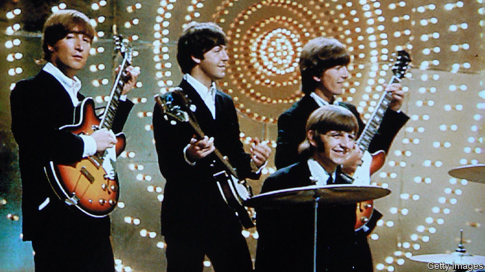

###### Come together

# A new Beatles track is surprisingly soulful 

##### “Now and Then” will satisfy old fans and introduce the band to new ones 

 

> Nov 2nd 2023 

The long and winding road of the Beatles officially . Rumours swirled of a possible reunion—until December 8th 1980, when John Lennon was assassinated in New York. Since then, the ’ archive has yielded a few posthumous gifts. In 1995 “Free as a Bird”, based on one of Lennon’s last demos, was released; another, “Real Love”, came the next year. 

On November 2nd “Now and Then”, touted as the last new Beatles song, hits the airwaves and the internet. Like its 1990s predecessors, it derives from a demo long judged unmixable.  hinted in June that a “kind of scary” AI would help produce a “final Beatles record”, seeding fears of some deep-faked pastiche. In reality far more basic software allowed Lennon’s voice as recorded to sing on this new track, over accompaniment by Sir Paul and Sir Ringo Starr. (Guitar from , who died in 2001, is also mixed in.)

The release of this audio archaeology comes soon after AI allowed researchers to discern a single Greek word (“purple”) from a carbonised scroll . The Beatles are not such ancient history, but in both cases, technology has let a lost world speak. 

“Now and Then” is like a technicolour version of what Lennon left in spare black and white; Sir Paul and Sir Ringo have turned Lennon’s private, prayer-like track into a big-production song fit for a film soundtrack. But even if it would be just a middling Beatles song—if indeed it should be called that, and not the last work of Lennon’s fruitful —its vitality is evidence of the Beatles’ enduring appeal. Younger listeners will be drawn in with this release. 

The Beatles broke up at the peak of their fame, rather than carrying on and on, like the Rolling Stones. Despite their last song’s age, “Now and Then” has the gift of freshness and the poignancy of a tribute by two elder musical statesman, well beyond 64, to the man who embodied the unrealised ambitions of his era. “Now and then/I miss you,” goes the chorus. “Oh, now and then/I want you to be there for me.” The lyrics almost sound directed at Lennon himself, at the Beatles, at the golden age of rock, which beckons once again. ■


