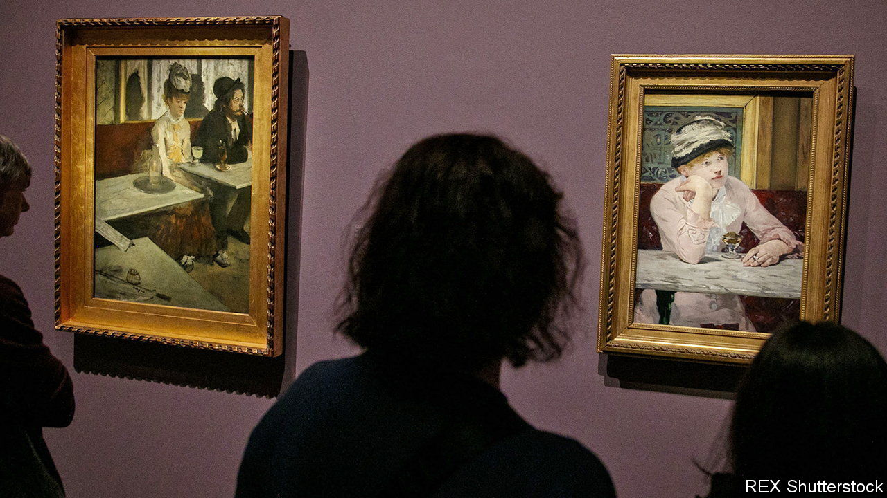

###### Artistic frenemies

# A show on Manet and Degas examines creative rivalry 

##### Artists are often in dialogue—and competition—with each other 

 

> Nov 2nd 2023 

The painting seems innocent enough. Edouard Manet slumps on a sofa, lost in thought or perhaps bored; his wife, Suzanne, plays the piano. This scene of cosy bourgeois domesticity was captured in the late 1860s by Manet’s friend, Edgar Degas, who gave the painting as a gift to the couple. However, something about the double portrait did not sit well with Manet. He took a knife to it, cropping off Suzanne’s face. Outraged by this unexpected act of violence, Degas took back his painting and, for good measure, returned a still life of nuts Manet had given him. (It does not take an art historian to interpret that.) 

The knifing is a high point of drama in “Manet/Degas”, a show at the Metropolitan Museum of Art in New York on view until January 7th, which examines how these two artists were in dialogue—and sometimes duelled—with each other. 

Manet may have disliked Degas’s painting, but it spurred him to create his own version of Madame Manet at the piano. Degas, meanwhile, went on to paint increasingly cropped images that cut figures out of the frame. He probably took a “moment of delight” in the painting’s defacement, recognising that “Manet had made a really modern painting out of his canvas,” says Stephan Wolohojian, the show’s co-curator. Like many frenemies, the painters reconciled and played off each other’s work. By putting their paintings side by side, the show invites visitors to consider how these artists influenced each other. 

The Manet-Degas rivalry began in the galleries of the Louvre, where Degas was copying a painting by Diego Velázquez. Manet was the hot-shot. At the Salon of 1865, his scandalous “Olympia”, depicting a naked courtesan, a black maid and an alert cat, provoked outrage, while Degas’s conventional painting, “Scene of War in the Middle Ages”, went unnoticed. Degas responded by producing more radical compositions and joined forces with a group of artists who became known as “Impressionists”. Manet refused to take part. He was “more vain than intelligent”, Degas quipped. Still, Degas created a series of drawings—Manet standing, Manet seated and holding his hat—that documented their friendship, while Manet never bothered to draw Degas. 

“Influence is influenza—an astral disease,” wrote Harold Bloom, a literary critic. Bloom was referring specifically to writers, but this “anxiety of influence”, as he termed it, . The young Michelangelo Buonarroti struggled in the shadow of , who was famous and adored. In the early 1500s, Florentine officials commissioned both artists to paint battle scenes in the Palazzo Vecchio—a showdown between master and prodigy that was further heightened by their personalities. (Da Vinci was sociable and well-dressed, whereas Michelangelo was rude, disagreeable and rarely bathed.)

Three centuries later,  and John Constable battled for recognition as Britain’s greatest painter at the annual exhibition of the Royal Academy. Constable anxiously dismissed Turner as “just steam and light”. Turner boastfully proclaimed himself the “great lion of the day”. In the 20th century, Henri Matisse and  vied to be the most avant-garde, pushing each other to greater experimentation. It is hard to imagine artistic revolutions like Cubism without that burning competition. In New York,  and  borrowed inspiration from each other to create their abstract masterpieces. When Pollock suddenly died in a booze-fuelled car crash, de Kooning borrowed his girlfriend, too. 

The Manet-Degas rivalry often manifested in their choice of subject matter, says Ashley Dunn, the show’s other co-curator. When Manet painted a dead , Degas painted a fallen jockey in a similar pose. When Degas painted a woman drinking in a café, Manet painted the same image of modern urban alienation. After Manet’s early death in 1883 of complications from syphilis, Degas began collecting his friend’s paintings. (“He was greater than we thought,” he reportedly admitted at Manet’s funeral.) One was a still life of a sliced ham with a gleaming knife. Degas hung it in his home next to the slashed portrait of Madame Manet, with the knife pointing slyly towards the defaced painting. ■


