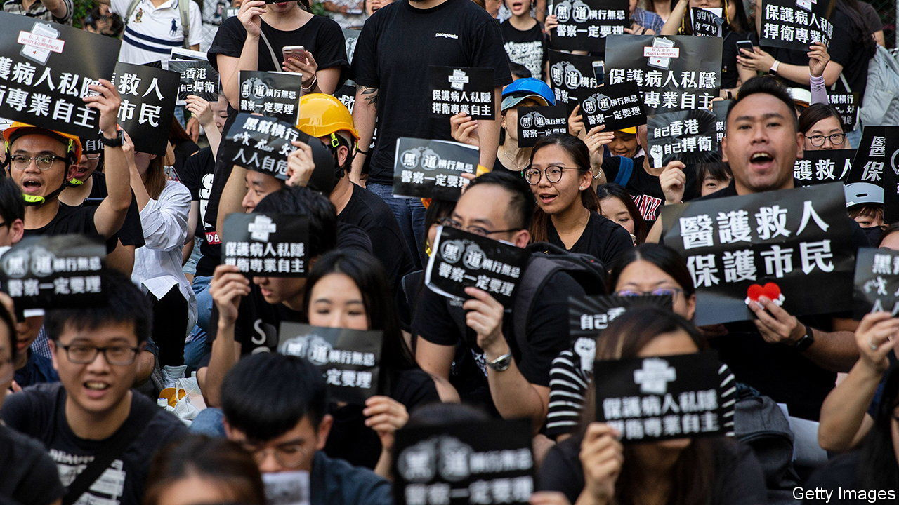

###### The defeated

# Hong Kong’s year of protest now feels like a mirage 

##### A new book follows four pro-democracy activists, none of whom find a happy ending 

 

> Nov 2nd 2023 

By Shibani Mahtani and Timothy McLaughlin. 

On July 21st 2019 Hong Kongers witnessed an attack so notorious that, like the felling of the  or the  massacre, they came to refer to it by numerical shorthand: 721. On that evening scores of gang members, known as triads, stormed Yuen Long, a rural metro station. There, in train carriages and on concourses, they set upon anyone they suspected of returning from that day’s pro-democracy protests.

Gwyneth Ho, then a 28-year-old journalist for , an online-news site, rushed to the station to livestream the violence. Even as triads beat her to the ground with bamboo sticks, she managed to keep filming. That bravery made Ms Ho’s name and eventually propelled her into politics. However, the authorities were no longer willing to tolerate opposition: they locked her up and . The trial of Ms Ho, who stands accused of endangering “national security”, is ongoing. The verdicts for her and  on similar charges alongside her are expected later this year.

Ms Ho is one of four pro-democracy activists followed in “Among the Braves”, a book by Shibani Mahtani, a journalistand Timothy McLaughlin, who writes on Hong Kong for the . (The authors are married.) Through this quartet the book traces the arc of a protest movement that had begun with optimism and enjoyed mostly unswerving support among the territory’s 7.5m people, but which . 

The week before the Yuen Long attack, over 1m Hong Kongers had taken to the streets to try to defend their freedom. The movement was cleaved between those advocating  (peaceful, rational, non-violent) protests and the front-line “Braves”, who favoured more confrontation. Among those who crossed the divide was Tommy. The mild-mannered teenager turned up to his first protest armed with nothing but two cartons of eggs, with which he planned to pelt government buildings. Within weeks he had stormed and occupied Hong Kong’s parliament. Within a year, by then a fugitive, he was planning a daring escape from Hong Kong aboard a speedboat bound for Taiwan. 

Hong Kongers’ dreams of democracy were , as China’s Communist Party took advantage of the pandemic, which put an end to street protests, to foist a draconian national-security law on its troublesome territory. But the movement had already begun to collapse. 

The demonstrators’ defining principle had been to remain leaderless—to “be water”—striking with tidal force before receding untraceably into the city’s crevices. Abandoning this strategy proved disastrous. In November 2019 hardcore protesters holed up in Polytechnic University following a riot. When police laid siege to the campus for days and rounded them up, the movement had been stripped of its most determined warriors. 

“Among the Braves” entwines the activists’ stories with a chronicle of Hong Kong’s decades-old , stretching from the Tiananmen Square massacre in 1989, through the “Umbrella” protests of 2014, to the unrest in 2019. It lays bare the incompetence of politicians in dealing with each unfolding crisis. Carrie Lam, the authors argue, will be judged as “the leader who killed her city without needing any soldiers or tanks”. 

The result is a book that is both a page-turner and a succinct history. But it is also a tale with an unsatisfying ending. With the most vocal activists having fled or been locked up, today all that remains are trampled hopes and suppressed memories. When the now-exiled Tommy calls his former brothers-in-arms, he finds they have returned to lives of “shopping trips, hotpot and gossiping about Cantopop stars”. It is, he says, “as if they had all imagined the demonstrations”. ■


