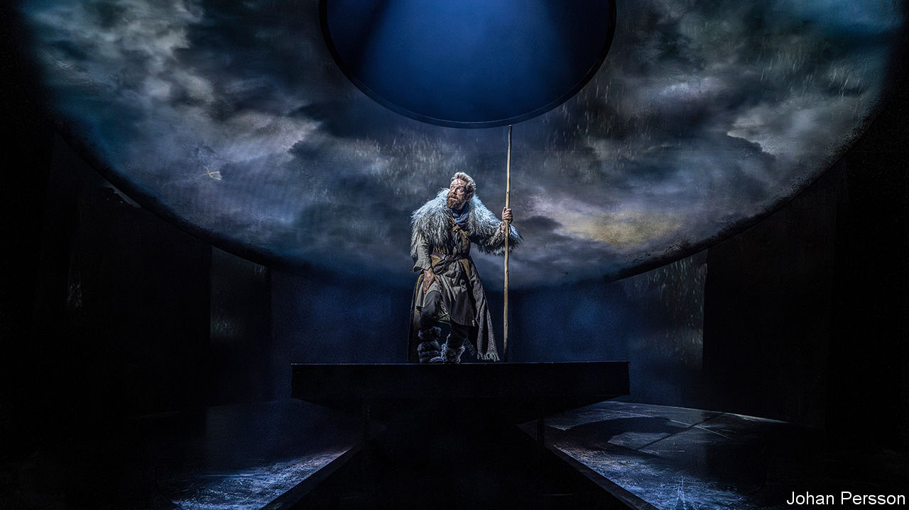

###### Back Story

# “King Lear” and the purpose of tragedy in dark times 

##### Sir Kenneth Branagh’s bold new production asks you to laugh, cry—and act 

 

> Nov 1st 2023 

Murder on the television, agony on the radio; lies and hatred on the internet, plus snuff videos that you click on before realising your mistake. The planet is a boiling cauldron in which you are the complacent frog. When the real world feels like a charnel house, why spend an evening and a chunk of cash watching bodies pile up on stage?

And in “King Lear”,  piles them high. “That’s but a trifle here,” a character says of another’s demise during the final die-in. But the play—and Sir Kenneth Branagh’s ingenious new production in London—make a powerful case for subjecting yourself to , even at a time of surround-sound horror.

These days “King Lear” is performed less often than “Hamlet”, with its startlingly acute psychology, or “Othello” and , with their overtly modern themes of race, misogyny and the corrupting effects of power. Critics have frequently regarded “Lear” as a triumph of philosophical poetry but impractical as a play. There is just too much of it, and too much in it: too many ideas and emotions, too many stories and, above all, too much desolation and despair.

The evil characters destroy one another, but they take the good down with them. Love kills; man is nothing but a “poor, bare, forked animal”. Throughout the 18th century this bleakness seemed so shocking, even immoral, that “Lear” was staged with a revised happy ending. Audiences still struggle with emotional overload. A decade ago, at another vaunted production in London, people sniggered when they were meant to weep.

Sir Kenneth, a British , stars in and directs the version that opened at the Wyndham’s Theatre on October 31st. (It goes to the Shed in New York in 2024.) Part of his response to the play’s scale is to cut lots of it. Running with no interval for ice-cream and gossip, this is two hours of neat tragedy—set, boldly, in Neolithic Britain. Wearing animal skins and wielding spears, the cast hulks around a stark set that recalls Stonehenge, their faces intermittently looming on the stones in un-Neolithic projections. Above them hangs an orb resembling both a planet and an eyeball, which sometimes seems to bleed.

Here the power struggle that follows Lear’s division of his kingdom is less a clash of armies than a scrap for a bauble in the mud. Yet the absence of pomp also makes the family drama at the story’s heart seem movingly intimate and familiar. Captured by his foes, arms bound behind his back, Sir Kenneth’s Lear uses his beard to dry the tears of his beloved daughter Cordelia (Jessica Revell). Soon he heaves her corpse onto the stage, howling in grief; this time, nobody laughed.

They chuckled at other moments though, as Sir Kenneth judiciously keeps and hones the funny bits to help the philosophy go down. It is not just the humour of absurdist madness and slapstick torment that hovers between pathos and ridicule, often called the “comedy of the grotesque”. There is also the comedy of charismatic devilment and gullibility, of champion wordplay and some of Shakespeare’s most colourful insults.

As for the purpose of tragedy: Edgar (Doug Colling) implies one as he drags his blind and suicidal father Gloucester (Joseph Kloska) across ancient Britain. “Men must endure/Their going hence, even as their coming hither,” he preaches. “Ripeness is all.” Life, in other words, is an endurance test. It follows that, for viewers, tragic art is a kind of practice in grinning and bearing it.

We have had quite enough practice in that, today’s punters may think; and a homily on stoicism makes a priggish sort of moral. Edgar’s conclusion, however, is not the play’s. The rationale it offers for its spectacle of pain is more than a lesson in patience, more even than the sense of solidarity in suffering that acting as fine as Sir Kenneth’s can provide. 

“King Lear” is full of audiences: characters who witness folly, misery or cruelty and must choose what to do about them. Some weigh their interests and join in. Some wring their hands. A few resist, such as the heroic servant who objects as Cornwall (a sinister Hughie O’Donnell) rips out Gloucester’s eyes in a spasm of bloodlust and impunity.

It is hard to imagine yourself as Lear, even one as denuded as Sir Kenneth’s. But maybe you could, just about, be like the unheralded minor figures who opt to act instead of merely watching. “O, you are men of stones,” the king cries at the close, demanding greater compassion for injustice from the surviving characters—and from the audience, too. Don’t just sit there, the play urges. Do something. ■


