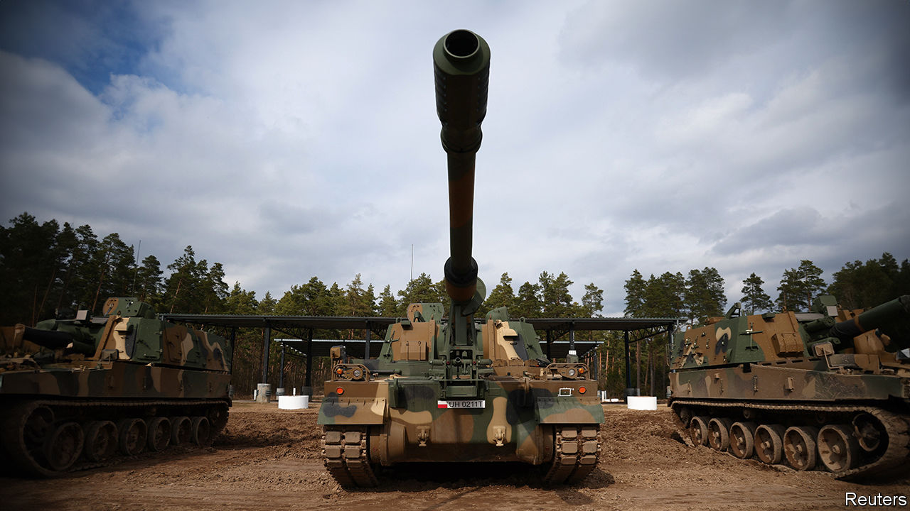

###### Fear spurs the Poles

# Beefing up Poland’s armed forces 

##### The incoming government is set to create the biggest army in Europe 

 

> Nov 2nd 2023 

Poland’s incoming coalition government will want to be seen by the rest of Europe as marking a fresh start. But in one respect it is unlikely to diverge far from the policies of its populist predecessor, PiS (the Law and Justice party). In the immediate aftermath of Russia’s invasion of its neighbour Ukraine in February last year, the then government embarked on a mission that the defence minister, Mariusz Blaszczak, described as providing Poland with “the most powerful land forces in Europe” by acquiring massive firepower and more than doubling the size of its armed forces. 

There is a strong Polish consensus on the need for such a plan. According to opinion research by NATO, 80% of Poles favour maintaining or increasing defence spending. In March 2022 parliament voted almost unanimously for the Homeland Defence Act that raised the annual military budget to 3% of GDP (well above NATO’s call for 2%) and set up an extra “off budget” fund for military modernisation worth about $9.5bn this year and next.

Few demurred when the prime minister, Mateusz Morawiecki, declared in January that the course of the war in Ukraine meant that “we must arm ourselves even faster” and pushed the target up to 4% of GDP amid hints that it might even have to rise to 5% over the next decade. 

Given that Poland’s security, unlike Ukraine’s, is undergirded by its NATO membership, some might question why Poland feels the need to be such an outlier in military spending. The answer is that history and geography make Poland hedge against the possibility of Ukraine being forced into an unsatisfactory ceasefire and Russia quickly regenerating its combat power. Besides, Poles fear the prospect of an isolationist Trump administration that might weaken NATO and balk at coming to Poland’s rescue, should the worst happen. 

Poland’s first priority last year was to fill the gaps left by transferring 240 mainly Soviet-era tanks, infantry-fighting vehicles, fighter jets and artillery (including 54 new Polish Krab howitzers) to Ukraine. America agreed to deliver 116 M1 Abrams tanks from Pentagon stocks to add to the 250 ordered in 2021. But the list soon expanded: most of the contracts went not just to America but, more surprisingly, South Korea. This was partly to snub Europeans critical of the PiS government’s creeping authoritarianism.

Though not all the contracts have been finalised, the total planned spending may be between $30bn-40bn but could rise to $135bn over the next decade. Aside from an agreement in 2020 to buy 32 F-35 fighter jets for $4.6bn, other big-ticket items ordered from America include 486 HIMARS rocket-launchers for about $10bn, to add to the 20 it has already; 96 Apache attack-helicopters for up to $15bn (in addition to an order worth $1.7bn for 32 AW149 helicopters from Leonardo, an Italian firm); 48 of the latest Patriot air-defence launch stations with hundreds of interceptor missiles, and an air-and-missile-defence battle command system that ties it all together, at a cost of up to $15bn. 

However, it is the size and scope of the string of deals with South Korea, worth together at least $14.5bn, that have startled observers. They include 1,000 K2 Black Panther tanks, 180 of them to be delivered rapidly from the Korean army’s own inventory and 820 to be made under licence in Poland from 2026. The rest of the package includes 672 Thunder howitzers, two-thirds of them locally produced, and 288 Chunmoo multiple-rocket launchers to be mounted on Polish infantry-fighting vehicles. Poland intends to field more tanks than are operated by the armies of Germany, France, Britain and Italy put together. 

K-Pop’s ARMY marches on

To replace the MiG-29s and SU-22s sent to Ukraine, Poland is also buying from South Korea 48 Golden Eagle FA-50 fighter jets, in preference to adding to its fleet of more expensive American F-16s, for which it would have to wait years. Speed of delivery, quality, price and standardisation with NATO equipment were all reasons for doing business with the Koreans. A further strategic goal has been to turn this buying spree into an engine for building Poland’s own arms industry as an exporter to the rest of Europe—again, with Korean help. 

What could possibly go wrong? While generally endorsing the defence build-up, the new government will want to review some contracts that may have been unduly rushed through. The affordability of the weapons binge also depends on optimistic assumptions about economic growth. Ben Barry, a land-warfare expert at the International Institute for Strategic Studies in London, queries whether Poland can handle the scale of infrastructure investments and institutional change needed to meet the “massive challenge” of training a much larger army to use the new kit. 

Poland’s demography—its population is falling fast—could make it hard to meet the goal of a 300,000-strong armed forces, of whom 250,000 are to be regulars and 50,000 part-timers. A former head of the national defence ministry, Tomasz Siemoniak, recently poured cold water on the plan: a professional army of 150,000, he reckoned, was the manageable limit. 

If as expected the new government seeks to repair relations with the EU, it will face pressure to comply with EU budget-deficit rules, which will bring greater scrutiny of Poland’s vaulting military ambition. Nonetheless, Poland seems bent on becoming NATO’s beefiest military land power in the years ahead. Fear of Russia is a great motivator. ■


