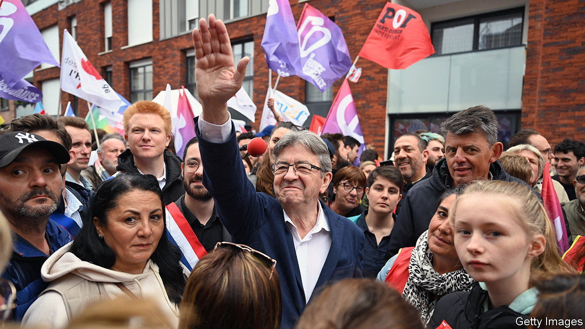

###### The fracturing French left

# The Middle East crisis is splitting the French opposition 

##### Divisions over Israel and Hamas threaten the left-wing alliance 

 

> Nov 2nd 2023 

A decade ago France’s Socialist Party controlled the presidency, both houses of parliament, and a majority of regions and big cities. Today the once-mighty party has been reduced to an inaudible minority partner in a left-wing parliamentary alliance controlled by Jean-Luc Mélenchon, a former Trotskyist firebrand. When this four-party grouping, known as NUPES, was first launched last year ahead of legislative elections, Socialist moderates accepted its logic through gritted teeth. Now, as differences over the Israel-Gaza conflict surface, the alliance is tearing itself apart.


Mr Mélenchon’s failure to describe the murderous Hamas attacks on Israel on October 7th as acts of terrorism prompted the first fracture. He denounced the violence and called for a ceasefire, with no reference to terrorism or Hamas. As the ambiguity persisted, Olivier Faure, the Socialist party’s leader, ordered a “moratorium” on working with NUPES. 

Since then, things have only worsened. On October 31st Mr Faure declared that there was no reason to return to the alliance, although he stopped short of quitting. He favoured a union of the left, he said, “but not at any price”. The “constant conflictualisation” of all subjects, Mr Faure argued, was “demonising” the left—precisely at a time when, on the far right, Marine Le Pen was busy “de-demonising” her own party. The left, in effect, was helping to make her look respectable.

The logic that turned the alliance into the biggest opposition grouping to Emmanuel Macron’s minority centrist government always had more to do with improvised electoral tactics than conviction or style. The constituent parties—Mr Mélenchon’s Unsubmissive France, the Communists, Greens and Socialists—disagree about NATO, Europe, nuclear power and more. NUPES delights in theatrical antics, designed to go viral on social media. One of Mr Mélenchon’s deputies brandished a vial of bedbugs in parliament. Another posed outside a government ministry with his foot atop an effigy of the minister’s head. 

Moderate Socialists have watched in dismay as the left’s credibility has been shredded. Divisions over the crisis in the Middle East have brought those strains to breaking point. In a recent poll 63% of Socialist voters judged Hamas’s attacks to be terrorist acts; among supporters of Unsubmissive France, the figure was a mere 38%. 

The troubling reality for the Socialists, however, is that they lack the weight to go it alone. Their candidate at each of the two most recent presidential elections secured a dismal single-digit score in first-round voting. Some Socialists who had misgivings about the NUPES adventure hope that the fracture might be a clarifying moment. It could be, says one ex-minister, a “chance for a realignment” of left-wing politics, which also draws disappointed left-wingers from Mr Macron’s centrist alliance. Bernard Cazeneuve, a Socialist ex-prime minister who quit the party when it joined NUPES, has called on the party to break definitively with the alliance. 

Even if it does, the damage will be hard to repair. “Moderates in the party have been trapped”, says a Socialist figure. A new poll on first-round voting for the presidential election in 2027 gives the Socialist candidate just 4-6%. The candidate who comes top, with 31-33%: Ms Le Pen. ■

