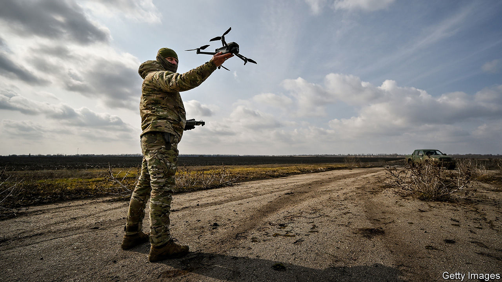
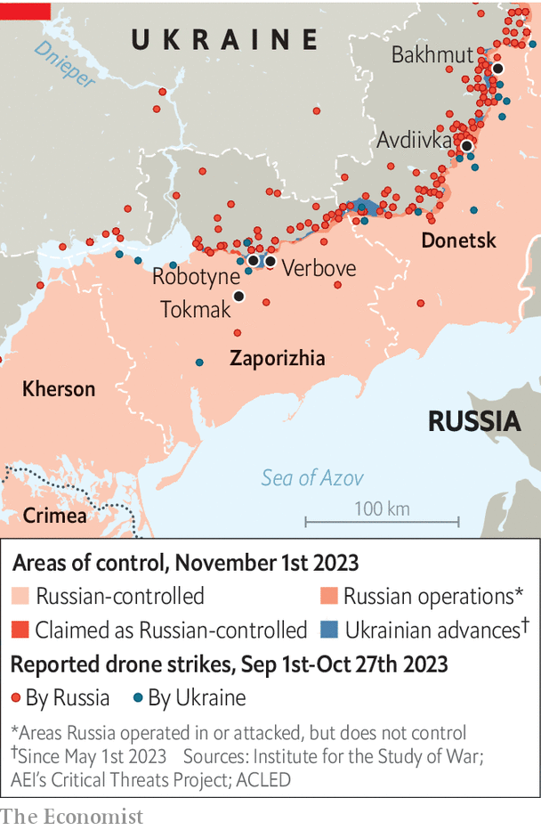

###### Don’t look up

# Trenches and tech on Ukraine’s southern front 

##### Drone pilots have become valuable targets for both sides 

 

> Oct 29th 2023 


THE DRONE might not spot you, but if it does, there is only one thing to do: hide well, and hide quickly. “Major”, a 25-year-old drone pilot operating near the hottest front lines of the south, in Zaporizhia province, says your chances are not good if an enemy pilot has you in his sights. The  can come from behind your own positions, and masquerade as your own. The cameras are not great. But running at speeds of 150-160 kph, it will always outpace you. “If your cover is poor, then you are likely a dead man,” he says. Major has survived a pursuit four times, the last time in mid-October. Two of his closest comrades have been less fortunate. “God, not physics, decides if you survive,” he says. 

The hunters are rapidly becoming the hunted. The controllers for most drones leave their own electronic trace, and if a pilot isn’t careful, the enemy can home in on them. “Hummer,” a commander in the 47th brigade, in the south, says the Russians fire everything they have once they identify a target. They can use their own strike drones, but they also apply high-precision artillery, mines, glide bombs and even, on occasion, saboteur groups. Major says he has lost 15% of his colleagues over the last few months. Hummer says his figures are lower, but refuses to elaborate. 

Ukraine is the  of the first-person-view (FPV) drones: craft that are flown, video-game-like, by goggle-wearing pilots with real-time manoeuvrability. The drones can cost just a few hundred dollars to build, but can deliver explosives capable of destroying or incapacitating equipment with a value of millions. In a day, a single operator can take out a dozen high-value assets, with corresponding human losses. That has made the drone pilot an even more prized kill than a sniper, one front-line commander suggests. “A lot of people want to become drone pilots because they think the work is further back and safer. The reality is that it’s extremely dangerous to be flying battlefield drones.” 

The first FPV drones appeared in eastern Ukraine in the spring. They were a response to limited supplies of Western ammunition and the challenge of a much . Drones have since played a leading role in degrading Russian firepower as part of Ukraine’s southern counter-offensive in the Zaporizhia region. Although Ukraine initially enjoyed total dominance in this new class of drones, the Russians are catching up. The first Russian FPV drones appeared by July, and are now harassing Ukrainian units along the front. Ukraine is also hampered by the fact that its drones are still largely assembled and paid for by volunteers. Command structures are similarly anarchic, with freelance drone operators, brigade drones, secret services and others operating in the same areas. Meanwhile Russia has clear superiority when it comes to more expensive classes of drones, such as high-powered reconnaissance machines. 

But the small FPV battlefield drones have challenged many accepted rules of war. “The future is already with us,” says “Genius”, a deputy battalion commander in the 47th brigade. In mid-October a Ukrainian pilot set a 22km record for the distance at which he incapacitated a Russian tank, 18km behind the front line. His commander says the Russians have imposed a 10km no-tank zone behind the front, dramatically decreasing the value of such weapons. Hummer says that his own forces have a 58% success rate in hitting targets. But the traffic is not one-way, and the Ukrainians have suffered many losses too. Russian FPV drones have destroyed several Bradley Fighting Vehicles (each worth some $2m) and even a Leopard tank. 

The Russians are learning “from their mistakes…and from ours,” says Hummer. Earlier in the summer, some units began to equip higher-value assets like tanks and artillery with jamming boxes, which create high-energy fields around an object so that signals around it stop working. Attacking such equipment, without video feedback, is a difficult if not impossible task. Ukrainian units by and large don’t yet have the same technology. “FPV  have completely changed the tactics of armoured infantry battle and we have to adapt better,” says Yuriy Momot, the deputy general director of a company developing technology-jamming countermeasures for Ukraine. “Before, only brigades thought about electronic warfare. Now company-level units need equipment that can detect and defend themselves against FPV drones.” 

 


Major, who pilots from positions starting just a few hundred yards from Robotyne, the centrepoint of the Ukrainian counter-offensive effort, says he operates without any electronic protection. “Intuition is the only thing that counts in this wild fight,” he insists. It is a fight that shows no sign of letting up—even as Ukraine’s progress south has slowed to a snail’s pace. “Left Handed”, an infantryman also fighting at the front, says Ukrainian losses have increased to alarming levels, in part due to the drones. The plains of Zaporizhia have turned their back on life, he says. “It’s hellish. Corpses, the smell of corpses, death, blood and fear. Not a whiff of life, just the stench of death.” Those in units such as his own have more chance of dying than surviving. “Seventy-thirty. Some don’t even see their first battle.” ■


