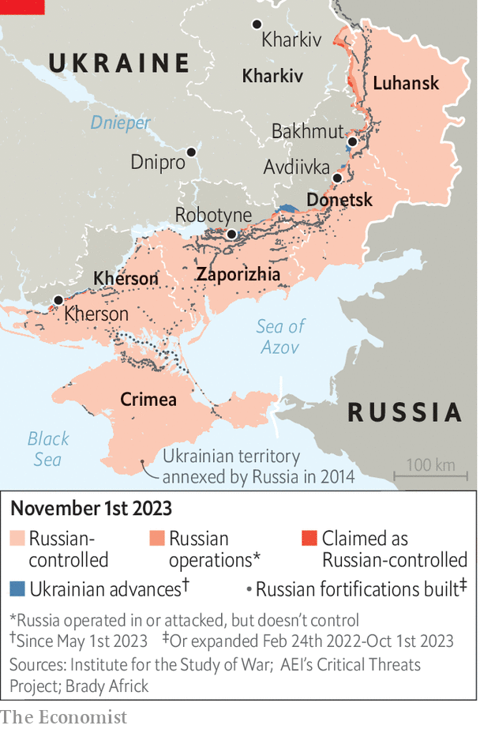

###### War of attrition

# Ukraine’s commander-in-chief on the breakthrough he needs to beat Russia 

##### General Valery Zaluzhny admits the war is at a stalemate 

 

> Nov 1st 2023 

FIVE MONTHS into its counter-offensive, Ukraine has managed to advance by just 17 kilometres. Russia fought for ten months around Bakhmut in the east “to take a town six by six kilometres”. Sharing his first comprehensive assessment of the campaign with  in an interview this week, Ukraine’s commander-in-chief, General Valery Zaluzhny, says the battlefield reminds him of the great conflict of a century ago. “Just like in the first world war we have reached the level of technology that puts us into a stalemate,” he says. The general concludes that it would take a massive technological leap to break . “There will most likely be no deep and beautiful breakthrough.” 


The course of the counter-offensive has undermined Western hopes that Ukraine could use it to demonstrate that the war is unwinnable, forcing Russia’s president, Vladimir Putin, to negotiate. It has also undercut General Zaluzhny’s assumption that he could stop Russia by bleeding its troops. “That was my mistake. Russia has lost at least 150,000 dead. In any other country such casualties would have stopped the war.” But not in Russia, where life is cheap and where Mr Putin’s reference points are the first and second world wars, in which Russia lost tens of millions. 

An army of Ukraine’s standard ought to have been able to move at a speed of 30km a day as it breached Russian lines. “If you look at NATO’s text books and at the maths which we did, four months should have been enough time for us to have reached Crimea, to have fought in Crimea, to return from Crimea and to have gone back in and out again,” General Zaluzhny says sardonically. Instead he watched his troops get stuck in minefields on the approaches to Bakhmut in the east, his Western-supplied equipment getting pummelled by Russian artillery and drones. The same story unfolded on the offensive’s main thrust in the south, where inexperienced brigades immediately ran into trouble.

“First I thought there was something wrong with our commanders, so I changed some of them. Then I thought maybe our soldiers are not fit for purpose, so I moved soldiers in some brigades,” says General Zaluzhny. When those changes failed to make a difference, the general told his staff to dig out a book he once saw as a student. Its title was “Breaching Fortified Defence Lines”. It was published in 1941 by a Soviet major-general, P.S. Smirnov, who analysed the battles of the first world war. “And before I got even halfway through it, I realised that is exactly where we are because just like then, the level of our technological development today has put both us and our enemies in a stupor.”

 


That thesis, he says, was borne out as he went to the front line in Avdiivka, also in the east, where Russia has recently advanced by a few hundred metres over several weeks by throwing in two of its armies. “On our monitor screens the day I was there we saw 140 Russian machines ablaze—destroyed within four hours of coming within firing range of our artillery.” Those fleeing were chased by “first-person-view” drones, remote-controlled and carrying explosive charges that their operators simply crash into the enemy. The same picture unfolds when Ukrainian troops try to advance. General Zaluzhny describes a battlefield in which modern sensors can identify any concentration of forces, and modern precision weapons can destroy it. “The simple fact is that we see everything the enemy is doing and they see everything we are doing. In order for us to break this deadlock we need something new, like the gunpowder which the Chinese invented and which we are still using to kill each other,” he says. 

This time, however, the decisive factor will be not a single new invention, but will come from combining all the technical solutions that already exist, he says. In a  article written for by General Zaluzhny, as well as in an essay shared with the newspaper, he urges innovation in drones, electronic warfare, anti-artillery capabilities and demining equipment, as well as in the use of robotics. 

Western allies have been overly cautious in supplying Ukraine with their latest technology and more powerful weapons. Joe Biden, America’s president, set objectives at the start of Russia’s invasion: to ensure that Ukraine was not defeated and that America was not dragged into confrontation with Russia. This means that arms supplied by the West have been sufficient in sustaining Ukraine in the war, but not enough to allow it to win. General Zaluzhny is not complaining: “They are not obliged to give us anything, and we are grateful for what we have got, but I am simply stating the facts.”

Yet by holding back the supply of long-range missile systems and tanks, the West allowed Russia to regroup and build up its defences in the aftermath of a sudden breakthrough in Kharkiv region in the north and in Kherson in the south late in 2022. “These systems were most relevant to us last year, but they only arrived this year,” he says. Similarly, F-16 jets, due next year, are now less helpful, suggests the general, in part because Russia has improved its air defences: an experimental version of the S-400 missile system can reach beyond the city of Dnipro, he warns.

The delay in arms deliveries, though frustrating, is not the main cause of Ukraine’s predicament, according to General Zaluzhny. “It is important to understand that this war cannot be won with the weapons of the past generation and outdated methods,” he insists. “They will inevitably lead to delay and, as a consequence, defeat.” It is, instead, technology that will be decisive, he argues. The general is enthused by recent conversations with Eric Schmidt, the former chief executive of Google, and stresses the decisive role of drones, and of electronic warfare which can prevent them from flying.

General Zaluzhny’s assessment is sobering: there is no sign that a technological breakthrough, whether in drones or in electronic warfare, is around the corner. And technology has its limits. Even in the first world war, the arrival of tanks in 1917 was not sufficient to break the deadlock on the battlefield. It took a suite of technologies, and more than a decade of tactical innovation, to produce the German blitzkrieg in May 1940. The implication is that Ukraine is stuck in a long war—one in which he acknowledges Russia has the advantage. Nevertheless, he insists that Ukraine has no choice but to keep the initiative by remaining on the offensive, even if it only moves by a few metres a day. 

Crimea, the general believes, remains Mr Putin’s greatest vulnerability. His legitimacy rests on having brought it back to Russia in 2014. Over the past few months, Ukraine has taken the war into the peninsula, which remains critical to the logistics of the conflict. “It must know that it is part of Ukraine and that this war is happening there.” On October 30th Ukraine struck Crimea with American-supplied long-range ATACMS missiles for the first time. 

General Zaluzhny is desperately trying to prevent the war from settling into the trenches. “The biggest risk of an attritional trench war is that it can drag on for years and wear down the Ukrainian state,” he says. In the first world war, politics interfered before technology could make a difference. Four empires collapsed and a revolution broke out in Russia. 

Mr Putin is counting on a collapse in Ukrainian morale and Western support. There is no question in General Zaluzhny’s mind that a long war favours Russia, which has a population three times and an economy ten times the size of Ukraine. “Let’s be honest, it’s a feudal state where the cheapest resource is human life. And for us…the most expensive thing we have is our people,” he says. For now he has enough soldiers. But the longer the war goes on, the harder it will be to sustain. “We need to look for this solution, we need to find this gunpowder, quickly master it and use it for a speedy victory. Because sooner or later we are going to find that we simply don’t have enough people to fight.” ■


