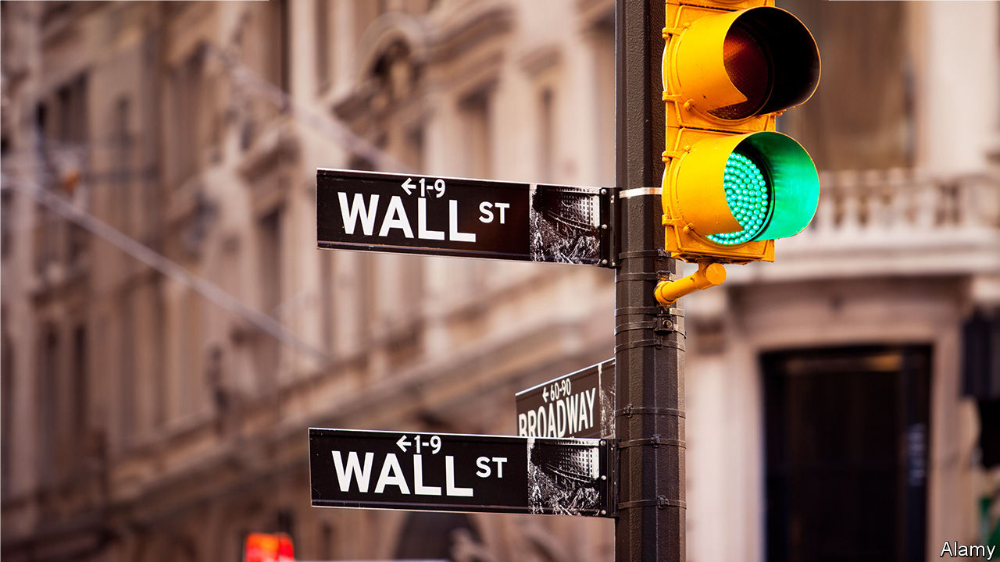
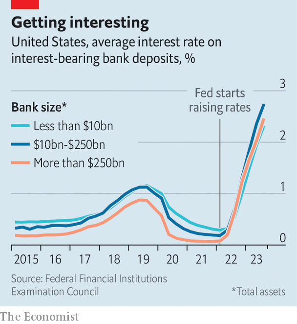

###### The joy of competition

# American banks now offer customers a better deal 

##### How much higher will interest payments go? 

 

> Nov 2nd 2023 

When the Federal Reserve began to raise interest rates more than a year ago, American banks enjoyed a nice little boost. They increased the interest they charged on loans, while keeping the rates they offered on deposits steady. In other countries this move attracted public opprobrium and politicians floated measures to ensure that customers were not swindled. Americans were happy to rely on a more American solution: competition.

It has done its job. Average yields on interest-bearing bank deposits have soared to more than 2.9%, up from 0.1% when the Fed began to raise interest rates. The extent to which higher rates have been passed on to customers—known as the “deposit beta”—has been a popular subject on recent quarterly earnings calls. Despite assurances by bank bosses that they have peaked, betas are likely to keep rising in the coming months, pinching profits.

 


The process is being driven by customers shifting their money from low-yielding products to higher-yielding ones. Data from quarterly filings show that the share of bank deposits held in interest-free accounts has fallen from 29% at the end of 2021 to 20%. Had this figure remained constant, bank interest costs would be roughly 10% lower than they are now. Quarterly filings also show that banks which have lost more than 5% of their deposits since the start of the year have increased the average rate on interest-bearing deposits by 2.7 percentage points, compared with a more miserly 2.1 percentage points at those institutions with more secure deposits. 

This much is familiar from past Fed tightening cycles. Historically, however, big banks have enjoyed an advantage over smaller peers, owing to their pricing power—something that now appears to be dwindling. America’s “big four” banks (JPMorgan Chase, Bank of America, Wells Fargo and Citigroup) reported average deposit costs of 2.5% in the third quarter of the year, identical to the median rate across all the country’s banks. And the funding gap between the biggest and smallest institutions has flipped since the last tightening cycle. In 2015-19 banks with assets of at least $250bn paid 0.3 percentage points less on their deposits than banks with less than $100m in assets; today they are paying 0.8 points more. 

Brian Foran of Autonomous Research, an advisory firm, suggests that this may reflect greater competition among big banks for corporate and high-net-worth clients, who are most likely to be aware of other, higher-yielding places to stash their cash. When rates were at zero, competition for such deposits was non-existent, notes Mr Foran. Now, with money-market funds offering 5%, the competition is much fiercer. 

How much longer will the squeeze continue? Chris McGratty of kbw, an investment bank, says that banks have felt most of the pain, but that costs have a bit further to rise and are likely to stay elevated, given that the Fed has signalled it will keep rates higher for longer than previously expected. Even if the Fed’s policymakers are done raising rates and banks keep yields steady, customers will continue to shift deposits from lower-earning to high-earning products, pushing up costs for banks. This will put pressure on deposits, forcing banks to slow their lending. While savers will benefit from higher rates of return, borrowers are another story altogether. ■


