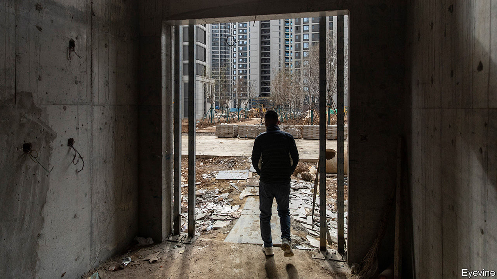

###### Indestructible

# China’s economy is a mess. Why aren’t firms going under? 

##### The government’s desire to avoid bankruptcies is another drag on growth 

 

> Nov 2nd 2023 

Evergrande is fighting for its life. On October 30th the property developer was granted its fifth, and probably final, stay of liquidation by a court in Hong Kong. Yet the situation on the mainland is a little more comfortable: the firm’s representatives have not even had to visit a courtroom. This is not unusual. Despite the many horrors visited upon China’s property sector, an industry publication reports that just 308 of the country’s 124,665 developers declared bankruptcy last year.

China’s ultra-low corporate bankruptcy rate—about a fifth of that found in America—might seem like unalloyed good news for officials in Beijing. That is until you consider the fact the country is experiencing a wave of corporate defaults, which includes half of the 50 largest property developers in 2020. With many unable to shed their bad debts through restructuring, businesses are struggling to reduce new borrowing and pay back outstanding loans. Policymakers, banks and firms all want to stave off formal bankruptcies in order to avoid a “Lehman moment”, or crisis-triggering event. The result is stifled productivity and deeper economic malaise.

Creative destruction, the process by which market economies replace failing firms with more efficient ones, has few fans in China. Local officials press lenders to prolong the lives of even the most unproductive businesses. Lending rules restrict debt forgiveness, an important tool in restructurings, because banks are state-owned, ultimately putting the government on the hook for losses. A corporate bankruptcy requires the consent of courts, creditors, local government and often a regulator, which all have a strong interest in keeping firms alive. As a deterrent for other company bosses, the threat of prison is never far away. In September Hui Ka Yan, Evergrande’s chairman, was detained. The next month a former chairman of Bank of China was arrested for a bevy of misdeeds, including the creation of financial risk. 

Barriers to bankruptcy mean that struggling firms have little choice but to refinance, replacing existing debts with new ones. China’s approach of keeping bad companies on life-support weighs on its economy, according to research by Li Bo of Tsinghua University and co-authors. Ms Li has found that provinces which have introduced special courts to arbitrate bankruptcies at arm’s length from local authorities have seen more firms created and improved productivity. Corporate borrowing becomes cheaper, too. In the rest of the country creditors demand a premium, since recovering debts is so hard. 

Rules that seek to keep sick companies alive also push up the number of liquidations when cases do reach court, because those that make it so far tend to be in a terrible way. Indeed, 83% of companies that arrive in court end up liquidated, compared with a mere 5% in America. Bankruptcy courts themselves drag out proceedings in attempts to avoid liquidation: cases average 539 days in court, around 50% longer than American ones. For its part, Evergrande has been in default for two years, during which it has been unable to propose a restructuring plan that is acceptable to its offshore creditors. The value of its assets has been driven lower still by the lengthy default. Deloitte, a consultancy, reckons that in a worst-case scenario offshore creditors will recover a miserable $0.02-0.04 per dollar owed.

China’s bankruptcy rules also have international ramifications. The country has become the world’s largest sovereign creditor, having lent $1.5trn to governments around the globe. Yet its refusal to accept write-downs has slowed multilateral debt negotiations—as was evident in October, when an imf deal on Sri Lanka’s debt was scuttled. The failure was partly a result of rules restricting China’s bankers from recognising and forgiving bad debts, says a mainland lawyer involved in overseas lending. Writing down the debt would have left Chinese firms that built Sri Lanka’s infrastructure out of pocket, triggering the same political concerns that exist in cases of domestic debt distress. A Lehman moment would have ramifications abroad. So, too, does China’s desire to avoid one. ■


