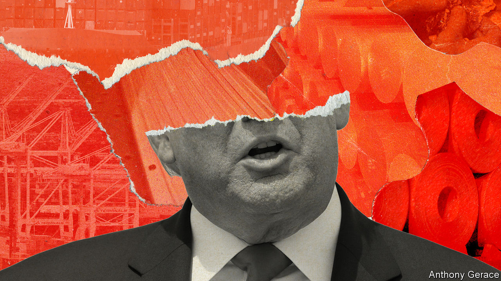
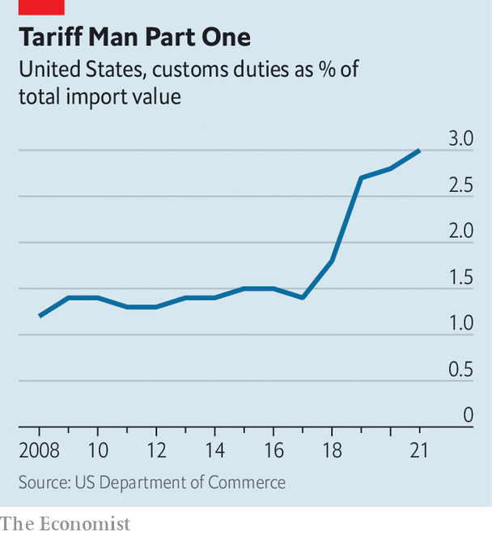
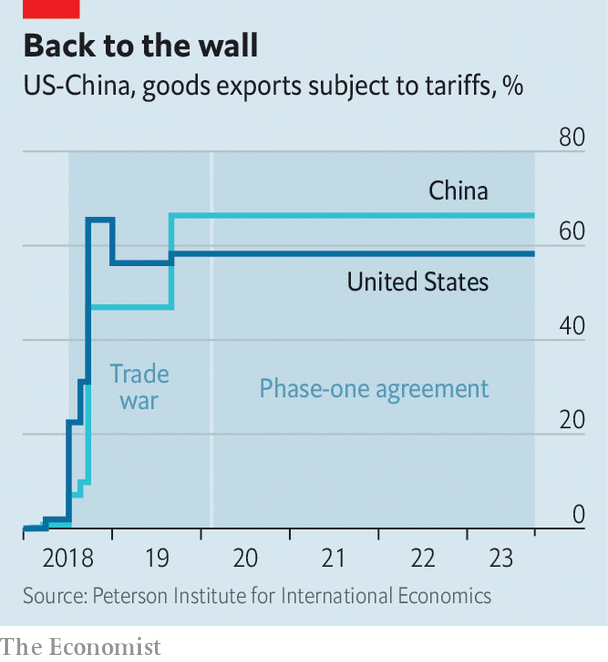
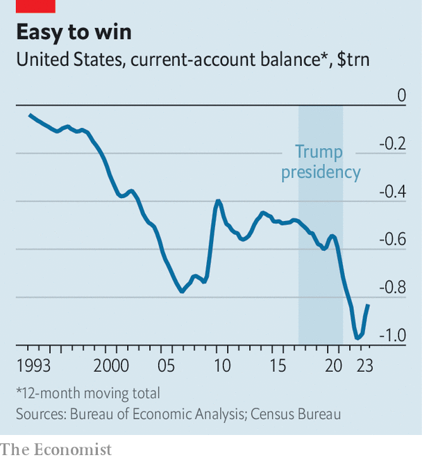
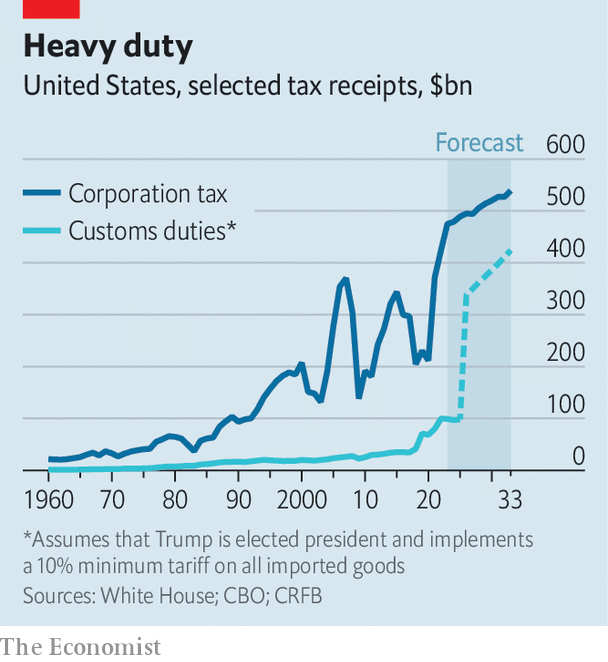

###### Tariff Man Part Two

# Donald Trump’s second term would be a protectionist nightmare 

##### His first term was bad enough 

 

> Oct 31st 2023 

Sequels are never as good as the original. And when the original was terrible, there is even more reason to dread the next episode. So it is with “Tariff Man Part Two”. In the White House, Donald Trump put more  on American imports than any president in nearly a century. His philosophy was simple: “I am a Tariff Man. When people or countries come in to raid the great wealth of our Nation, I want them to pay for the privilege of doing so.”

Mr Trump’s  made America poorer, did little to help exporters and annoyed its friends. If he wins the Republican presidential nomination (a likely outcome) and goes on to win the election (too close to call), he has vowed to ramp up things. He is mulling an across-the-board levy of perhaps 10% on all products entering America. In one fell swoop, his plans would more than triple the average American tariff. The direct costs would be bad enough, with the tariffs functioning as a tax on consumers and hurting most producers. Yet they would also tear at  with its allies and threaten to wreck the global trade system.

To get a sense of the impact, look back. On January 23rd 2018, a year after Mr Trump was sworn in, he got started with tariffs, hitting washing machines and solar panels. A couple of months later he went after aluminium and steel. A few months after that, it was Chinese goods. By 2021 American duties were worth 3% of the country’s total import value, double the level when Mr Trump took office. Tariffs on Chinese imports rose from 3% to 19%, calculates Chad Bown of the Peterson Institute for International Economics, a think-tank.

 


Mr Trump’s first aim was to slim the trade deficit. He thought tariffs would bludgeon other countries into submission, leading them to rejig policies to America’s advantage. Memorably, he declared that “trade wars are good, and easy to win.” But instead of shrinking, the deficit widened. Instead of buckling, China tripled its tariffs on America. Many allies retaliated, too.

The consequences were dismal. Industries that were protected by tariffs reaped benefits, enjoying greater market share and fatter profits. Most others suffered. America’s International Trade Commission (usitc), a bipartisan agency, found that industries downstream from tariff-coddled producers faced higher input prices and lower profitability. The Peterson Institute estimated that steel users in effect paid an extra $650,000 per job created in the steel industry. Studies have calculated that almost all the costs have been borne by Americans, rather than foreign producers. The usitc found a near one-to-one increase in the price of American imports in the wake of tariffs on China. 

 


Mr Trump did unquestionably succeed in one respect. He helped remake politics. According to a recent survey from the Chicago Council on Global Affairs, a think-tank, 66% of Americans think the government should place restrictions on imported foreign goods to protect jobs at home, up from 60% in 2018. On the campaign trail in 2019 Joe Biden criticised tariffs as a costly policy. In power he has rolled them back only a little. The  on China remains intact. Whatever the merits of lifting tariffs, the White House appears fearful of blowback from looking soft on China.

At the same time, Mr Biden has concocted an enormous industrial policy, fuelled by more than $1trn in subsidies for electric vehicles, offshore wind, semiconductors and the like. It is a more thoughtful and deliberate approach than Mr Trump’s, but it still looks likely to fail to bring about a manufacturing renaissance, is very expensive and, in lavishing subsidies on American factories, discriminates against other countries. It is, in short, rather Trumpist. 

 


How much worse could things get? If Mr Trump wins the presidential election in 2024, the world may discover that the answer is: “Rather a lot.” In August Mr Trump was interviewed on Fox Business, a television channel, by Larry Kudlow, his former economic adviser and a long-time media personality. Mr Trump put forward two ideas. First, all foreign firms selling to America would face a 10% levy. Second, if any country placed a high tariff on anything American, he would hit back with exactly the same tariff. “Call it retribution,” said Mr Trump. “Reciprocity,” interjected Mr Kudlow, using the politer label.

The lineage of these ideas can be traced back to thinkers who crafted policy during Mr Trump’s presidency, and who are working on new, more detailed plans. Robert Lighthizer, United States trade representative under Mr Trump, recently laid out his vision in a book, “No Trade is Free”. One of his ideas is the universal tariff on all imports, to be used as a lever to bring America’s trade flows into balance, so that the country no longer runs a big deficit. Mr Lighthizer would not limit the tariff to 10%. Rather, he writes, America should impose the levy “at a progressively higher rate year after year until we achieve balance”.

Project 2025, a coalition of conservative groups, published a book earlier this year with blueprints for almost every facet of government during a second Trump administration. In the trade chapter Peter Navarro, another economic adviser to Mr Trump, bemoaned the fact that countries like China and India have higher levies on America’s goods than America does on theirs, arguing that this has led to “systematic exploitation of American farmers, ranchers, manufacturers, and workers”. In principle, reciprocity could be achieved in two ways—either by persuading other countries to lower tariffs or by America raising its own. Mr Navarro leaves no doubt as to his preference.

Action, reaction

If Mr Trump has his way, other countries will probably respond by slapping their own tariffs on America. The spread of universal tariffs would be akin to a giant tax on cross-border transactions, making international commerce less attractive. Meanwhile, Mr Trump’s hopes of shrinking the trade deficit would run headlong into the economic forces that actually determine the balance of exchanges between countries. In America’s case the crucial factor is the country’s low saving rate, which is almost certain to continue as a result of persistently high consumer spending and widening government deficits. 

Mr Trump has pointed to one ostensible virtue of his tariffs: they generate income. The Committee for a Responsible Federal Budget, an advocacy group, estimates that a 10% tariff may bring in up to $2.5trn in extra revenue during its first decade of implementation, which could be used to reduce America’s budget deficit. But this money could also be brought in by other methods. Raising tariffs simply means picking them as a tax over others such as, say, a higher income or inheritance tax.

Every tax has pros (eg, generating public revenue or discouraging bad behaviour) and cons (eg, hurting growth or imposing costs on individuals). The cons of tariffs are big. Ahmad Lashkaripour of Indiana University estimates that a global tariff war would shrink American gdp by about 1%. Most countries would suffer falls closer to 3%. The drag on smaller, trade-reliant economies would be greater still. Tariffs are also regressive since they hurt those on lower incomes twice. They tax more of their spending, by raising the price of consumer goods, and more of their earnings, since many work in industries, such as construction, that face higher material costs. If the bulk of the tariff bill is passed on to American consumers, as occurred with the first round of Mr Trump’s tariffs, a 10% duty would cost each American household about $2,000 per year.

 


The toll from universal tariffs would go beyond their economic impact. International commerce, and the system that enables it, built after the second world war, allows countries to challenge each other’s policies at the World Trade Organisation (wto). But the wto’s role in dispute settlement has been disabled since 2019, when the Trump administration blocked appointments to its appellate body, preventing the institution from making binding rulings. The result is that countries which object to Mr Trump’s tariffs would lack a suitable way to confront them. “The system would fall apart in a much greater way than it did even during his first term,” says Douglas Irwin of Dartmouth College.

Mr Biden has not been a model free-trader. His industrial policy is built on lavish subsidies that, by incentivising investment in America, are unfair to other countries. Yet even if somewhat hamfisted, he has worked to cobble together supply chains and trade networks that bring America and its allies closer together. This is part of an attempt, still in its infancy, to lessen dependence on China. Mr Trump’s tariffs would reverse Mr Biden’s progress. It would no longer be America and (occasionally reluctant) friends versus China—it would be America versus the world. “Trump would view it as a badge of honour if other countries were upset. He’d say, ‘See, I’m fighting for you and we’re sticking it to them’,” predicts Mr Irwin.

Mr Trump would lack outright authority to implement a universal tariff. The constitution gives Congress the power to regulate commerce; the president can intervene only by using special justifications. Mr Trump previously drew on two statutes: section 232 of trade law allows the president to restrict imports in order to protect national security (the dubious basis for tariffs on steel and aluminium); section 301 allows a president to impose tariffs against a country with discriminatory trade behaviour (the more reasonable basis for actions against China). But both require time-consuming investigations, which would cut against the desire of Mr Trump and his advisers for rapid executive actions.

Another option would be to invoke the International Emergency Economic Powers Act, which Mr Trump used in 2020 to order the removal of TikTok and WeChat, Chinese social-media goliaths, from American app stores. In this scenario Mr Trump would declare a national emergency and then announce a universal tariff as the response. “It is less clear exactly what national emergency would be declared,” says Jennifer Hillman, a former general counsel with the us trade representative. “Perhaps that the trade deficit is threatening American competitiveness? Or that the size of the trade deficit is unsustainable?”

Few economists would endorse such thinking. Far from being a weakness, appetite for imports comes from strength. America has run deficits for the past half-century, a period of economic dominance. More crucially, legal experts would also take a dim view. “Trump would be bending the law in a direction that it was never intended to apply,” says Alan Wolff, a veteran of trade law. “There would be court challenges, and they might well be successful.”

Reciprocal tariffs might seem tidier, but any attempt to impose them would get messy. Mr Navarro loves to point out that American tariffs on cars are just 2.5%, whereas the European Union charges 10%. What he omits is that America has long placed a 25% tariff on imports of pick-up trucks, not to mention hefty duties on some imports of lumber and foods. A line-by-line look at tariffs would turn up scores of examples where American levies are higher than those of other countries. 

Indeed, a guiding principle of the wto is that countries can negotiate across different product categories to set tariffs that protect politically sensitive sectors, so long as they keep tariffs down overall. Letting countries hammer out unique tariff regimes is a core part of diplomacy. Pure reciprocity would descend into absurdity.

Politically, Mr Trump would also face opposition. Despite his embrace of protectionism, many in the Republican Party are less committed. Consider Project 2025, the coalition drawing up policy plans for Mr Trump’s second term. It is quite clear in all of its positions—except for that on trade. Its chapter on trade is split in two: Mr Navarro’s plea for tariffs is set against a free-trade argument by Kent Lassman of the Competitive Enterprise Institute, a think-tank. Mr Lassman lays out what he dubs a “conservative vision for trade”, calling for tariff cuts to reduce consumer prices, as well as more ambitious trade deals.

Mr Trump’s domestic opponents would receive support from abroad. A trade official with an American ally says that his government is braced for tariffs at the start of a new Trump administration, and that he and his colleagues have a damage-limitation playbook, honed during Mr Trump’s four years in office. They would work with firms and politicians in Republican districts that enjoy the benefits of trade—from Iowa’s corn-growers to Tennessee’s car industry—and try to persuade Mr Trump to carve out exceptions.

Charging farmers

Yet both legal challenges and lobbying would take months, if not longer, to play out. In the meantime, the global trade system would be plunged into uncertainty. Other governments would slap retaliatory tariffs on America. Mr Biden’s work to repair ties with America’s allies would be torn apart. As firms try to assess the risks, they could well turn more cautious in their investment, which would weigh on economic growth. Companies with border-straddling operations would face pressure to retrench. Smaller countries that are dependent on trade would be vulnerable.

One of the lessons of Mr Trump’s first stint in the White House is that he can cause great damage with the stroke of a pen, and that the damage is not easily reversed. Most of his tariffs are still on the books. The wto remains neutered. The America-first ethos that he preached, once a fringe preference, is now a force in the political mainstream. The consequences of a second Trump presidency for global trade would be grave and enduring. ■


