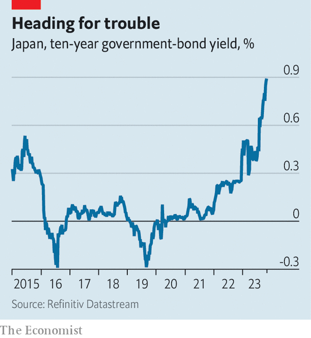

###### Frightening

# How Japan poses a threat to the global financial system 

##### Huge, reliable buyers of overseas bonds may be about to close their wallets 

 

> Nov 2nd 2023 

The bank of japan (boj) failed to deliver a Halloween thriller. Even as central banks elsewhere have raised interest rates in recent years, the boj has stuck with its ultra-loose policy, designed to stimulate growth. Japan’s benchmark interest rate sits at -0.1%, where it has been for seven years. And on October 31st, despite building pressure, the bank decided merely to tweak its cap on ten-year government-bond yields. The 1% ceiling on yields, which the bank makes enormous bond purchases in order to defend, is now a reference rather than a rule. Indeed, yields on the benchmark bond are at 0.95%, their highest for over a decade (see chart). 

 


After the boj’s announcement, the yen fell to ¥151 to the dollar, its lowest in decades. Inflation, long quiescent, is no longer so low—the boj raised its forecasts for underlying “core” inflation over the next three years. Many analysts expect the central bank to end its yield-curve-control policy once and for all early next year, and to have raised interest rates by April. But even when the boj  does finally raise interest rates, it is likely to be by just a fraction of a percentage point, meaning the gulf between Japanese bond yields and those in the rest of the world will remain large, with major consequences for global financial markets. A fright is still in the offing. 

To understand why, consider the impact Japan’s rock-bottom interest rates and continued intervention to suppress bond yields have had. Low rates at home have generated demand for foreign assets, as investors seek better returns. Last year the income from Japan’s overseas investments ran to $269bn more than was made by overseas investors in Japan, the world’s largest surplus, equivalent to 6% of Japanese gdp. The huge gap between bond yields in Japan and those in the rest of the world now presents dangers to both the Japanese investors that have bought foreign bonds and the global issuers that have benefited from Japanese custom.

Jeopardy is particularly apparent at Japan’s largest financial firms, which make big investments abroad. The cost of hedging overseas investments depends on the difference between the short-term interest rates of the two currencies at play. America’s short-term interest rates are more than five percentage points above Japan’s equivalent, and the gap exceeds the 4.8% yield on ten-year American government bonds. This means Japanese buyers now make a guaranteed loss when buying long-term bonds in dollars and hedging their exposure. Hence why the country’s life insurers, which are among the institutions keenest to hedge their currency risk, dumped ¥11.4trn ($87bn) in foreign bonds last year. 

The huge gap between short-term interest rates means that Japanese investors now have more limited options. One is to continue buying overseas, but at greater risk. Meiji Yasuda Life Insurance and Sumitomo Life, each of which held more than ¥40trn in assets last year, say they will increase their overseas bond purchases without hedging against sudden currency shifts, in effect betting against a sudden rise in the yen. Life-insurance firms are usually conservative, but the longer the enormous gap in interest rates persists, the more they will be encouraged to take risks. 

Meanwhile, rising yields on long-term Japanese bonds, which will surely rise further still if the boj does abandon yield-curve control, may tempt local investors to bring home their money. Japan’s 40-year bonds offer yields of 2.1%—enough to preserve the capital of investors even if the boj hits its target of 2% inflation. Martin Whetton of Westpac, a bank, says that this prospect ought to worry firms and governments in America and Europe used to a voracious Japanese appetite for their bonds. 

In such a scenario, a source of demand would turn into a source of pressure on the funding of Western firms and governments. The yen might then surge, as Japanese investors sell foreign-currency debt and make new investments at home. Bob Michele of JPMorgan Asset Management warns of a decade of capital repatriation.

The flow of Japanese capital to the rest of the world, which emerged during a decade of easy monetary policy around the world, looks likely to be diminished. Whether the resulting pain will be felt by local financial institutions, or foreign bond issuers, or both, will become clearer over the months to come. What is already clear is that it will be felt by someone. ■


