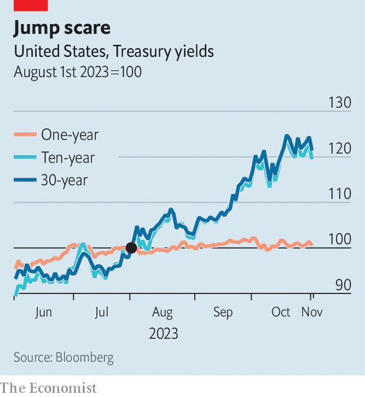

###### The tail that wags

# Investors are paying close attention to the world’s safest assets 

##### Forget the Federal Reserve. There is a new show in town 

 

> Nov 2nd 2023 

Regular and predictable. That has been the golden rule of Treasury issuance for 40 years. America’s fiscal branch once funded itself with “tactical” bond sales. Officials would survey market participants and issue debt in response. But this process proved highly disruptive to financial activity. So in 1982 they adopted a new approach: a regular schedule of issuance would be followed, communicated long in advance. Treasury officials now think that, by reducing overall borrowing costs, this strategy has saved taxpayers a fortune.

As a part of this regularly scheduled programme the Treasury has, for decades, released a “quarterly refunding announcement” in which it lays out its plans for the next three months. This is not generally a hotly anticipated event, being precisely the kind of wonkish release that seldom attracts wider interest. But on November 1st the announcement was pretty much all that Wall Street cared about. Ian Lyngen of bmo Capital Markets, an investment bank, declared this a “unique moment in market history”, because the refunding announcement was more important than the meeting of the Federal Reserve, which took place later the same day. “All that matters at this moment is supply.”

Investors’ interest has been piqued for several reasons. America’s fiscal deficit is large. It will clock in at almost 6% of gdp for the fiscal year of 2022-23. It has been pushed upwards by high interest rates, which have increased the cost of servicing America’s national debt. This has put pressure on bond markets. In August, at the last refunding announcement, the market appeared surprised by both the increase in total issuance and just how much of it was long-dated. In the weeks that followed several auctions “tailed”—trader-speak for the auction resulting in debt being issued at a higher yield than expected. 

 


Some traders think this exacerbated the almighty sell-off in long-dated bonds that has occurred since the summer. Since August 1st the yield on t-bills, the name given to short-dated Treasuries which mature within a year, has not budged at all. Yields have spiked, however, for long-dated bonds that mature in ten or 30 years. The difference between what it costs to borrow in the short term and the long term is called the “term premium”—and it has returned with a vengeance (see chart).

In the event, markets were relieved by the Treasury’s announcement. Planned issuance was increased, but will be concentrated at the short end. Exactly the same value of 20-year Treasuries will be issued in the three months from November as in the three that preceded it, but almost 20% more two-year Treasuries will be sold. Currently, short-dated t-bill issuance is more than one-fifth of total debt issuance. Although that is slightly above historical levels, the issuance committee indicated that it might be willing to go higher still. As noted in the minutes of their meeting, committee members “supported meaningful deviation” from the range. Markets embraced all of this news. The yield on the ten-year Treasury fell about ten basis points after the release.

That the Treasury managed to reassure investors this time round is a pleasing outcome for all involved. Its officials are sticking to their procedure as far as regular programming is concerned—they will, in three months’ time, publish their next set of issuance plans. But with markets so volatile it is becoming ever harder for the Treasury to remain predictable.■


