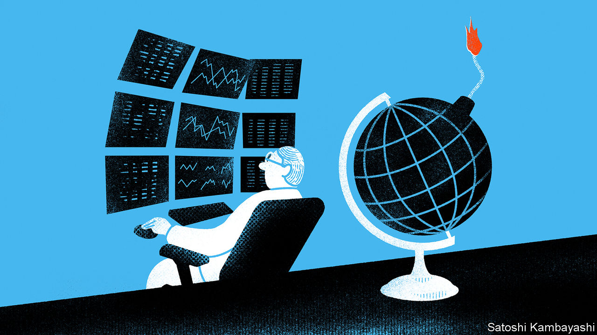

###### Buttonwood

# What a third world war would mean for investors 

##### Global conflicts have a habit of sneaking up on money-managers 

 

> Oct 30th 2023 

Europe had been moving towards the slaughterhouse for years, and by 1914 a conflict was all but inevitable—that, at least, is the argument often made in hindsight. Yet at the time, as Niall Ferguson, a historian, noted in a paper published in 2008, it did not feel that way to investors. For them, the first world war came as a shock. Until the week before it erupted, prices in the bond, currency and money markets barely budged. Then all hell broke loose. “The City has seen in a flash the meaning of war,” wrote this newspaper on August 1st 1914. 

Could financial markets once again be underpricing the risk of a global conflict? In the nightmare scenario, the descent into a third world war began two years ago, as Russian troops massed on the Ukrainian border. Today Israel’s battle against Hamas has the frightening potential to spill across its borders. American military support is crucial to both Ukraine and Israel, and in Iraq and Syria the superpower’s bases have come under fire, probably from proxies of Iran. Should China decide it is time to take advantage of a distracted superpower and invade Taiwan, America could all too easily end up being drawn into three wars at once. The rest of the world risks those wars interlocking and turning into something even more devastating.

This scenario would of course place financial damage a long way down the list of horrors. Even so, it is part of an investor’s job to consider exactly what it would mean for their portfolio. So far the possibility of a world war has barely caused a tremor in the markets. True, they have for some time now been more seized by fear than greed. Bond prices have been turbulent, even for supposedly risk-free American Treasuries, and yields have been climbing for most of this year. Stock indices in America, China and Europe have fallen for three consecutive months. Yet this choppiness can all be plausibly explained by peacetime factors, including outsized government borrowing, interest-rate expectations and shareholders whose previous optimism had got the better of them.

In short, it does not look anything like the panic you might expect if the odds of the world entering into war were edging higher. The brightest conclusion is that such odds really are close to zero. A darker one is that, like the investors of 1914, today’s may soon be blindsided. History points to a third possibility: that even if investors expect a major war, there is little they can do to reliably profit from it.

The easiest way to understand this is to imagine yourself in 1914, knowing that the first world war was about to arrive. You would need to place your bets quickly—within weeks, the main exchanges in London, New York and continental Europe would be closed. They would stay that way for months. Would you be able to guess how many, and which way the war might have turned by then? If you wisely judged American stocks to be a good bet, would you have managed to trade with a broker who avoided bankruptcy amid a liquidity crisis? You might have decided, again wisely, to trim positions in soon-to-be war-strained government debt. Would you have guessed that Russian bonds, which would experience a communist revolution and Bolshevik-driven default, were the ones to dump completely?

War, in other words, involves a level of radical uncertainty far beyond the calculable risks to which most investors have become accustomed. This means that even previous world wars have limited lessons for later ones, since no two are alike. Mr Ferguson’s paper shows that the optimal playbook for 1914 (buy commodities and American stocks; sell European bonds, stocks and currencies) was of little use in the late 1930s. Investors in that decade did try to learn from history. Anticipating another world war, they sold continental European stocks and currencies. But this different war had different winning investments. British stocks beat American ones, and so did British government bonds.

Today there is a greater and more terrible source of uncertainty, since many of the potential belligerent powers wield nuclear weapons. Yet in a sense, this has little financial relevance. After all, in a nuclear conflagration your portfolio would be unlikely to rank highly among your priorities. The upshot of it all? That the fog of war is even thicker for investors than it is for military generals, who at least have sight of the action. If the worst happens, future historians might wonder about the seeming insouciance of today’s investors. They will only be able to do so because, for them, the fog will have cleared.■


