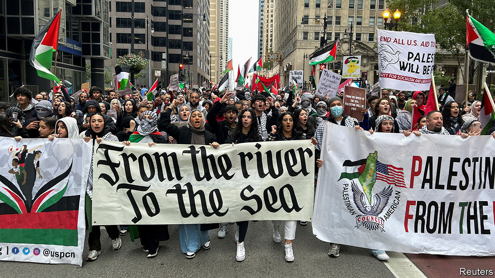
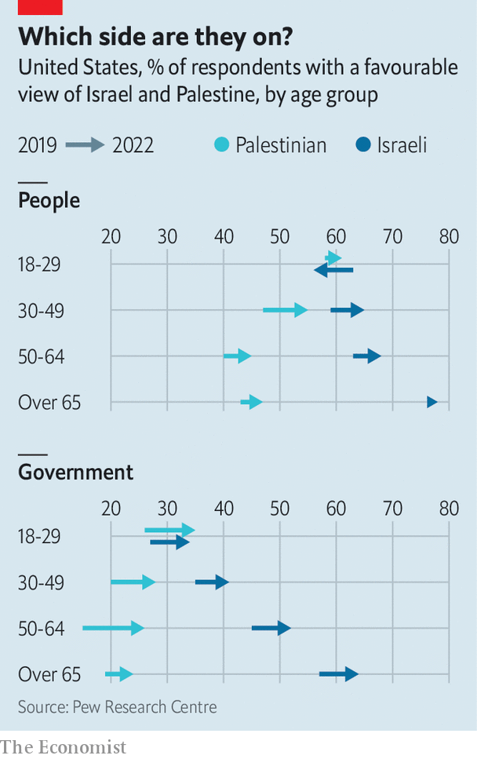

###### Views of the Middle East

# The culture war over the Gaza war 

##### The conflict is raging on streets and screens in the West 

 

> Oct 28th 2023 

The imagery is enticing, the rhythm and rhyme are propulsive. “From the river to the sea,” runs the popular slogan, “Palestine will be free!” In recent days that couplet has resounded in squares from Toronto to Berlin. Wearing chequered scarves, Californian pupils declaimed it as they swept down school corridors. Activists projected the words onto a wall of a university in Washington, DC.


What do they mean? Superficially an idealistic vow of liberation, the decades-old expression also contains a threat: the river is the River Jordan, the sea is the Mediterranean and freedom, in this case, implies the destruction of the state of Israel. That is certainly the sense in which  uses the phrase. The children chanting it at the base of Nelson’s column in London on October 21st, during a big pro-Palestinian march, may not have grasped the menace. But several marchers who were yelling the words, or bearing them on placards, seemed aware of it, clamming up defensively when asked to explain them.

“Anyone who’s paying attention knows exactly what that means,” says Jonathan Greenblatt of the Anti-Defamation League, an American anti-hate group which, like watchdogs in Britain and elsewhere, has documented a steep rise in antisemitic incidents since  on Israel on October 7th. (Islamophobic incidents have multiplied in several countries, too.) The ubiquity of this deceptively hardline mantra points up an important shift in Western attitudes to the Israeli-Palestinian conflict. Three related forces are driving it: technology, demography and ideology.

The Western left once sympathised with Zionism. That changed markedly after the six-day war of 1967 and the Israeli occupation of the West Bank and Gaza. Especially since the end of apartheid in South Africa, the  cause has been a talismanic issue for left-leaning Westerners. Why it acquired this status is a matter of debate. In some analyses, Israel serves as an avatar for American power, or for bygone colonial struggles. Jewish groups and others have wondered why the casualties in, say, Syria or Afghanistan—where the perpetrators as well as the victims are Muslim—stir less  concern.

After a period in which the issue receded in prominence in Western diplomacy and headlines, Gaza’s plight is now inspiring protests and disputes as never before. A glut of open letters by artists and other luminaries have decried Israel’s bombardment and Western leaders’ acquiescence to it. (Counter-petitions mourn the atrocities of October 7th and affirm Israel’s right to self-defence.) Pro-Palestinian rallies have been held in many cities, including some where they were notionally banned. 

The recriminations flow both ways. In Britain the BBC’s reluctance to refer to Hamas as “terrorists” led to an outcry and a partial climbdown. Dave Chappelle, an American comedian, reportedly had a spat with punters at a gig in Boston after he lamented the crisis in Gaza. Some American students have been hounded for their stridently anti-Israel views; talks by Palestinian authors have been cancelled. Palestine Legal, which supports pro-Palestinian activists in America, says they are “facing a wave of McCarthyite backlash targeting their livelihoods and careers”. 

“Silence is violence”, runs another popular protest slogan, a position taken by some on all sides. A range of institutions, from universities to unions, have been berated for the wording of their public statements, or for failing to issue one. Calls for peace have been likened to appeasement. And supporters of both Israel and the Palestinians make analogies with Ukraine to show the supposed hypocrisy of the opposing camp. Backers of the Palestinians see Gaza as the victim (like Ukraine) of invasion by a bullying neighbour. Pro-Israelis point to Hamas’s incursion and liken its barbarity to Russian war crimes. 

The polarised passions and viral slogans are in part a sharp manifestation of the echo-chamber effect of social media. Millions of people have watched footage of Hamas’s depredations in horror. Many others are transfixed instead by images of Gaza’s agony. In Germany, for instance, where a synagogue has been firebombed and Stars of David daubed on Jewish homes, some Islamists exist in “parallel societies”, relying on digital and overseas news, says Felix Klein, the federal commissioner for antisemitism. So, he adds, do many on the far right, which commits most of the country’s antisemitic crimes. (There, as in America, the two groups have made common cause online.)

Worse, the heart-rending clips and pictures sometimes come from the wrong country or the wrong war, or even from video games. Like the echo-chamber effect, online disinformation is a familiar problem that has seemed as acute as ever in the ongoing crisis. 

The blast at the Ahli Arab hospital on October 17th was a supreme example of the reach and clout of falsehoods. Swiftly picked up by major news outfits, misleading reports contributed, in short order, to the cancelling of a summit between Arab leaders and President Joe Biden. Demand for disinformation, reckons Peter Pomerantsev of Johns Hopkins University in Baltimore, is an even bigger problem than supply. In wartime, “people are looking for reasons to confirm their biases,” he says glumly. “It isn’t about the facts.”

Screen habits encourage another striking feature of reactions to the war: the “gamification” of news, whereby irony and taboo-busting are prized, even amid the gravest calamities. The paragliders on which some Hamas murderers flew to Israel were, for a few onlookers, irresistibly meme-worthy. Black Lives Matter Chicago briefly posted an image of a paraglider with the words, “I stand with Palestine.” “From Chicago to Gaza,” runs another of its messages, “from the river to the sea.”

As for demography: immigration is one factor skewing the culture war in the West over the tragic one in the Middle East. Muslim populations in Western countries are both growing and changing in composition. In the past, notes Yunus Ulusoy of the Centre for Turkish Studies and Integration Research in Essen, the Muslim population in Germany was of predominantly Turkish origin. Now, he says, around 2.1m Muslims in the country have roots in Syria, Iraq and other places that are hostile to Israel. They brought their views of the conflict with them—shaped, says Mr Ulusoy, by a sense of solidarity with the, or global Muslim community.

Awareness of Nazism and the Holocaust, which for decades coloured German attitudes to Israel and antisemitism, is waning. Some Muslims, says Professor Julia Bernstein of the Frankfurt University of Applied Sciences, think this awful past “is not our history”, and that they are now the real victims of prejudice in Germany.

France, notes Dominique Moïsi, an eminent French commentator, is home to both the largest Muslim population in western Europe and the biggest Jewish one. It has a traumatic recent history of Islamist terrorism, and a more distant one of collaboration with the Nazis, both of which tend to bolster support for Israel. But it also harbours contrary strains of anti-Americanism and guilt over French colonialism in the Arab world. The result, says Mr Moïsi, is a “conflict of memories” that plays out in politics and on the streets.

In America, the most influential depiction of Israel in popular culture is probably “Exodus”. A novel by Leon Uris published in 1958, it dramatises the birth of the state and became a film starring Paul Newman. (“As a piece of propaganda,” said David Ben-Gurion, Israel’s first prime minister, “Exodus” was “the greatest thing ever written” about the country.) Overall, Americans remain much more supportive of Israel than are Europeans. Polls conducted since October 7th show a hardening of support for it among Democrats in particular. 

 


But there is an important demographic wrinkle. As Tim Malloy, a polling analyst at Quinnipiac University in Connecticut, says, younger Americans are much less inclined to back Israel than are their elders. They also think more favourably of the Palestinian people. According to surveys by Pew, this gap in sympathy between American generations is widening (see chart). 

Many young voters do not have direct memories of the attacks of September 11th 2001, a calamity which shaped older Americans’ views of Islamist terrorists such as Hamas. Their diverging outlook also reflects the third force swaying Western attitudes: a binary ideology that emerged from American universities to win converts far and wide.

Beyond good and evil

Seeing the world in Manichean terms can be comforting. It turns confounding issues into simple clashes of good and evil, conferring a halo of virtue on those who pick the right side. As Yascha Mounk, author of “The Identity Trap”, argues, the emerging ideology offers just this form of comfort, sorting the world into opposing categories—coloniser and colonised, oppressors and oppressed—often along racial lines. In essence it transposes the terms of American debates over race onto other places and problems. “The American brand of anti-colonialism”, quips Mr Mounk, “is astonishingly colonialist.” 

In a polarised age, lots of people infer their opinions from their political allegiance rather than the other way round. This, thinks Mr Mounk, is part of the new ideology’s appeal: it furnishes an all-purpose vocabulary to apply to any conflict. In this schema, the powerless can do no wrong, least of all to the powerful—and nobody can be both. Liberation movements of all kinds are linked, as communist insurgencies purported to be during the cold war. As flares in the colours of the Palestinian flag were set off at Piccadilly Circus, a protester in London holding a “Queers for Palestine” sign explained that “All the struggles are connected.”

This philosophy is tailor-made for the posturing and character-limits of social-media posts, perhaps one reason it is gaining adherents. But it prohibits the balance and nuanced judgments that intractable real-world hostilities demand. In particular, because the Palestinians are cast as powerless, and Israel is classed as powerful, it follows that Israelis cannot qualify as victims. Never mind the exile of Mizrahi Jews from Arab countries to Israel. The Holocaust is ancient history.

The schema shows up glaringly in references to Hamas’s crimes as a form of “resistance” or “decolonisation”, and in the statement by some Harvard students that held Israel “entirely responsible” for the slaughter of its own citizens. Many Jews, in Israel and the diaspora, perceive a wider disregard for Israel’s suffering—not just less sympathy than it received during, say, the Entebbe hostage crisis of 1976, but a void. If the issue is morally simple, meanwhile, for many Western activists the remedy is blunt and drastic: not the two-state solution of yore, but a Palestine that stretches “from the river to the sea”.

In the left-leaning political elite, the picture is starkly different. Both Mr Biden and Sir Keir Starmer, leader of Britain’s opposition Labour Party, have offered Israel staunch support. All the same, the escalation in some rank-and-file attitudes to the war may have a lasting fallout—both in the Middle East and in the West. Mr Biden, Sir Keir and other leaders have been lambasted by some in their parties for declining to call for a ceasefire. This disapproval—often motivated by natural compassion for Palestinian civilians rather than ideology—may cost them votes, Muslim and otherwise, in what may be tight elections next year. (Mr Biden may have weighed that risk against the potentially higher cost of supporting a ceasefire.) 

That may not be the only form of political blowback. Plenty of liberal voters are dismayed by the responses of people with whom, in the past, they felt broadly aligned. Their coalition with more radical voters was already under pressure; for some liberals, the bedrock of common values that they thought underpinned it seems to have crumbled. If the debate over Gaza has been a symptom of polarisation in the West, it may yet prove to be a cause of realignment, too.

The consequences for Israel and the Middle East are unpredictable. At least in the short term, revulsion for Hamas seems to outweigh any qualms Americans might have had before the war over Israel’s rightward lurch under Binyamin Netanyahu. Most Americans, including most Democrats, tell pollsters that supporting Israel is in American interests. How far and how long that remains the case depends on a series of unknowns—starting with the conduct and outcome of the ground invasion of Gaza, and the new dispensation that may follow. Developments in domestic politics will matter, including the fervour of the Republican embrace of isolationism.

From an Israeli point of view, though, the long-term trajectory of opinion in America is worrying. And in Europe, as the second world war recedes from living memory and the clout of Muslim voters grows, support for Israel may continue to soften, especially on the left. 

Even as the disaster in Israel and Gaza unfolds, one of its morals is already clear. Amid the unchecked flow of images and ideas, Western public opinion and geopolitical conflicts are entangled in new and explosive ways. Culture wars and real wars are no longer separate struggles. ■

