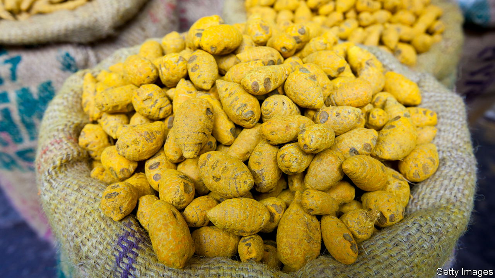

###### Lead poisoning

# How to stop turmeric from killing people 

##### Developing countries—especially India—should learn from Bangladesh 

 

> Nov 2nd 2023 

Turmeric, a flowering plant of the ginger family, has long been prized in Ayurvedic medicine for its anti-inflammatory properties and in Asian cuisines for its earthy flavour and vibrant hue. Haldi, the spice’s Hindi name, is derived from the Sanskrit for “golden coloured”. But for the millions of South Asians who habitually consume it, turmeric’s skin-staining yellowness can be deceptive and deadly.

To heighten their colour, the rhizomes from which the spice is extracted are routinely dusted with lead chromate, a neurotoxin. The practice helps explain why South Asia has the highest rates of lead poisoning in the world. The heart and brain diseases it causes—to which children are especially susceptible—accounted for at least 1.4m deaths in the region in 2019. The economic cost is crippling; that year lead poisoning is estimated to have lowered South Asian productivity by the equivalent of 9% of GDP. Yet it turns out that with clever policies, enlightened leadership and astute messaging this blight can be greatly reduced. Bangladesh has .

At the instigation of teams from Stanford University and the International Centre for Diarrhoeal Disease Research, Bangladesh, a research institute, the country launched a nationwide campaign against turmeric adulteration in 2019. Rules against adulteration were enforced and well-publicised stings carried out against wholesalers who persisted in it. The prime minister, Sheikh Hasina, discussed the problem on television. Bangladeshi bazaars were plastered with warnings against it. Local media also publicised it. 

According to newly published data, the country thereby reduced the prevalence of turmeric adulteration in its spice markets to zero in just two years. That slashed lead levels in the blood of Bangladeshi turmeric-mill workers by about a third. Nationwide, it probably saved thousands of lives. Early analysis suggests that each extra year of healthy life cost a mere $1 to preserve. Achieving the same benefit through cash transfers is estimated to cost over $800.

Other countries where lead poisoning is rife should follow Bangladesh. Recent estimates suggest a staggering 815m children—one in three of the global total—have been poisoned by the metal. According to the Centre for Global Development, a think-tank in Washington, this disaster explains a fifth of the learning gap between children in rich and poor countries. 

The poisoning has many causes. Weak or absent regulators permit lead-infused cooking utensils, cosmetics and other products. Yet adulterated turmeric looks like a major culprit almost everywhere, chiefly owing to poor practice in India, which produces 75% of the spice. India was the source of much of the poisonous pigment found in Bangladesh and is estimated to have the highest incidence of lead poisoning of any country.

Bangladesh’s response to the problem, if properly understood, could work in many countries. Its key elements included an openness to foreign expertise; effective NGOs; a willingness by the government to work with them; and the formation of an even broader coalition, also including journalists and private firms, to maximise the effort. This low-cost, co-ordinated and relentless approach to problem-solving, familiar to admirers of Bangladesh, has underpinned its outstanding development success over the past two decades. And Sheikh Hasina deserves credit for it—even though her commitment to such enlightened policymaking appears to be flagging.

Leaders and lead poisoning 

With an election approaching, the world’s longest-serving woman prime minister, Bangladesh’s ruler for two decades, is growing more . The importance of the turmeric campaign should help persuade her to reverse course. As it shows, the Bangladeshi model rests on organising, collaboration and consensus, not political fiat, and there is much more than her legacy riding on it.

India, whose leader, Narendra Modi, is in the process of driving out foreign donors and dismantling any NGO he considers unfriendly to him, has much to learn from Bangladesh’s more open, pragmatic approach. The developing world has countless health and environmental problems that it might help solve. For these many reasons, it should be sustained and widely copied. ■

