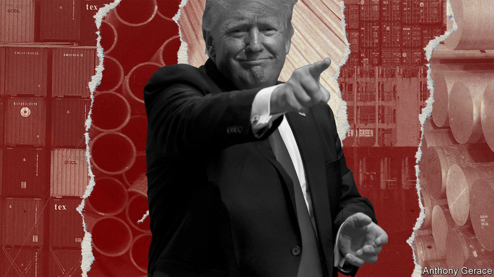

###### Trade wars: episode II

# Trump’s tariff plans would be disastrous for America and the world 

##### You may think his worst ideas won’t get far. Sadly, on trade he has been singularly influential 

 

> Nov 2nd 2023 

Joe Biden’s approval rating is languishing and Donald Trump is cruising to the Republican presidential nomination, so it is wise to consider what another Trump term might bring. Though much about Mr Trump’s policy agenda is chaotic, in one area he is crystal clear: he wants to . A lot. He has proposed slapping a 10% tariff on all imported goods, thereby trebling the country’s average and taking American trade protectionism back to its mid-20th-century heyday.

This is not idle talk. Mr Trump’s lieutenants want to double down on the bad bets they placed in his presidency. Robert Lighthizer, Mr Trump’s chief trade negotiator, has proposed a universal tariff that would be as high as is necessary to eliminate the country’s trade deficit. Peter Navarro, a prickly adviser in Mr Trump’s White House, has called for total reciprocity: if any country has high tariffs on specific American products, Mr Trump should match them. Economic populists, meanwhile, are trying to sell Americans on the merits of all this. On October 28th the  published an essay by one arguing “Why Trump is right about tariffs”. In fact, the policy would not only fail to achieve its goals, it would also inflict grievous harm on America and the world economy.

Mr Trump and his fellow travellers argue that tariffs strike three targets: they lead to a reduction in America’s gaping trade deficit, a source (in their view) of economic weakness; they encourage businesses to manufacture at home; and they counter the manifest injustice of a global economic system in which other countries, especially China, exploit America’s openness. 

Each of these propositions is bunk. The argument that tariffs determine the size of the trade deficit is wrong in both theory and practice. The fundamental driver of the trade balance is America’s low national savings rate, which in part reflects its consumer-led economy. Rather than being a sign of fragility, its appetite for imports is proof of its vitality. America has run a trade deficit every year since 1975, during which time it has been the world’s pre-eminent economic power. And Mr Trump’s own experience shows that tariffs alone do little to change the trade deficit. It widened by nearly 25% during his time in office. 

Tariffs do help some manufacturers. Protected industries tend to expand their domestic market share, as steelmakers have since Mr Trump coddled them with tariffs. But at what cost? Sheltered companies can get away with being less efficient than their global rivals. Other domestic industries suffer: one study estimates that steel users paid an outrageous $650,000 for each steelmaking job created by Mr Trump’s tariffs. And although Mr Trump claims that tariffs are paid for “mostly by China”, the burden actually falls on American consumers, via higher prices. A 10% universal levy would cost each American household an average of $2,000 a year.

Last, tariffs will not fix the global trading system but will make things worse. Other countries would retaliate, as they did during Mr Trump’s first rodeo. That would amount to a global tax on trade, adding to inflation risks. The World Trade Organisation would go to the brink, having been weakened by American administrations over the years, including the present one. And tariffs would tear at America’s ties with its allies, undermining attempts to forge supply chains that do not hinge on China.

Regrettably, Mr Biden does not have much standing to criticise Mr Trump on protectionism. His subsidies for electric vehicles, wind turbines and more besides discriminate against foreign countries and may end up squandering public money. He has left most of Mr Trump’s original tariffs untouched and may reapply levies on European steel as  falter.

That sorry record is all the more reason to fear Mr Trump’s plans. On trade he has been influential, turning America from a force for free trade into an apologist for protectionism. With a 10% tariff, that ugly transformation would be complete. ■

