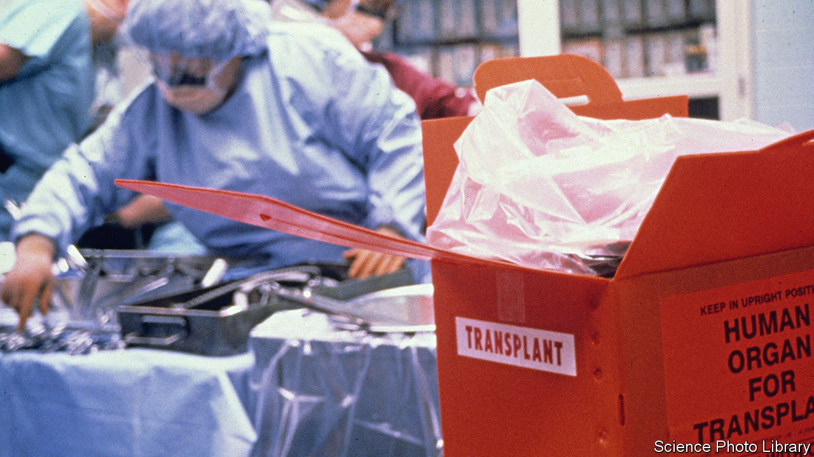

###### On donating organs, mental health, the Sagrada Família basilica, film lengths, James Bond, “Star Trek”

# Letters to the editor 

##### A selection of correspondence 

 

> Nov 2nd 2023 


Organ-donation economics

More than 110,000 Americans are waiting for an organ transplant and over 5,000 died waiting for an organ in 2019. Close to 6,000 recovered organs were discarded. “” (September 23rd) correctly pointed out that the responsibility lies in part with non-profit Organ Procurement Organisations and in part with the excessive caution exercised by transplant centres when deciding who to conduct transplants for and which kidneys to use. 

Numerous initiatives in Congress, and more proposed by various non-governmental agencies, such as the Federation of American Scientists and the National Academies of Sciences, Engineering and Medicine, among others, have been focused on tweaking how the performance of organ procurers and transplant centres should be measured while keeping in place the system that put us in today’s quagmire. As we indicate in our recent paper (conditionally accepted at the ), such approaches that keep regulations fragmented are bound to be inefficient, given that the incentives and opportunities facing organ procurers and transplant centres are intertwined.

We show that “holistic regulation”, which aligns the interests of organ procurers and transplant centres by rewarding them based on the health outcomes of the entire patient pool, can get at the root of the problem. This approach also leads to more organ recoveries while increasing the use of organs for sicker patients who otherwise would be left without a transplant.

In the end increasing access to kidney transplantation will require the improvement of the entire supply chain of organs. This means boosting donor registrations and donor recoveries from the deceased. It also means increasing living donations, and co-ordinating donations through mechanisms like paired kidney donations and deceased-donor-initiated kidney- exchange chains.

Alex Chan

Assistant professor of business administration

Harvard University


Alvin E. Roth

Professor of economics

Stanford University


 


Hope on mental health

The history of psychiatry is a history of therapeutic enthusiasm, with all of the tragedy and triumph, hubris and humility that such enthusiasm brings (“”, October 21st). Many of the challenges facing mental-heath treatment in the United States are seen elsewhere. In high-income countries, just one-third of people with depression receive formal care. In low-income countries, the rate of minimally adequate treatment is 3%.

Neuroscientific progress is glacial, but there are reasons for hope. Despite our rudimentary understanding of the brain, we have treatments that work, including psychological therapies and antidepressants. Antipsychotic medication is associated with longer life in schizophrenia. Globally, the suicide rate declined by a third between 1990 and 2016. This dramatic improvement in global public health does not mean the work is done (even a single suicide is one too many), but it shows that positive change is possible.

Brendan Kelly

Professor of psychiatry

Trinity College Dublin

A church becomes art

The completion of unfinished work by a dead artist raises interesting questions about authorship and merit (““, October 21st). In architecture, the work of Antoni Gaudí i Cornet shows how the creativeness, vision and craft of a genius can live on and be completed according to his original designs 100 years after his death. Gaudí was a renowned architect in Barcelona when he was appointed as the chief designer for the Sagrada Família basilica in 1883. He completely changed the designs, everything from the external structure to the details of the interior, and attracted a group of designers, architects and craftspeople to work with him according to his designs. This continued until his death in 1926 (after being hit by a tramcar). 

The construction continued, exactly according to his vision, through extended periods of social unrest, a civil war and a world war. The final two towers of the four evangelists were only recently completed and the cathedral is on target to finish the tower of Jesus Christ at the centenary of Gaudí’s death in 2026. This work is not a reconstruction, or the redevelopment of plans or the projection of other architects onto the plans of Gaudí. The basilica will look as it did in the original plans envisioned by Gaudí. 

J.M. Innes

Visiting fellow

Churchill College, Cambridge

 


About time

“” (October 21st) explained how films today are on average 24% longer than in the 1930s, and pointed to competition from streaming and the growing clout of big-name directors as possible reasons. But there is a much more practical factor: costs have come down because of digital capture and digital projection. Every extra foot of film in older movies cost money. It also cost a great deal for the initial capture and development, and editing was slow and tedious. The average reel of finished film was around one hour and 20 minutes. 

Every cinema in America needed six reels of film, all of which required costly printing and shipping. Today, even if a film is captured on film stock, 99% of the final projection will be from a digital scan. At most, this means a hard drive shipped to the cinema. At that point length really doesn’t matter much, at least in terms of studio economics, even if it stretches an audience’s patience or bladder control.

Douglas Bowker


I was among the last to see “Titanic”. I was sure a bathroom break would be needed for a movie that long and I have wondered why there was not an intermission. Additional candy sales would surely have resulted.

Connie Elliot


 


For your eyes only

As mentioned in your review of Nicholas Shakespeare’s biography of Ian Fleming, John F. Kennedy listed Fleming’s “From Russia, with Love” as one of his ten favourite books in a 1961 interview with  magazine (“”, October 14th). What may also be of interest to your readers is that the  article began with an agitated Kennedy asking his secretary about the late delivery of the latest issue of . 

A few paragraphs (and reminders) later, our hero sallies forth to his waiting helicopter the next day, said issue of  safely tucked under his arm.

ALOK MOHAN


 


Highly illogical

I think was a bit premature in predicting the demise of the hand-held device (October 7th). One only needs to watch Captain Kirk flip open his communicator in “Star Trek” to realise such devices will obviously remain indispensable, even in the 23rd century.

Greg Nole


