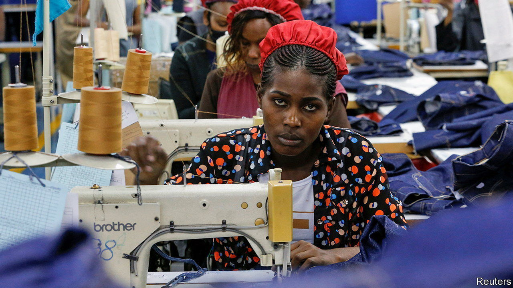

###### AGOA and out

# America suspends duty-free access to four African countries 

##### Trade officials are meeting to discuss America’s approach to the continent 

 

> Nov 2nd 2023 

In the eyes of American officials, the African Growth and Opportunity Act (AGOA) is about “more than just trade”. The flagship policy grants duty-free access to America for almost 7,000 products from sub-Saharan Africa. To qualify, countries must respect human rights, uphold labour standards, promote a market-based economy and eliminate barriers to American investment, among other criteria. 

But can a system of trade preferences also be a tool of foreign policy, without stifling trade’s potential for development? That question will rumble beneath the surface as American and African officials gather in Johannesburg between November 2nd and 4th for the annual AGOA forum. Out of 45 countries that could benefit from the scheme, ten are already ineligible. On October 30th President Joe Biden said four more would be kicked out next year, while Mauritania would be reinstated after making progress on workers’ rights.

None of the new suspensions are surprising. Niger and Gabon have recently had coups. The Central African Republic (CAR) has become a second home for trigger-happy Russian mercenaries. Uganda has a long record of human-rights violations and this year passed a law that imposes strict punishments for homosexuality, including the death penalty in some cases. Ugandan human-rights groups says that LGBT people have been tortured, arrested and sacked, among other abuses.

For many governments the consequences are more reputational than economic. America buys just 6% of sub-Saharan Africa’s goods exports; China and the EU each purchase three times as much. Even though the Ugandan government is irked by America’s warnings to firms about the risks of doing business in the country, it can probably live without AGOA, which applied to just $12m of its exports last year. Niger and the CAR export next to nothing under the scheme. 

In a handful of countries AGOA really does make a difference, especially in clothing. There, a suspension can put a brake on economic development. Ethiopia has been ineligible for almost two years over abuses by soldiers and rebels during a civil war. But that was hardly the fault of the young women who stitch shirts in industrial zones, and who were laid off in their thousands when the loss of duty-free access made Ethiopian exports uncompetitive. Some investors have packed up and left. “Once bitten, twice shy: when will people come back to those zones?” asks another, who is weighing up how long to stay.

Even South Africa, the biggest exporter under AGOA, cannot take its trade access for granted. America is alarmed by its close military ties to Russia. Senior congressmen have questioned whether the country should remain eligible for AGOA and pushed for this year’s forum to be moved elsewhere. That did not happen, but only after a South African delegation flew to Washington to patch up things.

As AGOA is an act of Congress, not a two-way trade deal, countries have little recourse when they are booted off. Some Africans accuse America of bullying. “We want to be supporting governments and institutions that our values align with,” says Joy Basu, an American deputy assistant secretary of state for African affairs, adding that human rights and democratic principles in turn create “the right environment to deepen trade and investment”.

All that will be moot if Congress does not extend AGOA beyond its current expiry date of 2025. The uncertainty has caused 45% of American clothing firms to reduce their sourcing from Africa, according to an industry survey. Some senators have called for a swift renewal to “counter the malign influence of China, Russia, and other foreign actors”. In Washington, trade with Africa has long been viewed as both a boost to development and a spur to good governance. It is increasingly seen as a contest between great powers, too. ■

