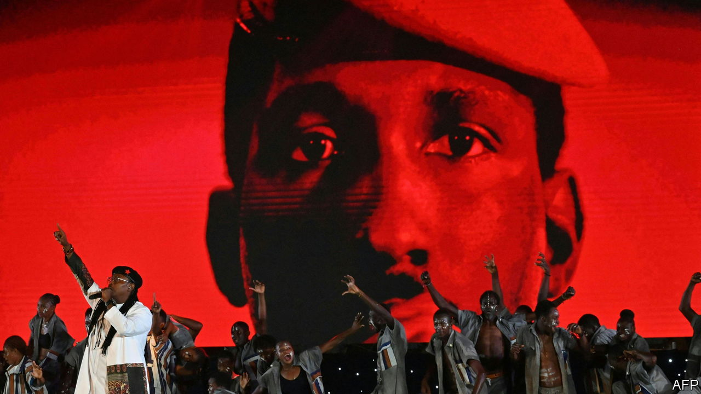

###### Firebranding

# How the red beret became Africa’s most political hat 

##### From Uganda to South Africa, it conjures the spirit of revolution 

 

> Nov 2nd 2023 

French revolutionaries wore the . Fans of Donald Trump don MAGA baseball caps. For young activists in Africa, the red beret is . Julius Malema, a South African firebrand, says the hat is “a revolutionary symbol of defiance and resistance”.

It is sported by supporters of Mr Malema and his Economic Freedom Fighters, a populist party. It is also worn by followers of Bobi Wine, a singer and opposition leader who is trying to unseat an autocratic president in Uganda. Activists from Ghana to Zimbabwe pull on berets of various hues.

The head that launched a thousand hats belonged to Thomas Sankara, a Marxist president of Burkina Faso who was assassinated in 1987. A man of personal modesty and striking looks, he refused to let his portrait be hung in public buildings. But in death his image is everywhere on the pan-African left. He first wore the red beret because he was a soldier (who staged a coup). He said he later took inspiration from Che Guevara, to whom he is often compared.

Ibrahim Traoré, an army captain who led a coup in Burkina Faso last year, mimics Sankara’s rhetoric and headgear. But it is generally civilian activists who wear berets to project radical vibes. 

The beret can be worn in ironic rebuke of soldiers and the police. Omoyele Sowore, a Nigerian activist, has contrasted his orange beret with the black ones worn by police officers, who have a reputation for brutality. Yet the cap can also make one a target of the state. In Uganda, beret-topped followers of Mr Wine have been convicted by army courts for wearing military uniforms, an offence that can lead to life imprisonment. 

“The beret evokes and carries a sense of liberation fighting,” says Oliver Barker-Vormawor, a convener of a Ghanaian youth movement that hopes to launch its own version. For many young Africans who look across the continent and see that promises of democracy, equality and dignity are unfulfilled, the beret is surely a symbol of a revolution that is not yet complete. For many others, though, it may simply be that it is, as Mr Wine has said, “more fashionable” than dowdy sun hats worn by Yoweri Museveni, his ageing adversary—and by their parents.■

