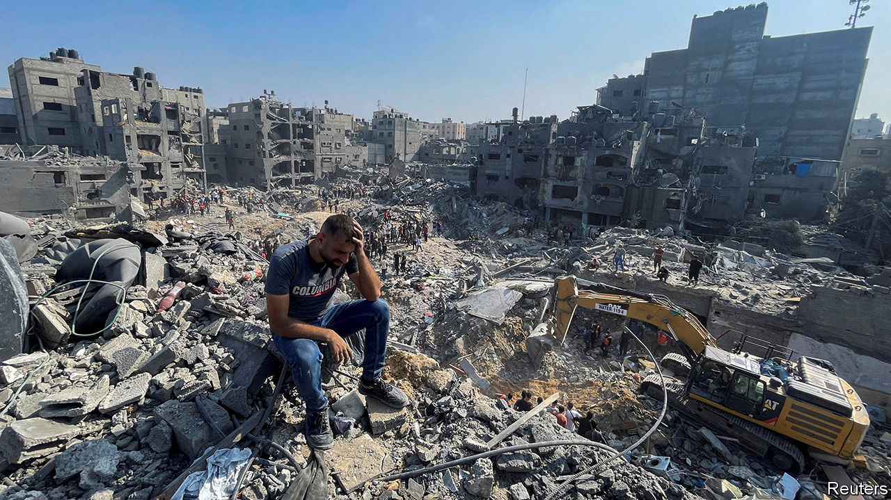
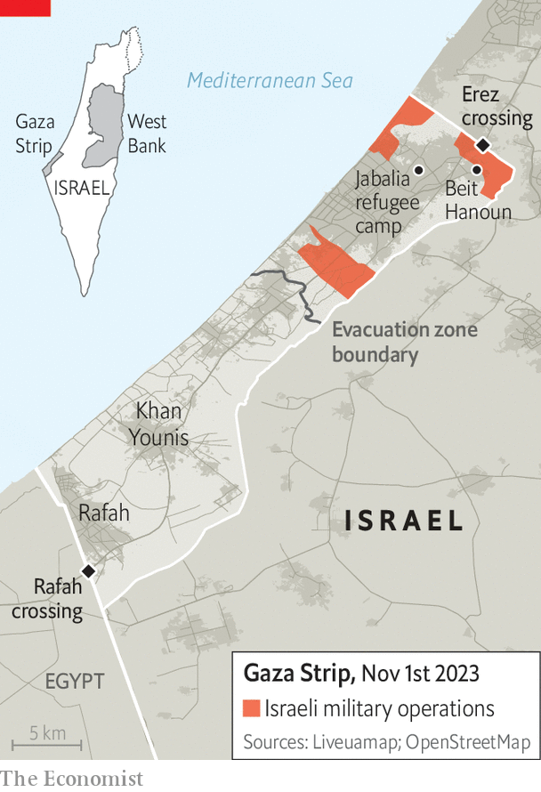

###### Darkening days

# The pace of Israel’s war in Gaza far exceeds previous conflicts 

##### But Israel’s generals think they could be fighting Hamas in Gaza for a year 

 

> Nov 2nd 2023 

THE WORLD shook, and then the ground opened. On October 31st Israeli jets carried out air strikes in Jabalia, a refugee camp in northern Gaza. A witness reported hearing multiple explosions, which left huge craters. Videos from the site showed apocalyptic scenes: buildings crumpled and canted at odd angles, dead bodies being pulled from the rubble. Dozens were killed. The Israeli army said it was targeting the underground headquarters of a Hamas commander, Ibrahim Biari, and militants with him, and that much of the damage was caused when tunnels collapsed. 


The war between Israel and Hamas, the militant group that controls Gaza, is nearing the end of its first month, and it is already the bloodiest conflict between Israelis and Palestinians since 1948. Since it began on October 7th, when Hamas murdered more than 1,400 Israelis, the Israel Defence Forces (IDF) has struck more than 11,000 targets in Gaza, far exceeding the pace of previous wars. The Hamas-run health ministry says that more than 8,800 Palestinians have been killed, including some 3,500 children. Large parts of northern Gaza, normally home to more than 1m people, have been reduced to rubble.

Much of Israel’s formidable border fence with Gaza is gone. Hamas breached it in 29 separate locations during its attack, and Israel has dismantled more of it to facilitate the entry of armoured battalions. Israeli troops entered Gaza on October 27th from two places: near Beit Hanoun in the north, and at a point just south of Gaza city in the narrow waist of the 45km-long strip. Their goal is to bisect Gaza and gradually encircle the northern part of the enclave, which they have told civilians to evacuate.

Hamas does not want a head-on fight with an advancing IDF, which has vastly superior firepower. Instead it will seek to harass Israeli troops with guerrilla warfare. Israeli military sources think they have only a short window of opportunity in which to operate with large formations inside Gaza. They will try to destroy tunnels and command centres to disrupt Hamas’s freedom of movement and divide its fighters. In the coming weeks, Israeli generals expect international pressure will force them to revert to a more limited presence inside Gaza. The war will shift to raids against specific targets. These, they predict, will take months, perhaps even a year.

About two-thirds of northern Gaza’s population is thought to have heeded the evacuation order. That still leaves hundreds of thousands of people. Conditions in the south, supposedly a safe zone, are dire. More than half of Gaza’s population—1.4m people—has been displaced. Shelters are overflowing: one un facility in Khan Younis, the first city south of the evacuation line, now houses 22,100 people, more than ten times its intended capacity.

 


Essential supplies are still scarce. Around 250 lorries have entered Gaza since October 21st, when Israel lifted its veto on aid deliveries. Martin Griffiths, the un’s top humanitarian official, calls the deliveries thus far a “drop in the ocean compared to the vast scale of needs”. Israel still refuses to allow shipments of fuel to Gaza, arguing that this will eventually force Hamas fighters, who need it to light and ventilate their tunnels, to move above ground. The sole power plant ran out of fuel on October 11th. One-third of Gaza’s hospitals and two-thirds of its clinics are closed, either because they have no fuel left or because they were damaged by Israeli bombardment.

After weeks of delay, people with foreign citizenships were allowed to leave Gaza via Rafah on November 1st. Egypt also allowed ambulances with injured Palestinians into its territory for treatment. But it refuses to open its border for refugees.

As the fighting expands, so has the dysfunction in Binyamin Netanyahu’s government. Many Israelis hold the prime minister responsible for the failures leading up to Hamas’s attack. Though the army and intelligence chiefs were also culpable, they are much more popular than he is. Half of Israelis told pollsters they trust IDF commanders to lead the country in war. Just a tiny minority trusts Mr Netanyahu more.

This has enraged the prime minister, which compounds the divisions within Israel’s war cabinet. Officials present at its meetings have described a “traumatic” atmosphere. The day after ground forces entered Gaza, Mr Netanyahu took to X (formerly Twitter) and blamed intelligence and security chiefs for their assessment, before the October 7th attacks, that “Hamas was deterred and sought accommodation.” He deleted the post after public criticism from members of the war cabinet.

The divisions are affecting military decision-making. They explain why IDF soldiers sat in staging areas near the Gaza strip for two weeks until the order to go in was given. “The army took a terrible hit but is now standing on its two feet,” says one senior official. “The same can’t be said for the rest of the government.”

The public is also furious with Mr Netanyahu for his handling of the hostage crisis. At least 240 people were abducted during the Hamas raid and brought back to Gaza. Four have been released, and on October 30th Israel said its forces had freed a soldier, Ori Megidish, captured during the Hamas assault. There are ongoing talks via Qatar, which has close ties with Hamas, about a deal to free more hostages. 

As the ground offensive grinds on, Israel will have to decide whether to release more of the 360,000 reservists called up after Oct 7th. Their mobilisation is a growing burden on the Israeli economy. Some in the war cabinet, however, would like to take advantage of the country’s war footing and attack Hizbullah, the Shia militant group in Lebanon that has been firing rockets and anti-tank missiles at Israel.

Those attacks have reached steadily further into Israeli territory. On October 29th a rocket hit a house in Kiryat Shmona, the largest city on its northern border; another barrage was aimed at Rosh Pina, 14km from the Lebanese border. Israel’s retaliatory strikes have also moved deeper into Lebanon. Still, the view in both Israel and Lebanon is that Hizbullah does not wish to expand the fighting much further. Hassan Nasrallah, the group’s leader, was due to make a speech on November 3rd, his first public appearance since the war began. His silence is unusual. But he is under intense domestic pressure to keep Lebanon out of the war. A survey published in , a Lebanese daily sympathetic to Hizbullah, found that 68% of Lebanese opposed opening a full-fledged war with Israel.

On October 31st the Houthis, a Shia militant group that controls large parts of Yemen, launched drones and ballistic missiles at Israel. One was shot down by Israeli missile-defences. The Houthis are keen to show their support for Hamas, but their drones are slow and their missiles inaccurate. One explosive drone aimed at Israel hit Taba, an Egyptian resort town, and injured six people; another landed in Jordan.

Though Iran continues to issue near-daily threats, it seems reluctant to unleash its proxies. Raz Zimmt, an Iran-watcher at the Institute for National Security Studies, an Israeli think-tank, notes that some Iranian media outlets have tried to portray Israel’s ground offensive as a failure. This may make it appear as if Hamas can continue the fight without Iranian help. “[It] provides Iran with justification to avoid expanding the conflict,” says Mr Zimmt.

In Gaza, though, that conflict will expand. A day after the first strike on Jabalia, Israeli jets bombed the camp again. There will be many more scenes of devastation in what will be a long war. ■


