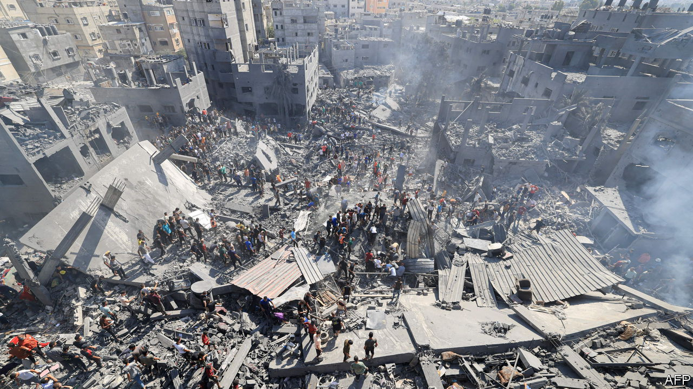

###### Civilians and the ground invasion

# Why urban warfare in Gaza will be bloodier than in Iraq 

##### The battle against IS in Mosul offers Israel lessons—and warnings 

 

> Oct 30th 2023 

THE WAR in Gaza is exacting a brutal toll on civilians. The Hamas-run health ministry says that more than 8,000 people have . The number of children among them, more than 3,000, exceeds the annual death toll for children in all wars in each of the preceding three years.  , from satellite imagery, that over a tenth of Gaza’s housing stock has been destroyed, leaving more than 280,000 people without homes to which they can return. In many ways that fits with the norm of urban warfare, which is unusually destructive. But Israel’s war in Gaza is also distinctive.


War in built-up areas is always bloody. America’s first assault on Fallujah in 2004 killed as many as 600 civilians, or 0.2% of the population, compared with 0.3% in today’s war in Gaza. A second assault later in the year killed around 800 more and left the majority of the city’s buildings damaged. A battle for Sadr City, a suburb of Baghdad, is thought to have killed nearly 1,000 people in March and April 2008, out of a population of around 2m, not dissimilar to that of Gaza.

The largest urban battle in recent years was the assault on the city of , which had been seized by the Islamic State (IS) group, by an American-led coalition including Iraqi and Kurdish ground forces. At least 9,000 civilians were killed in Mosul during 2016-17, according to Airwars, a non-profit organisation that tracks civilian harm. That amounts to 0.6% of the population at the time. Of the buildings that were damaged, more than 80% were residential. 

These cases might suggest that the , though destructive, is not unusually so by historical standards—at least not yet. Yet there are also key differences. The first and biggest is the status of civilians. In Mosul, IS attempted to prevent civilians from fleeing, firing at them and mining corridors out of the city. Many left nonetheless. Between October 2016 and June 2017 nearly 900,000 departed—almost half of the pre-war population. Even Russia, during its siege of Mariupol in Ukraine between February and May 2022, negotiated humanitarian pauses in which some civilians were permitted to leave. Israel has thus far rejected calls, by the European Union and others, for such pauses.

 is less permissive than any of these cases. Israel has told around 1.1m civilians to evacuate from the north of Gaza, but around a third of those have remained in place. Many residents are already refugees from other places and fear that if they leave they might never be allowed to return to their homes. Those who do want to escape cannot go south to , which does not want to take responsibility for refugees and has so far refused to open its border.

Israel is still striking parts of southern Gaza, albeit in more limited fashion than the north. “Locals can’t really get away, nor can fighting really occur in open areas away from urban centres,” says Amos Fox, an expert on urban warfare who has written extensively about Mosul. “The urban fight [in Gaza] is self-contained and likely far more costly than anything we’ve seen in the past few years.” Even those civilians who have moved south face a growing humanitarian crisis. Gaza’s health-care system has capacity for only 3,500 beds, according to Médecins Sans Frontières, a humanitarian group, far short of what is needed.

In Mosul, by contrast, the World Health Organisation was able to establish trauma stabilisation points to provide urgent medical attention within 10-15 minutes of the front line, with larger field hospitals another hour away. The Israel Defence Forces (IDF) have a small number of “humanitarian affairs officers” embedded in its fighting units whose role it is to try and address the needs of the local population, but these are far from sufficient for dealing with the needs and scale of misery resulting from a ground offensive. Israeli politicians have said they will not send aid for civilians until all hostages are released, though officials acknowledge that may change as the offensive develops.

A second difference is the degree to which civilian and military infrastructure is intermingled in Gaza. In Iraq, IS had held Mosul for little over two years when the battle to remove them began. Even in that short period, the group had established impressive multi-layered defences, drawing on Western military doctrine, says Rupert Jones, a retired British major-general who was deputy commander of the anti-IS coalition.

, in contrast, was founded in Gaza in 1987 and has much earlier roots there, dating back to the foundation of the welfare organisation Mujama al-Islamiya (‘Islamic Centre”) by Ahmed Yassin in 1973. For half a century it has been fully integrated into Gaza’s social fabric and has run the strip for 16 years. Its defences have been built around—and —the territory’s civilian infrastructure. Part of the ease with which Hamas seized Gaza from Palestinian rivals in 2007 was down to the fact that its fighters were recruited from the streets. 

A third difference is tactics. Israel’s armed forces say that they place considerable emphasis on civilian protection. Nonetheless, Israel’s bombardment of Gaza has been intense by historical standards. It dropped 6,000 bombs on the territory in the first six days of the war, a rate of ordnance far exceeding American and Western counter-terrorism campaigns. In Mosul, for instance, the American-led coalition dropped 7,000 over two months in the most intense period of bombing. On October 30th a former deputy commander of the IDF’s Gaza Division told the : “When our soldiers are manoeuvring we are doing this with massive artillery, with 50 aeroplanes overhead destroying anything that moves.”

Tactics are shaped by how an army views the stakes of a war, the nature of the enemy and that of the surrounding civilians. For Israel, the war in Gaza is “existential in a way that even Mosul or Marawi weren’t”, says Anthony King of Exeter University, referring to a battle between the Philippines army and IS in 2017. Israeli officials increasingly describe Hamas as akin to IS—an enemy with which compromise is no longer possible. Nor does the IDF have the same affinity with Palestinian civilians that Iraqi forces did with the compatriots they were liberating from IS rule. 

In Mosul, Iraq’s political leadership, from the prime minister down, insisted that great emphasis be placed on civilian protection. Lieutenant General Basim al-Tai, a senior Iraqi officer, was in charge of the humanitarian operation. “He was carrying the weight of the Mosul population on his shoulders,” says General Jones. “He cared deeply about the civilians.” Caroline Baudot, an adviser in the civilian-protection unit in the International Committee of the Red Cross in Geneva, agrees: “The commander’s intent in Mosul was extremely clear.” 

Even then, the experience of different parts of Mosul is instructive. The east of the city, viewed as the more intellectual and urbane part, suffered less damage. The old city in the west, where IS made its last stand, was viewed by Iraqi forces as more conservative and IS-friendly and emerged far worse. “The mindset in which you fight affects your planning, your conduct, and even the reconstruction,” says Ms Baudot. “If you operate on your own territory [as opposed to] in another territory you might not have the same care for civilians.” 

The role of medical facilities is especially contentious. In the previous rounds of warfare, Palestinian hospitals and other civilian relief centres were marked on Israeli military maps as non-strike areas. Some were hit in past wars, but none intentionally, claims Israel. In this war, Israel has ordered the evacuation of northern Gaza, including —which it says are used as Hamas command posts. Under the laws of war, hospitals lose their special protection if they are used for military purposes. But, even then, armies can only attack them “after due warning” and “a reasonable time limit”. 

Mosul, again, provides a point of comparison. IS used the city’s hospital as a stronghold. Commanders spent weeks deliberating whether it could be attacked, says General Jones, considering other options such as the use of snipers. “Slowly, over time, it became clear it was no longer a functional hospital.” Ultimately it was struck only with the approval of Iraq’s then prime minister. “I’ve never heard of any case where you have a few days to evacuate and dismantle an entire hospital,” says one veteran expert on wartime civilian harm, reflecting on the Gaza case. “It’s just not possible.” 

A fourth and final difference is the nature of battlefield intelligence. At the outset of this war the IDF would have had considerable intelligence on Hamas’s infrastructure in Gaza, collected over years. But many of those targets would have been struck in the first week of the campaign. Air forces must then move to “dynamic” targeting—finding and striking targets that were not known at the start of the war and have to be developed in relatively short order. This is where most cases of civilian harm occur, says the expert. 

In Mosul, local civilians, many of whom hated IS, provided a wealth of human intelligence, or HUMINT—information passed on by sources on the ground—to Iraqi forces, helping them to target IS fighters. In contrast, during the battle for Raqqa, a Syrian city held by IS, in 2017, commanders, with fewer infantry forces on the ground, were “starved of local information” and found themselves reliant on aerial surveillance, incapable of seeing inside buildings, according to a report by the RAND Corporation, a think-tank. 

Israeli intelligence has already suffered one serious intelligence failure in Gaza, having missed sufficient signs of Hamas’s preparations for the attack of October 7th. It will have good electronic intelligence on the strip, aided by the phalanx of American aircraft patrolling in the eastern Mediterranean. But Hamas is likely to have the intelligence advantage on the ground, argues Mr Fox, with locals offering a steady flow of HUMINT to the group as the IDF advances. “This flips the HUMINT situation that we saw in Mosul on its head,” he says. “The IDF will have to methodically fight through better planned and prepared defences…than they otherwise would.” The result will be more civilians killed. The last three weeks have been hard on civilians in Gaza. The coming weeks could be even harder. ■

