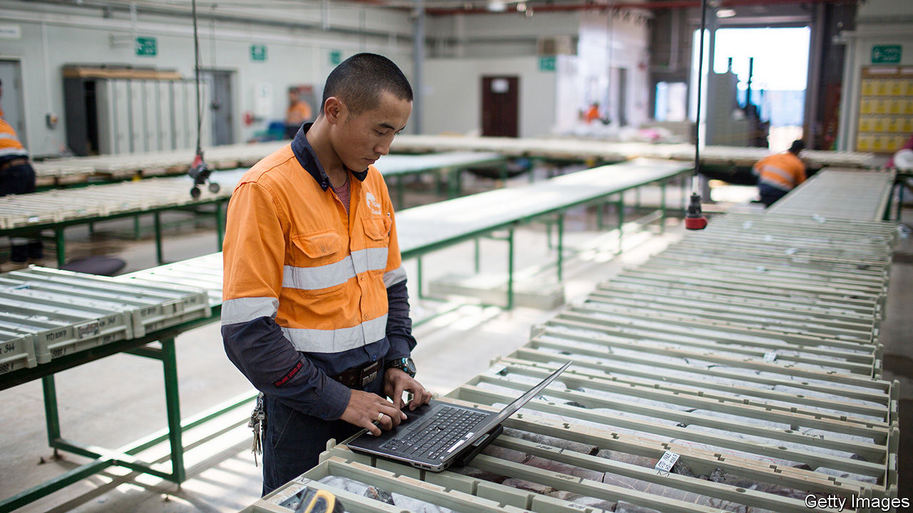

###### Ground truths

# Could AI help find valuable mineral deposits? 

##### Computers have keener eyes than geologists 

 

> Nov 1st 2023 

The future is electric. That means it will need a lot of batteries, motors and wires. That, in turn, means a lot of cobalt, copper, lithium and nickel with which to build them. Great times, then, for prospectors, and particularly for any who think they can increase the efficiency of their profession. Several firms are applying  (AI) to the process, both to improve the odds of surface strikes and to detect underground ore bodies that are invisible to current techniques.

KoBold Metals in Berkeley, California, Earth AI in San Francisco and VerAI in Boston are tiddlers at the moment, as are SensOre, in Melbourne and OreFox, in Brisbane. But at least one bigger fish—Rio Tinto, an Australian-British firm—is also keen. They are garnering reams of geological, geochemical and geophysical data to feed to software models. These, they hope, will spot patterns and draw inferences about where to sink new mines.

Some of the data are new. But a lot once mouldered in the archives of national geological surveys, journals of geology and other historical repositories—or, in the case of Rio Tinto, which has been operating for 150 years, sat in the form of rock cores in various sheds around the world. 

Kobolds were mythical underground sprites that bedevilled miners in medieval Germany. (They also gave their name to cobalt.) Kurt House, KoBold’s boss, hopes some of their magic will rub off. His firm has reformatted archive data from around the world, many of which are on paper and some of which go back to the 19th century, into machine-useable form. That has permitted it to build maps of areas of interest all over Earth’s surface.

Some of those maps are used to train the company’s AI models. Others are used to test that software’s effectiveness by checking how good it is at predicting known ore deposits on maps it has not previously seen. If it passes, it can be let loose on under-explored places of interest, generating leads for KoBold’s geologists.

Earth AI, led by Roman Teslyuk, SensOre, led by Richard Taylor, and OreFox, led by Warwick Anderson, have taken similar approaches, but have concentrated on Australia, which has particularly rich public geological records. VerAI, led by Yair Frastai, focuses on the western bits of North and South America, home to eight of the world’s ten biggest copper mines. 

Dr House is especially proud of his AI’s ability to predict the shapes and distributions of subterranean plutonic intrusions. These are bodies of igneous rock, often ore-bearing, that have risen as liquid magma from Earth’s interior but solidified before they reached the surface. They can be detected from the surface via magnetic anomalies which suggest that a particular group of rocks formed at a different time from its surroundings, a standard practice in the industry. But KoBold’s AI is able to make more accurate predictions of the shapes of these intrusions, and so suggest the most effective places to drill.

And with success. Last year, KoBold announced its discovery of a rich deposit of chalcocite, a sulphide of copper, in Zambia. Earth AI, meanwhile, has to its credit a big find of molybdenum (an important component of specialist steels) in New South Wales. VerAI has found ore containing copper, gold and silver in Chile and Peru. SensOre has found a large source of lithium in Western Australia. And OreFox’s technology has turned up a potential gold mine in Victoria, plus several promising copper prospects.

Rio Tinto is building what Russell Eley, its head of exploration data science, calls a “virtual core shed”. This will bring together details of the many rock-core samples the firm has collected over the years. Software will then search these for patterns that will assist the interpretation of new cores, and tell geologists the best places to drill next.

Dr House observes that 99% of exploration projects fail to turn into actual mines. AI therefore has plenty of room to improve things. It may also help with a more subtle problem. By greatly expanding the volume of rock which can be searched, it will enable new strikes in familiar, well-governed countries, lessening the need to rely on what Mr Taylor diplomatically calls “exotic jurisdictions” for future supplies. ■


