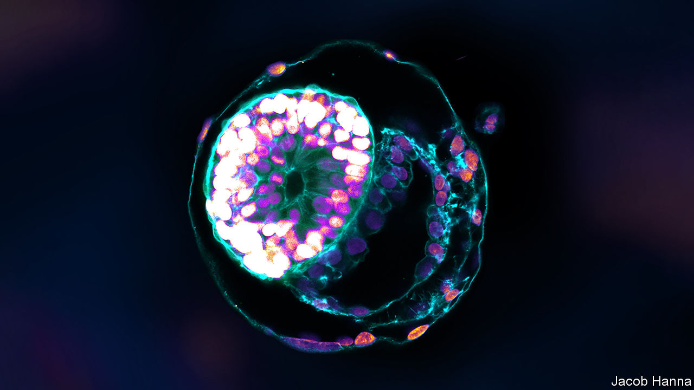

###### When the map becomes the territory

# Lab-grown models of embryos increasingly resemble the real thing 

##### Embryoids promise many benefits, but pose tricky ethical questions 

 

> Nov 1st 2023 

The traditional way to make an embryo is to combine a sperm cell with an egg, often after dinner and a bottle of wine. But a new way may be around the corner. In recent years scientists have discovered that they can persuade stem cells—those with the ability to transform into many other sorts of cells—to form structures that look and behave very much . 

“Embryoids”, as such creations are called, can help with the study of embryology and pregnancy, and how they can go wrong. Some of the facsimiles look strikingly real. In 2022 two teams, one led by Magdalena Zernicka-Goetz, who works at the California Institute of Technology and the University of Cambridge, and another by Jacob Hanna at the Weizmann Institute of Science, in Israel, published papers describing mouse embryoids with . In June Dr Zernicka-Goetz published a paper describing a human embryoid designed to mimic the earliest stages of development, shortly after a real embryo would have implanted into its mother’s womb. 

That second study was controversial, with some other scientists dubious that it represented as much of an advance as its authors claimed. But the state of the art is moving fast enough that some think embryoids may soon become hard to distinguish from the embryos they are meant to model. In many ways, that would be a good thing: the more accurate a model, the more useful it is. Human embryoids could shed light on developmental heart defects or diseases like spina bifida, and boost the success rates of in-vitro fertilisation (IVF). 

But research on embryos—which, after all, have the potential to develop into human beings—is strictly regulated. Many countries ban the use in research of human embryos that are more than 14 days old, and researchers in countries without such laws usually adhere to the same standard voluntarily. The more similar embryoids become to the real thing, the harder it becomes to avoid the question of whether they should be subject to similar rules. 

A natural embryo begins with a single fertilised egg. To make an embryoid scientists grow a mix of different stem cells derived from embryos or, sometimes, from adult organisms. They may tweak the molecular signals between the cells and which of their genes are active. Within days, embryo-like structures appear. 

Embryoids are desirable partly because real embryos are scarce: the main source is leftovers from IVF treatment. They are also hard to grow. That makes it tricky to run large-scale experiments. Embryoids offer a less ethically fraught alternative. 

A rose by any other name

One example of their benefits is the study of implantation, the process by which an embryo implants into the womb. It is here that most pregnancy losses happen. But the reasons were almost impossible to study in detail before the advent of embryoids. “You cannot go through the body of the mother to see the development of this embryo,” says Dr Zernicka-Goetz. 

Embryoids—specifically, a type called a blastoid—offer the next-best thing. First created by Nicolas Rivron at the Austrian Academy of Sciences, they resemble an embryo at the blastocyst stage, just before implantation. In humans implantation happens around day seven and in mice, around day four. Each blastoid consists of a hollow ball of cells that would, in a real embryo, go on to become part of the placenta. Attached to the inner wall is a smaller ball that would, in other circumstances, develop into the fetus. By rolling blastoids across uterine tissue in a dish, Dr Rivron’s team found that they only stick when they are oriented so that this inner mass is closest to the womb tissue.

That implies the inner mass sends signals to the outer cells, instructing them to stick to the womb. Dr Rivron thinks he has identified those signals, and plans to publish his results soon. He hopes to help explain why so many embryos fail to attach. That might, in turn, improve the success rates of IVF, which in America is only about 35%. Blastoids have made such discoveries much easier, says Dr Rivron. He has started a company, Dawn Bio, which uses blastoids to screen drug candidates that might be useful in fertility treatment. 

Other embryoids try to capture what embryos look like after implantation. The most advanced are made with mouse stem cells, such as the brain-and-heart models described above, which represent day eight in mouse development. Dr Hanna holds the record for human embryoids. In a paper published in September he and his colleagues described embryoids that mimic the development of human embryos between days eight and 14. He is keen to try to push things further, perhaps to day 35. At that point, his embryoids, like the mouse ones, would be starting to develop organs. 

Dr Hanna believes that could make them a source of medically useful cells. They might, for instance, provide stem cells that could in turn be turned into bone marrow for transplant in leukaemia patients. If the stem cells used to create the embryoid were taken from the patient, then the marrow would be genetically identical to the patient’s own. That would remove the risk of immune rejection, and the need for immune-suppressing drugs. 

Convincing the embryoids to develop still further might open up truly mind-bending possibilities. From day 50 or so, the embryoids would have gonads. That might mean, one day, that women struggling to get pregnant could be given a brand new, freshly baked set of their own eggs. (Dr Hanna’s company, Renewal Bio, is pursuing such goals.)

No one knows when—or even if—these goals might be achieved. Naomi Moris, a developmental biologist at the Francis Crick Institute in London, agrees that Dr Hanna’s 14-day-old embryoids look the part. But she does not think they yet qualify as full replacements. For one thing, Dr Hanna’s embryoids never go through a blastocyst-like stage. That missing link prevents them from attaching to a natural womb, and might impose limits on how long they can carry on developing in a dish.

Still, the fact that such goals are being pursued at all has convinced some scientists that the time to think about regulation is now. Dr Moris has proposed a new legal definition for embryos that would be based on their potential to develop into a fetus, a developmental stage that begins eight weeks after fertilisation and lasts until birth. In many countries human embryos are legally ill-defined. Dr Moris hopes her proposal would make clear that an embryoid could qualify as an embryo—if it had the same developmental potential. 

Working out if they do, though, might be tricky. The only way to know for certain whether an embryoid could develop into a fetus would be to try it and see—though such an experiment might risk violating the law if it were successful. Instead Dr Moris and her colleagues, including Dr Rivron, have suggested a two-part test that would make at least a compelling argument that embryoids had closed the gap.

The first step would be to check just how closely human embryoids track the developmental trajectory of real embryos. The second would be to push animal embryoids as far as possible, ideally to the point of producing live, fertile offspring. Such a process might start with mice before moving on to pigs or monkeys. If such long-developing embryoids look biochemically similar to the human state-of-the-art, caution would be warranted. 

Dr Moris reckons that, within two to five years, someone will have produced animal embryoids that can reach the fetal stage. In April, Chinese researchers transplanted monkey blastoids into surrogate animals, producing pregnancies that lasted for up to 20 days. And there is always the chance that someone goes rogue. In 2018 He Jiankui, a Chinese researcher, announced that he had created gene-edited human babies. He was jailed, and widely condemned. But it is not inconceivable that someone might try to push the boundaries in a similar way with embryoids. 

Pushing the limits

Amander Clark, the president of the International Society for Stem Cell Research, highlights another irony that could make regulation difficult. Since human embryos cannot be cultured for longer than 14 days, scientists do not have a detailed picture of how they develop afterwards. That would make it very difficult to tell if embryoids older than 14 days were behaving as they are supposed to. The only comparators are animal embryos and dissections of wombs surgically removed from pregnant women. In other words, the very rule meant to protect embryos means researchers could struggle to tell whether their alternatives were good enough—or so good they should be given legal protection in turn. ■


