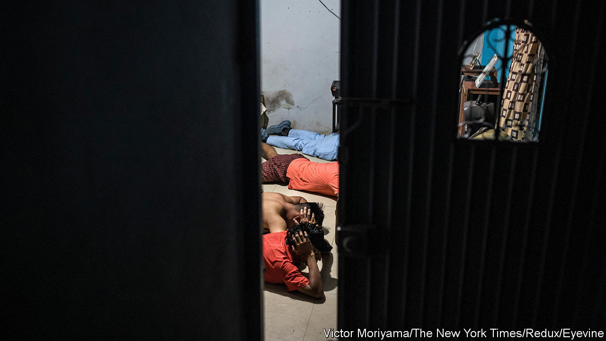
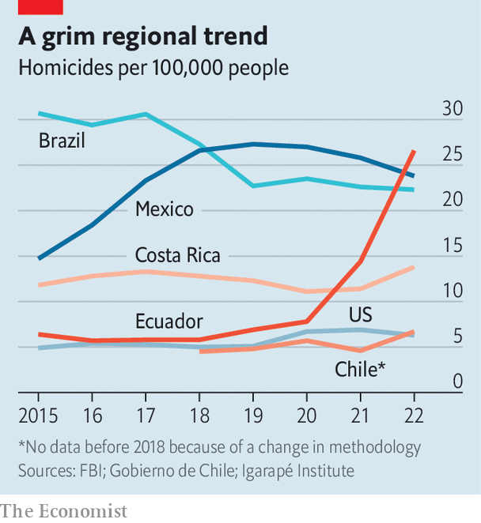

###### The new narco network

# Gang violence is spreading across Latin America 

##### Previously safe countries such as Ecuador are now racked with crime 

 

> Nov 2nd 2023 

On October 27th 90 police officers, 22 vehicles and a water cannon stood ready in a field on the outskirts of Santiago, the capital of Chile. They were not there to guard a rowdy protest. Instead, they were there to monitor a : the burial of a young woman with alleged ties to drug-traffickers. Such an event, which often ends with bullets being shot into the air by mourners, would have once been unthinkable in Chile, long considered one of Latin America’s safest countries. But between May 2019 and September 2023 gangs held nearly 2,000 such funerals, according to Gabriel Boric, the president. In September Mr Boric sent a bill to Congress intended to limit them. 

Latin America’s murder map is being redrawn. The region’s homicide rate has been falling since 2017, although countries such as Mexico and Brazil are still home to some of the cities with the highest murder rates on Earth. But in previously safe countries murder rates are hitting record levels, including Ecuador, Costa Rica and Chile. Call it the new narco network: a cocktail of drugs, guns and migration is fuelling gang violence across the region.

 


Take Ecuador first. Its descent into chaos has been swift. In 2018 the country was a sleepy Andean patch of 17m people. It exported oil and fish. It had the fourth-lowest homicide rate in Latin America, at 5.8 per 100,000 people. But this year that rate is expected to top 35 per 100,000 people. It is already higher than Mexico’s and Brazil’s (see chart). Criminal groups kill with impunity, setting off car bombs and hanging dead bodies from bridges. In August a presidential candidate running on an anti-corruption platform was assassinated. The six supposed Colombian hitmen were found hanged in their prison cells in October.

Cocaine is the primary cause of Ecuador’s problems. For decades the country was mostly ignored by international drug-traffickers. That changed in the late 2000s, when gangs realised they could get even juicier mark-ups by shipping blow farther afield, to Europe and Australia. Partly as a result, gangs then changed their shipping methods: rather than pack it onto planes or boats to the United States, coke was squirrelled away inside container ships among legitimate goods.

After Colombian ports tightened their security, criminals looked for alternative shipping routes. Ecuador’s poorly-monitored ports became even more attractive after 2009, when Rafael Correa, a left-winger, then the president, undermined the country’s defences by closing an American naval base and, as such, ending co-operation with the US Drug Enforcement Administration. Ecuadorean gangs such as Los Choneros signed up as , moving coke for Mexican gangs and the Albanian mafia. By 2019 Ecuador had turned into a cocaine superhighway. 

Locking up gangsters merely helped them strengthen their networks. Los Choneros thrived in the crowded prisons, recruiting heavily and launching attacks on their enemies. Targeted killings escalated into massacres, where dozens of inmates were dismembered and burnt. In 2021 some 330 prisoners were murdered in Ecuador, the highest number in the world. That same year coke ranked as Ecuador’s sixth-biggest export, worth nearly $1bn, or 0.9% of GDP, according to InSight Crime, an investigative outlet.

Similarly, this year in Costa Rica homicides are predicted to hit a record of 17 per 100,000 people, compared with 11 per 100,000 people three years ago. Cocaine is a big part of the problem there, too. Rising production in Colombia, where record amounts of coca leaf have been harvested in recent years, translates into larger shipments arriving in Costa Rica, says Álvaro Ramos, a former security minister. 

However, coke is not the only reason for rising violence. In recent years many murders have been about the domestic marijuana market. Illegal cannabis is big business in Costa Rica: 3% of residents say they use it monthly, one of the highest consumption rates in Central America. Many gangs prefer weed to coke. Moving the white stuff is hard: it requires connections and corrupt officials (of whom there are relatively few in Costa Rica). By contrast weed has few barriers to entry and it can be sold anywhere. 

The state is ill-equipped to stop these new gangs from thriving. Costa Rica abolished its military in 1949. Rodrigo Chaves, the president, blames past administrations and the judiciary for the situation. He says the country does not have enough police, the laws are outdated and the judicial system is too soft on criminals. 

The third place in this new narco network, Chile, is not a murder hotspot. Last year its homicide rate reached a record 6.7 per 100,000 people. That is far below its neighbours, and close to the rate in the United States, of 6.3. But as its narcofunerals attest, crime is getting much worse. More cocaine and potent cannabis are being interdicted than ever before, with cannabis seizures tripling between 2018 and 2021. Its ports have become targets for gun-runners. Timber-trafficking is also a problem. The copper industry, which accounts for nearly 11% of the country’s GDP, is blighted by armed hijackings.

Cocaine blues

Chile is one of the region’s richest countries. It also hosts half a million Venezuelan migrants fleeing Nicolás Maduro’s regime. That combination has attracted mafias such as Tren de Aragua, Venezuela’s largest gang. It is battling to control Chile’s underworld, having built a human-trafficking empire across South America. Shoot-outs occur regularly in the port city of Iquique, as local gangs fend off incursions by the Venezuelans. Tren de Aragua’s cells run prostitution rings in several cities. Some 40 alleged members were jailed in one province last year. Dozens have been detained in police raids this year.

As a result, the share of Chileans who say immigration is bad has surged from 31% in December 2018 to 77% in April 2023, according to Cadem, a pollster. Another survey found that most blame illegal immigration for the rise in crime. Facing regional elections next year, the government has focused more on security. After three police officers were killed in March, Mr Boric pledged a 40% annual increase in the security budget and passed stricter penalties for crimes against police. Even so, many consider him too soft on crime.

What does this new narco network mean for the countries that were once among Latin America’s success stories? Many citizens will vote with their feet. Last year, Ecuadoreans were the second-biggest nationality to cross Panama’s treacherous Darien Gap on their way north. 

Those who stay at home may turn to more extreme solutions. According to Latinobarómetro, a regional survey, fully 48% of Ecuadoreans, 31% of Chileans and 22% of Costa Ricans rank security as their country’s biggest problem, well above the regional average of 13%. Plenty of Latin Americans admire El Salvador’s authoritarian president Nayib Bukele, who over the past year has locked up 1.6% of the population in a sweeping gang crackdown and whose approval rating is 88%, the highest in the region. 

Politicians across Latin America are taking note. On October 15th Daniel Noboa, a 35-year-old right-winger, won the presidential elections in Ecuador. He has promised to ape Mr Bukele’s approach, and build floating prisons in the Pacific. Some are sceptical that will curb the gang problem there. But such outlandish solutions are increasingly popular. Faced with ever more powerful gangs, many Latin Americans appear to think sacrificing civil rights is a price worth paying for security. ■

