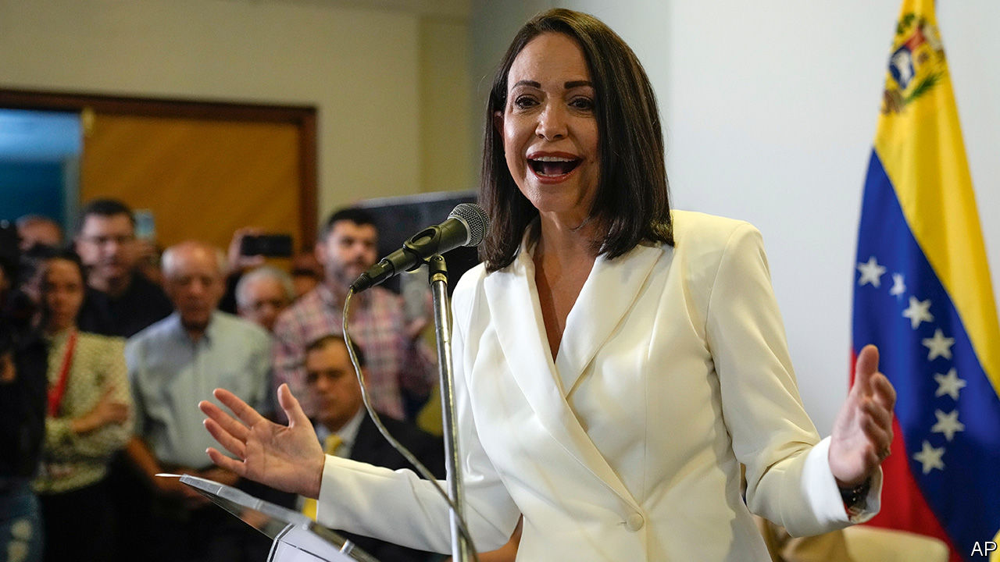

###### Dashed dreams of democracy

# Venezuela’s Supreme Court tests President Joe Biden 

##### By barring the opposition primaries, the country risks an escalation of sanctions 

 

> Nov 2nd 2023 

For a fortnight in October, it did not seem delusional to feel hopeful about Venezuela. On October 17th the autocratic regime of President Nicolás Maduro met in Barbados with representatives of the opposition to agree on how free and fair future elections should be held. The following day, the United States government lifted most of the draconian sanctions it had imposed since 2019 on Venezuela’s oil, mining and finance sectors. Five political prisoners were then set free. On October 22nd, opposition primaries went ahead. Turnout was high, with the organisers saying more than 2m people voted. A thunderous 92% of those who participated backed María Corina Machado, one of Mr Maduro’s most determined critics (pictured).

Ms Machado, a former congresswoman and an advocate of privatisation, has already been banned from political office by Mr Maduro’s regime. But for a few giddy hours during and after the primary election, there was a flurry of optimism that perhaps a change was in the air. “All we Venezuelans want to do is vote,” said Carlos Fernández, a 74-year-old, as he cheerfully queued to cast his ballot at a polling station in Caracas, the capital. Some dared think that Mr Maduro’s government might finally have been persuaded that the prize of a lifting of American sanctions was a fair exchange for allowing a real presidential election—one in which it might even be defeated—to take place next year. 

Then came the reality check. Jorge Rodríguez, president of Venezuela’s National Assembly—a body itself born out of a rigged vote in 2020—declared that the opposition-run primary was “a farce and a scam”. He insinuated that the opposition stole the identities of 2m Venezuelans. His allegations were followed up by actual legal threats, delivered by the regime’s attorney-general, Tarek William Saab, who announced that he was investigating those who had organised the primary vote. On October 30th the country’s Supreme Court, yet another arm of Mr Maduro’s government, declared that the result of the election was formally annulled. 

“They basically wiped out the election. They’ve broken the deal”, said Marco Rubio, the Republican senator for Florida, to Antony Blinken, the US secretary of state, during a committee hearing at the Senate on October 31st. Mr Blinken insisted that the Venezuelan government would not get “a free pass” and that sanctions could be reimposed “if the regime has, in fact, violated the agreement that it reached”. Mr Blinken has previously stated that the regime has until the end of November to set a timeline “for the expedited reinstatement of all candidates”, and to release several American prisoners from Venezuela.

Full reimposition of sanctions seems unlikely. The United States “has several reasons to be careful,” says Mariano de Alba, from the Crisis Group, a think-tank in Brussels. In September 50,000 Venezuelan migrants crossed the Mexican border to the United States, outnumbering Mexicans for the first time. Along with ensuring its own access to Venezuelan oil at a time of global supply concerns, Mr Biden’s government is likely to want to stop that migration at its source by leaning on the regime. Meanwhile Mr Maduro’s government will be reluctant to cut itself from the boom that a sanction-free economy could offer in an election year, while retaining the option to cheat if necessary. The end of this Venezuelan tragedy does not seem near. ■

