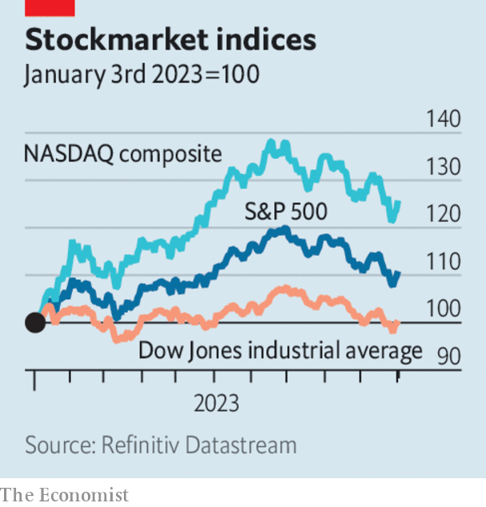

###### The world this week

# Business 

#####  

 

> Nov 2nd 2023 

The  left its benchmark interest rate , at a range of between 5.25% and 5.5%. Inflation has slowed, but uncertainty remains over the sell-off in the bond market, the oil price and the tight labour market. The central bank left the door open to a rate rise at its next meeting in December.

 


America’s  all lost ground in October, the third consecutive month of declines and the longest losing streak since the start of the covid-19 pandemic in 2020. The S&amp;P 500 slid by 2.2% during the month, the NASDAQ composite by 2.8% and the Dow Jones industrial average by 1.4%. Investors are adapting to a world of higher interest rates, which reduce the present value of future earnings.

The  relaxed its policy of capping long-term interest rates for the second time in three months. It will now allow the yield on ten-year Japanese government bonds to rise above 1%, treating this level as “a reference” rather than a strict ceiling. Ueda Kazuo, the bank’s governor, attributed the decision to the sharp rise in American Treasury yields. The BoJ remains the world’s only central bank to have a negative policy interest rate, of -0.1%.

In a busy week for the big central banks, the  also left its key rate on hold, at 5.25%. It is the second month in a row that the rate has been held. Annual inflation in Britain is still high at 6.7%, far above the bank’s target of 2%. 

The  GDP grew by just 0.1% in the third quarter, year on year. Over the previous three months it shrank by 0.1%, dragged down by Germany’s economy, which also contracted by 0.1%. That was in part a result of reduced household spending, but also of subdued global demand for Germany’s industrial goods. There was also some good news for the currency bloc, though. Annual inflation tumbled to 2.9% in October, from 4.3% in September.

 manufacturing industry contracted again in October, according to the official purchasing-managers’ index. On that measure manufacturing has shrunk in six of the past seven months. 

The  union ended its six-week strike after reaching pay deals with Ford, General Motors and Stellantis, the parent company of Fiat-Chrysler. All three Detroit carmakers have agreed to increase workers’ pay by 25% over a four-year contract. Ford said recently that the stoppage cost it $1.3bn in operating earnings, GM reckoned it was losing $200m a week, and Stellantis said it lost $3.2bn in revenue. 

Putting the brakes on

Meanwhile GM’s self-driving car business, , decided to halt all its robotaxi operations after California suspended the service in the state because of safety concerns. Cruise’s other markets include Dallas, Houston, Miami and Phoenix.

 reduced the profit outlook for its electric-car battery business, blaming a slowdown in demand for some  models. Panasonic has made a big bet on making batteries for EVs and operates a factory with Tesla in Nevada. Tesla’s share price has fallen sharply in recent weeks, as investors fret that it will sell fewer cars in the future. 

 is reportedly preparing to file for bankruptcy protection. The office-sharing company is mired in debt and is now worth just tens of millions of dollars, a far cry from its valuation of $47bn in January 2019, when exuberance about its prospects peaked. 

Big  reported bumper quarterly earnings. BP’s headline profit came in at $4.9bn for the third quarter, Chevron made $6.5bn in net income, ExxonMobil $9.1 and Shell $5.8bn. Those were all higher than in the previous quarter, and largely reflect rising oil prices from July to September. 

Orsted, based in Denmark and the world’s largest developer of , announced that it was withdrawing from two projects off the coast of New Jersey, citing “adverse impacts” relating to supply chains and increased interest rates. The company is writing down $4bn in impairments. The industry has been hit by a storm of problems. General Electric said recently it expects its wind division to lose $2bn over two years. 

Thinking, fast and slow

Britain hosted the first global  at Bletchley Park, the base for Alan Turing’s band of codebreakers during the second world war. Attendees included Kamala Harris, the American vice-president; Wu Zhaohui, China’s vice-minister of science and technology; and Elon Musk, the boss of Tesla. The conference aimed to hammer out a set of international rules for the safe and responsible development of AI.

, formerly Twitter, is now worth $19bn, according to internal memos reported in the press. Elon Musk paid $44bn for the company when he bought it last year. He has struggled to turn the platform into an “everything app”. Ever the optimist, in March Mr Musk told staff that he saw “a clear, but difficult, path” to achieving a valuation of at least $250bn. 

