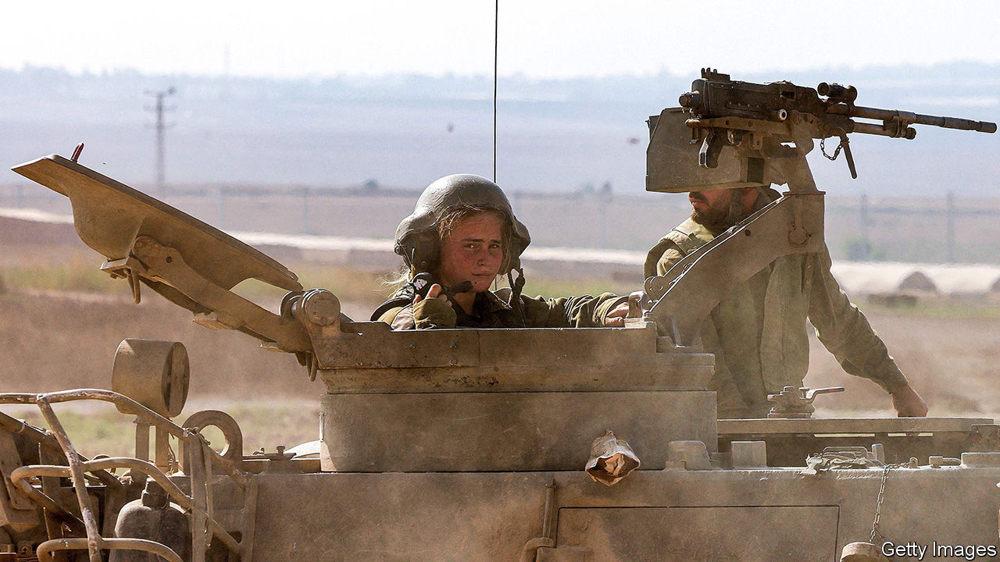
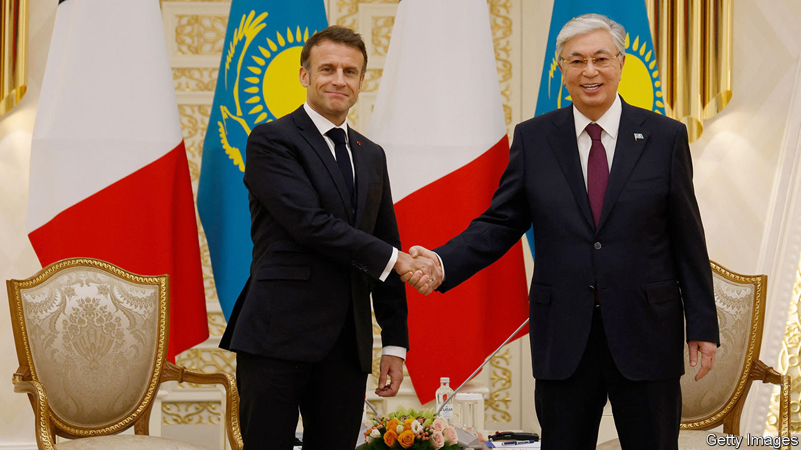

###### The world this week

# Politics 

#####  

 

> Nov 2nd 2023 

 ground forces pushed deeper into  to attack Hamas militants. The Israelis said they killed one of the leaders of the October 7th terrorist attack and a number of other Hamas men in an air strike on Jabalia, north of Gaza city; the Hamas-run authorities said scores of civilians had died. One of the 240 hostages held by Hamas, a female soldier, was rescued by the Israelis. Binyamin Netanyahu, Israel’s prime minister, rejected calls for a ceasefire. He said people who are calling for one are asking Israel “to surrender to barbarism”. 

The  continued to build in Gaza. The death toll among Palestinians now exceeds 8,000, according to the authorities in the enclave. Some 1.4m people have been displaced. Shelters are overflowing. More aid lorries were allowed in, though their number still fell far short of the 500 a day that had been entering the area before the war started. The first trickle of civilians left Gaza through the Rafah border crossing into Egypt under a deal negotiated by Qatar. Only foreign nationals and the severely wounded are being allowed to leave. 

Israel sent missile boats to the Red Sea to head off potential strikes from , where the Houthi militia claimed to have launched rockets and drones at Israel. The Israeli army said it had intercepted an “aerial threat”. The Houthis are backed by Iran and control large parts of Yemen, including the capital, Sana’a. 

 government said it would explore all legal options to help secure the release of eight Indian nationals who have been sentenced to death in  for spying for Israel. The eight men formerly served in the Indian navy. 

An antisemitic mob attacked the main airport in , a mostly Muslim Russian republic in the North Caucasus. Hundreds of men swarmed the area looking for Jewish passengers who had arrived on a flight from Tel Aviv. Scores of them were arrested after they clashed with police. 

The haters

Attacks on Jewish people and symbols around the world have risen markedly. According to the Anti-Defamation League, a Jewish organisation in New York,  rose in America by 388% between October 7th and 23rd compared with the same period last year. Britain saw an increase of 689% over three weeks, according to the Community Security Trust, another Jewish group. Attacks on Muslims have also increased. 

 in America’s House of Representatives introduced their own bill for $14.3bn in emergency aid to Israel, setting up a clash with the White House. The Republican bill hives off money for Israel from a wider package put forward by Joe Biden that includes extra funding for Ukraine. It offsets this by cutting $14.3bn that has been allocated for the Internal Revenue Service under the Inflation Reduction Act, Mr Biden’s signature bill. 

The main opposition presidential candidates standing in general election next month called for urgent measures to prevent manipulation of the results. Electoral authorities have not published voters’ roles or lists of polling stations, making it difficult to monitor voting independently.

Ziraat Katilim, a Turkish bank, has become the first foreign lender to operate in since 1970, when a Marxist government nationalised the financial system.

, a former prime minister of , died of a heart attack, aged 68. From 2012 to 2022 Li was the Communist Party’s second-highest-ranking official, but he was overshadowed by Xi Jinping, who has consolidated power. Censors have deleted many of the online tributes to Li, fearing they might lead to dissent or demonstrations.

Officials in  said that tens of thousands of  who reside in the country illegally had obeyed an order to leave ahead of a November 1st deadline. The Pakistani government issued an order for all illegal migrants, meaning Afghans, to go following a wave of suicide-bombings that it blames on Afghan terrorists. Around 1.7m of the 4m Afghans who live in Pakistan are there illegally. The government says it will forcibly expel them if they do not depart voluntarily.

Opposition parties in  claimed that the police had arrested thousands of their supporters following clashes at anti-government demonstrations, in which two people died. The protesters are calling for Sheikh Hasina to resign as prime minister ahead of a general election that is due to take place in January.

 


Emmanuel Macron visited , where he praised the country’s leadership for not siding with Russia in its war on Ukraine. The French president’s trip rattled the Russians, who are worried about the growing influence of the West in the former Soviet Central Asian states. Meanwhile, 46 miners died in a fire at a coal mine in Kazakhstan. The mine’s operator, ArcelorMittal, recently agreed to transfer ownership to the Kazakh government. 

Lest we forget

A senior official at the UN told the Security Council that 40% of population, or around 18m people, are in need of humanitarian assistance, and that the figure is likely to rise over the coming winter. Russia is expected once again to focus on knocking out power stations once temperatures start to plummet. The official said that 9,900 civilians are confirmed to have been killed in the war, but that the true figure was probably much higher. 

 got a new coalition government, following an election in June. Milojko Spajic of the centrist Europe Now Movement is the new prime minister. Aged 36 Mr Spajic, a former banker at Goldman Sachs, is one of the world’s youngest leaders. 

 Supreme Court  the opposition’s primaries process, nearly two weeks after an overwhelming victory for María Corina Machado. Ms Machado is a liberal and vocal critic of Nicolás Maduro’s autocratic regime. Mr Maduro had already barred her from holding office, but it was hoped that the lifting of most American sanctions would lead him to liberalise. In America Republicans called for the sanctions to be reinstated.

Saudi Arabia seemed set to host the football  in 2034, after Australia, the other potential host, decided not to bid. Questions have been raised about how women will be treated at the tournament (public places are segregated). Speculation is rife that the Saudis may relax a strict prohibition on alcohol by creating “fan zones”. 

