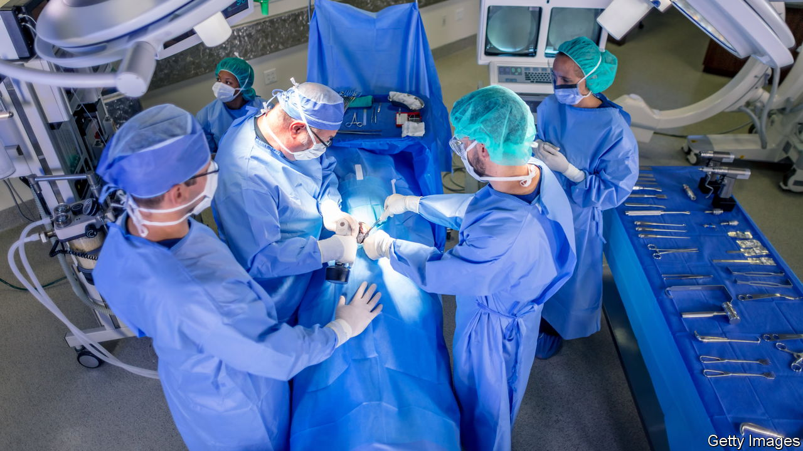
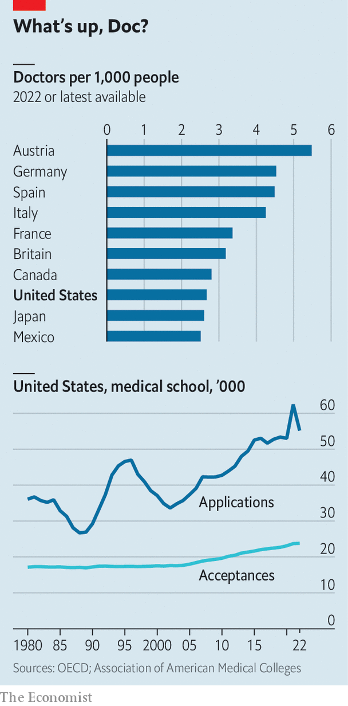

###### Medicine’s gilded age

# Why doctors in America earn so much 

##### A mismanaged training system has artificially depressed the supply of medics 

 

> Oct 31st 2023 

According to the Association of American Medical Colleges (AAMC), in a decade America will have a shortage of up to 124,000 doctors. This makes no sense. The profession is lavishly paid: $350,000 is the average salary according to a recent paper by Joshua Gottlieb, an economist at the University of Chicago, and colleagues. Lots of people want to train as doctors: over 85,000 people take the medical-college admission test each year, and more than half of all medical-school applicants are rejected. And yet there is a shortage of doctors. What is going on?

 


For many Americans, the  has already arrived. More than 100m people today live in an area without enough primary-care doctors (the problem is particularly bad in rural areas). For mental health things are even worse: half of Americans live in an area with a shortage of mental-health professionals. With less than three physicians for every 1,000 people, America is behind most other wealthy countries, despite spending vastly more on health care (see chart).

The usual suspects have been blamed. As the baby-boomers age the need for medical care rises and the doctors among them retire. According to the AAMC, more than two out of five practising doctors will be 65 or older within the next decade, leaving even more vacancies. Covid-19 drove doctors away: an analysis by Peterson-KFF, a non-profit group, shows that health-care workers are quitting their jobs at a rate 30% higher than before covid (and about double the rate of all workers today). “A majority of physicians would not encourage our offspring to go into health care,” says Jesse Ehrenfeld, a physician and president of the American Medical Association. “People have lost the joy in the profession.”

Yet there is another explanation for the doctor shortage, which has to do with the pipeline into the profession, and which the American Medical Association has played a part in creating. It takes longer to train a doctor in America than in most rich countries, and many give up along the way. Future physicians must first graduate from university, which typically takes four years. Then they must attend medical school for another four years. (In most other rich countries, doctors need around six years of schooling.) After post-secondary education, American doctors must complete a residency programme, which can last from three to seven years. Further specialist training may follow. In all, it takes 10-15 years after arriving at university to become a doctor in America.

If the expense and length of the training were not off-putting enough, the number of places in the profession has also been artificially held down. In September 1980 the Department of Health and Human Services released a report warning of a troubling surplus of 70,000 physicians by 1990 in most specialties. It recommended reducing the numbers entering medical school and suggested that foreign medical-school graduates be restricted from entering the country. Despite the shortage, doctors trained abroad must still sit exams and complete a residency in most states regardless of their years of experience.

Medical colleges listened, and matriculation flatlined for 25 years, despite applications rising and the population growing by 70m over the same period (see chart). In 1997 federal funding for residencies was capped, forcing hospitals to either limit programmes or shoulder some of the financial burden of training their doctors. Some spots have been added back, but not nearly enough. Many potential doctors are being shut out of the profession. “Not everyone who would be willing to go through that training and could do it successfully is being allowed to,” says Professor Gottlieb, the economist.

In reaction to this artificial doctor shortage, a new type of medical degree gained popularity: DOs (doctors of osteopathic medicine). In 1981, there were only 14 osteopathic medical schools. Today there are 41. In most countries, an osteopath is someone who manipulates middle-aged spines. In America DOs are fully-licensed doctors. They represent about 11% of the physician workforce and 25% of medical-school students. “The American DO looks almost nothing like their international counterparts,” says Robert Orr, a policy wonk. “They basically mainstreamed themselves in response.”

Nurse practitioners and physician assistants have been given responsibilities typically reserved for doctors, such as writing prescriptions. Foreign-trained doctors have filled some of the gap too. Yet the shortage persists. This looks a lot like a labour market that has been rigged in favour of the insiders. ■


