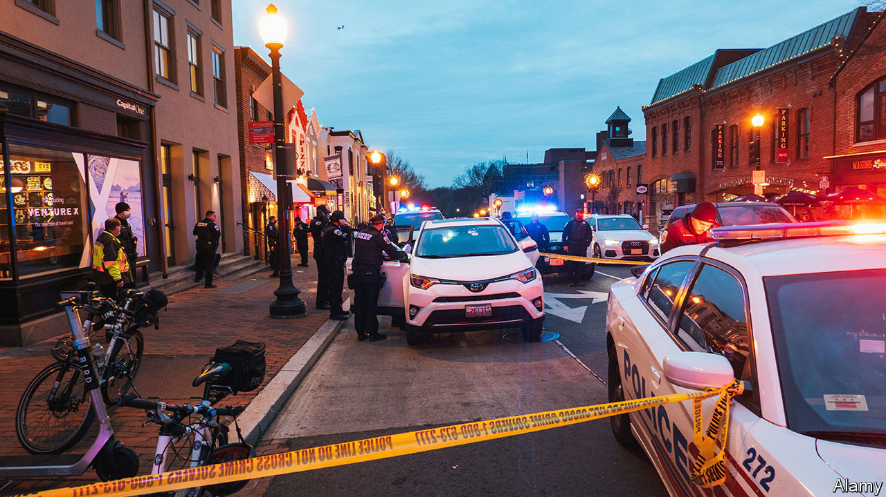

###### Crime and governance

# Why is America’s capital so violent? 

##### In most big cities violent crime is declining. In Washington the opposite is true 

 

> Oct 30th 2023 

Though he has a black belt in karate, when a trio of armed boys in ski masks threatened Henry Cuellar, a congressman from Texas, outside his Navy Yard flat on October 2nd he swiftly handed over the keys to his Toyota Crossover. It was the 754th carjacking in America’s capital this year, amounting to roughly three a day since January. And it was not the first attack on a member of Congress. In February Angie Craig of Minnesota heroically fended off a man who grabbed her by the neck in the lift of the building where she stays near the Capitol.

Violent crime in the district is up by 40% this year. A proliferation of guns has turned dozens of petty disputes into killings: for the first time in a quarter of a century, more than 200 people were murdered before October 1st. That bucks the . Elsewhere the crime epidemic that came with covid-19 is ebbing. In 30 cities that make their murder counts publicly available, the Council on Criminal Justice, a think-tank, found that by July there had been 202 fewer homicides than in the first half of 2022, a 9.4% drop. In Atlanta, Los Angeles, Philadelphia and Rochester the murder rate fell by more than 20%. Why then is the capital of the free world on track to record its worst year in decades?

Because the District of Columbia is , the federal government has an unusual amount of say in its affairs. In March Congress reversed a revision to Washington’s criminal code passed by the district council which, among many other changes, dropped mandatory minimum sentences for carjacking. It was the first time Congress had nixed a local law in three decades. Mitch McConnell, the Senate’s minority leader, warned that the district’s “soft-on-crime” leaders needed “adult supervision”. By summer’s end three Republican congressmen had filed a bill to dissolve the council and mayor’s office and put federal lawmakers in charge. 

Local government is certainly to blame for some of DC’s problems. Washington’s crime lab, a district agency responsible for processing forensic data, lost its accreditation in the spring of 2021 after it repeatedly tried to cover up mistakes it had made. Data from the first nine months after it closed show that just 7% of DNA samples collected at crime scenes were analysed. That made some cases impossible to prosecute. The lab is now seeking re-accreditation, two and a half years later. But even if it resumes work, Matthew Graves, Washington’s chief prosecutor, expects substantial litigation over whether courts can recognise the scientists at the lab as forensic experts again. 

Letting the House of Representatives run the District would be no magic fix, however (especially given its own penchant for disorder). In fact, the current degree of federal involvement seems to be hindering Washington’s ability to ward off crime. Criminal-justice research suggests that people are not deterred from committing crimes based on the severity of punishment, but rather on whether it is certain and swift. The federal government’s chokehold on the district complicates both. 

Capitol offences

In Washington, unlike any other American city, the us attorney is responsible for prosecuting both local and federal crimes (and defending the federal government in civil cases). The office’s split personality means that resources must be rationed. After January 6th 2021, for example, the former US attorney pulled staff off local cases to help prosecute insurrectionists who had stormed the Capitol.

In 2022 the office declined to prosecute 67% of local arrests, up from 31% in 2016. That is much higher than in other cities: according to the , last year Philadelphia prosecutors dropped just 4% of cases, Cook County, which includes Chicago, 14% and Detroit 33%. Such a high dismissal rate could well be discouraging police from making arrests. And though it could suggest triaging, where prosecutors prioritise slam-dunk cases, the office’s win-rate did not budge as they slimmed down their docket. That sends a message: in America’s capital, committing a crime may not have consequences. 

Because there is no state apparatus, district judges who hear local cases are nominated by the president and approved by the Senate, just like federal judges. Since presidents are eager to fill circuit-court posts across the country to increase their political influence, Washington’s judges get sidelined. As a result the district has 12 vacancies and seven judges awaiting Senate confirmation. That is unusual: in Pennsylvania just two posts are unfilled, in neighbouring Maryland one. With nearly one-third of the bench empty, fewer cases go to trial. The backlog is not only an injustice; it also pulls the punch of a quick conviction.

More independence from the feds would probably help the District get back on track. But local leaders will be trusted only when they can reduce violence. In July the council passed a bill that temporarily raised the charge for firing a gun from a misdemeanour to a felony and made it easier to lock up violent offenders before trial. After Mr Cuellar was attacked they voted to extend that bill for another 90 days.

Last week the mayor introduced another one, to crack down on loitering, wearing dodgy masks and scheming to steal from shops. Congress ought to commend them for it. Instead, House Republicans’ latest appropriations bill includes a provision to allow out-of-state gun-owners to carry concealed weapons in the district. It is hard to imagine how that will help. ■


