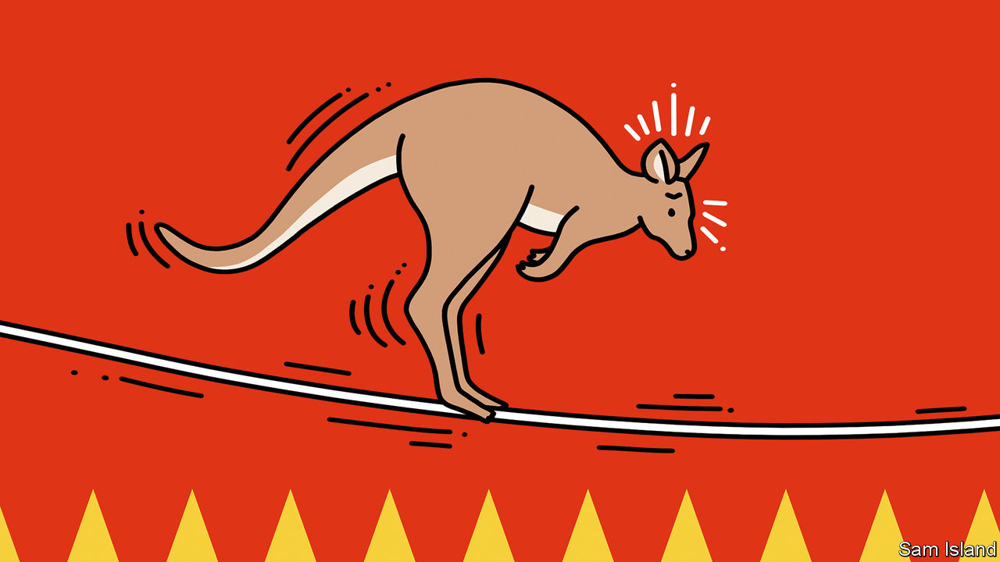

###### Banyan

# Australia and China patch things up 

##### Anthony Albanese, Australia’s prime minister, takes a trip to Beijing 

 

> Nov 7th 2023 

WHEN ANTHONY ALBANESE shook hands with Xi Jinping in Beijing on November 6th, it marked the first time in seven years that an Australian prime minister had travelled to China to meet its leader. For much of the intervening period the two countries’ economic and political relations were badly ruptured. Yet in the Great Hall of the People Mr Xi declared that China and Australia had “embarked on the right path of improvement”. Mr Albanese, for his part, said that Australia supported China’s growth and “ongoing engagement with the world”. That his visit came on the 50th anniversary of Australia’s opening of diplomatic relations with Communist-run China was intended by both sides to symbolise a significant step towards normalisation. 

There were several causes of the rupture, but at root was China’s desire to bend Australia to its will. Its rulers were angered by Australia’s deepening security co-operation with America, its longtime ally, in response to China’s growing assertiveness towards Taiwan, the seas around it and beyond. Australia’s decision to bar Huawei, a Chinese telecoms giant, increased the friction. So did the umbrage Australia’s then conservative government took at signs of Chinese “sharp” power, including interference and surveillance orchestrated through the Chinese embassy in Canberra and within Australia’s universities and large Chinese diaspora. As Australia grew increasingly hawkish towards China, in late 2020 that Chinese embassy handed a laundry list of grievances to the Australian press. China also froze ministerial exchanges between the two countries and slapped embargoes on some Australian exports, including barley, timber, coal, sugar, wine and lobsters. 

Though China is Australia’s biggest market, this chastisement failed. Far from turning on their government, put-upon Australian businesses backed it in the row. Many of them found new markets for their products. Australia meanwhile embarrassed China by bringing cases against it at the WTO. And China’s own businesses suffered from the embargoes, even as the Chinese economy started to flag as a result of disruptions related to the pandemic and also to a property crash and weak foreign investment.

A change of government in Australia last year offered an occasion for China to try a softer approach. Regular ministerial dialogues are expected to resume. Most of China’s embargoes are being lifted, with the remainder expected to come off soon. Cheng Lei, a Chinese-born Australian journalist who was picked up in China by state goons in 2020 on trumped-up charges of espionage, has been released.

Many in Australia think this has straightforwardly demonstrated that standing up to Chinese bullying pays off. Others, however, warn of the insidious nature of Chinese coercion, which will not end, even if it may take a different form towards Australia. Days after Ms Cheng’s release, Australia’s government renewed a Chinese lease on the strategic port of Darwin (in opposition, Mr Albanese had called the lease a “grave error of judgment”). The government denies that this represented a quid pro quo. Yet Euan Graham of the Australian Strategic Policy Institute in Canberra sees a “loss of discipline” in the government’s handling of China. He suggests there is now a risk it will give too much away. 

The charge is probably premature. Mr Albanese’s mantra is that Australia and China must “co-operate where we can, disagree where we must”. So far, that seems to be working. But it is wrong to hope, as some do, that China will settle for an equitable relationship with Australia. As Benjamin Herscovitch at the Australian National University in Canberra notes, China’s conciliatory moves in recent months appear to be intended “to get Australia more on side with its own objectives”. These include continued Chinese access to Australia’s rare earths and other mineral resources; and Australian support for China joining the 12-country CPTPP, a trade grouping.

America would be unhappy on both scores, which is another reason why Australia’s relations with China will not be easy. Mr Herscovitch predicts that America will grow ever more uncomfortable about Australia’s deep and recovering economic ties with China. The dilemma for Australia—of leaning on America for security while, on trade, so many roads lead to China—will only sharpen. Australia has just passed a notable diplomatic test. But given Chinese coercion, Australia’s determination to resist and American goading, the normalisation moment could be rather brief.


