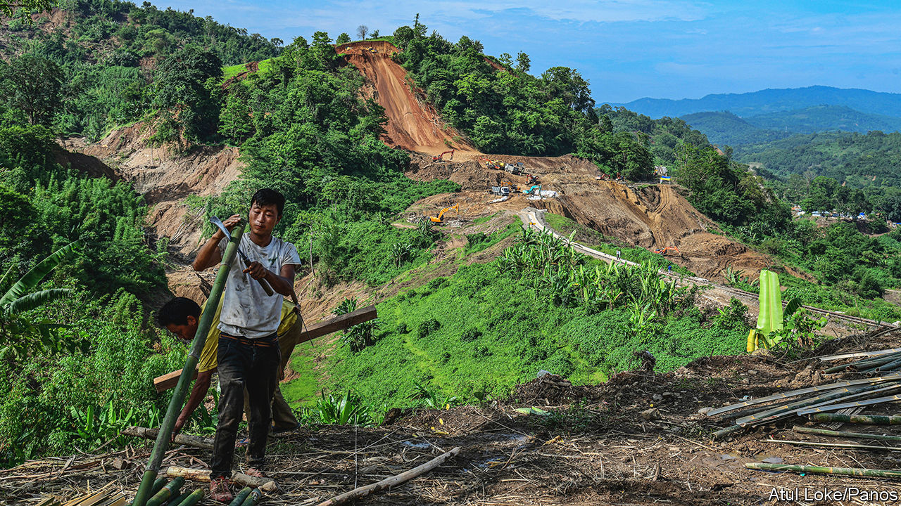
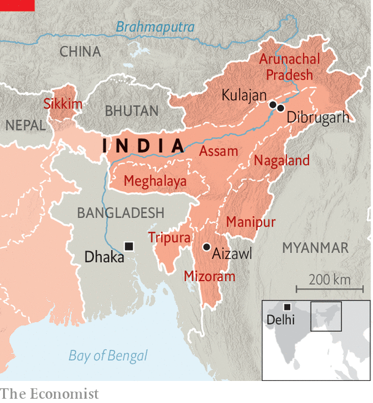

###### India’s north-east

# Can Narendra Modi complete India’s state-building project? 

##### Ethnic violence shows it will take more than infrastructure development 

 

> Nov 9th 2023 

SUMIT DAS, a 32-year-old shopkeeper in Kulajan, a town in Assam in India’s north-east, divides his life into two parts: before the bridge and after. Until 2018 Kulajan, on the north bank of the Brahmaputra river, was poor and isolated. Crossing the river to reach the nearby commercial hub of Dibrugarh could take a day. Then Narendra Modi, India’s prime minister, inaugurated the Bogibeel bridge, the country’s longest rail-and-road crossing, cutting the journey time to less than an hour. Kulajan has been transformed. Mr Das used to be employed in a clothes shop and now runs his own. “I owe this to the bridge,” he says.

This is the sort of story Mr Modi’s Bharatiya Janata Party (BJP) likes to tell about north-east India. Long an embarrassment to the government in Delhi, the region’s eight states are poor, insurgency-racked and mostly tucked away beyond neighbouring Bangladesh. No part of India—not even restive Kashmir in the far north—has been so little touched by its 76-year-long state-building effort. The Modi government has tried to change that.

 


It has accelerated infrastructure projects in Arunachal Pradesh, Assam, Manipur, Meghalaya, Mizoram, Nagaland, Sikkim and Tripura (see map). It has improved relations with Bangladesh and tried to limit the ability of China—which claims Arunachal—to cause trouble. These efforts appeared to be succeeding—until the eruption in May of ethnic conflict in Manipur. This has left more than 200 dead, 70,000 displaced and the state divided between two ethnic groups. Where, in light of that crisis, does Mr Modi’s north-eastern approach stand?

Understand, first, how daunting it is. The region’s 50m people belong to dozens of ethnic groups, speak more than 200 languages and follow several religions. Many, including scores of militant bands, do not get along. The scar tissue of earlier interventions, British colonial and Indian, underlies their conflict. State borders imposed by the British jumbled tribal areas. The privileges some communities wrested from the central government—a jobs quota here, a land settlement there—enraged their neighbours. The conflict in Manipur was stirred by one such rivalry. The government in Delhi has sometimes intervened brutally. In 1966 India’s then prime minister, Indira Gandhi, ordered air strikes on the city of Aizawl, in what is now Mizoram, to quell a secessionist uprising. Perhaps unsurprisingly, many north-easterners feel little allegiance to India; other Indians tend to look on them suspiciously.

Recent governments have tried to woo the region with peacemaking and development. Yet as India’s growth rate has picked up, the disparity between the north-east and elsewhere has increased. The region’s share of GDP fell from 3.1% in 1991 to 2.6% in 2011. Mr Modi, in power since 2014, has sought to tackle this. His government speeded up infrastructure projects, improved relations with some ethnic groups and ordered administrators to make the north-east more “Indian”. The pace of road construction more than doubled during the first five years of his tenure; the total length of national highways in the region is approaching 16,000km, up from 8,500 in 2014. It has 17 civilian airports, compared with nine a decade ago. The current union budget includes 59bn rupees ($700m) for development in the north-east, twice the previous year’s allocation. The region’s share of GDP was up to 2.8% in 2022. 

This has brought major improvements. The Bogibeel bridge has also given Arunachalis access to Assam’s stronger economy. “For the first time we are getting tourists from mainland India,” says Komnga Karlo, a local leader in Arunachal. Meghalaya is trying to use better connections to boost ecotourism and fruit exports. “They’ve done very well on infrastructure,” says Subir Bhaumik, a journalist who has reported on the north-east since the early 1980s and is otherwise no fan of Mr Modi.

Better ties with Bangladesh, long a refuge for north-eastern militants, have also helped. On November 1st Mr Modi and his Bangladeshi counterpart, Sheikh Hasina, reopened a railway link between Tripura and Bangladesh, which had been dormant for seven decades, and a connecting line to Bangladesh’s Mongla port. This will improve port access for both India and Nepal.

Such progress has helped the BJP make big political inroads in the region. The Hindu nationalists won power in Assam in 2016, ending 15 years of rule by the Congress party. They won in Manipur in 2017 and 2022, Tripura in 2018 and 2023, Arunachal Pradesh in 2019, and have joined governing coalitions in Meghalaya and Nagaland. Yet the flare-up in Manipur illustrates the limits of the BJP’s approach.

The conflict pits the state’s dominant Meitei community, which is mostly Hindu and accounts for 51% of Manipuris, against the poorer and mostly Christian Kuki minority, concentrated in the state’s hilly periphery. It was sparked in May by plans to give Meiteis access to affirmative action and other measures reserved for Kukis. Yet the BJP, which invariably views communal relations through its Hindu-majoritarian lens, has hyped up the conflict’s religious element, backing the Meiteis and casting the Kukis as criminals and insurgents. This has made a bad situation much worse. 

Manipur’s recent economic progress, for which the BJP had made great claims, has been undone. The picturesque green state has been torn between its Meitei-controlled valley and the Kuki-controlled hills, with armed police manning checkpoints in between. Nearly 5,000 houses and hundreds of temples and churches have been burned. With many fields and markets in effect inaccessible—including to the many thousands huddled in over 300 refugee camps—local agriculture is in crisis. The state’s budding services economy is also at a standstill, the government having shut down the mobile internet, at least until November 13th. And the violence continues. On October 31st a police officer was shot dead near the border with Myanmar.

“The Indian state has been very confident about the development of the region, but this kind of thing can undo it quickly,” says Rakhee Bhattacharjee of the North East studies centre at Jawaharlal Nehru University in Delhi. Indeed, the crisis shows not only how fragile the region is, but how patchy are the BJP’s strengths. Its economic plans are robust. But a party that rose by sowing discord between Hindus and Muslims makes a poor peacemaker.

Not a peripheral issue

The bjp also has weak state-level leaders, a flipside of Mr Modi’s charismatic leadership, exemplified by its hapless chief minister in Manipur, N. Biren Singh. This is by no means, as its opponents claim, a total indictment of the government’s north-eastern strategy. It has already had striking success and promises more. But it is a reminder that India’s progress under Mr Modi is liable to be fraught.■

